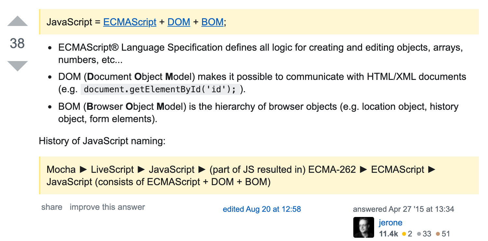

# web前端相关的介绍

## 基础

学习网站

https://developer.mozilla.org/zh-CN/

https://www.w3schools.com/

### 网络

​	HTTP/HTTPS等等

### 语言

- 超文本标记语言（HyperText Markup Language, HTML）

  可扩展标记语言（英語：Extensible Markup Language，简称：XML）

  可扩展超文本标记语言（英語：eXtensible HyperText Markup Language，XHTML）。

- 层叠样式表(Cascading Style Sheets, CSS)

- JavaScript/ECMAScript

- Wasm (webAssembly) 2019年成为标准

  “前端娱乐圈”

**重点：面向用户侧开发：**

1. 把内容交给了浏览器（用户），通过浏览器完成渲染      tip:flash、sliverlight、ActiveX
2. 没有秘密（对于任何直接面向客户的都是相同的，例如“穷B”VIP（MAC客户端） https://www.v2ex.com/t/407653）
3. 面向用户交互  用户使用不同版本的浏览器怎么办？ https://caniuse.com/
4. 历史包袱  向后兼容backward

## 发展历程

来源:http://goodbedford.github.io/introJs/

来源：如水印

[JavaScript起源](https://zh.wikipedia.org/wiki/JavaScript)

- NetScape JavaScript **Brendan Eich** 10天时间设计原型（和Java没有任何关系，本来打算叫Mocha/LiveScript）（NetScape 4 开源）

  Mozilla 项目组

  Mozilla Foundation

  **所有的浏览器都带了个Mozilla？？？**

  *早期IE干的事情，为了告诉服务器端自己兼容Netscape，于是UA要写作"Mozilla/\<version> (compatible; MSIE \<version>..."。后来就传下来了，除了网络爬虫，基本上所有的浏览器的UA开头都这样写。*

  *IE一直到IE8都只敢写Mozilla/4.0，到IE9才开始和Firefox、Chrome等一样，写Mozilla/5.0。*

  *https://www.zhihu.com/question/19954276*

  补充：网络爬虫，SEO？robots.txt

- 微软 JScript（Windows可以直接运行js文件？）

- ECMA Committee（欧洲计算机制造商协会）EcmaScript(ESx... ) 

  

来源：https://stackoverflow.com/questions/912479/what-is-the-difference-between-javascript-and-ecmascript

### 前端开发与相关技术的发展

参考：https://segmentfault.com/a/1190000012729188

推荐网站：https://web.archive.org/  

#### 1. 通过模版形式返回页面代码（服务端渲染）

1999年的Google

- [freemarker](https://en.wikipedia.org/wiki/FreeMarker)

- JSP(JAVA Server Pages): Released in 1999 by [Sun Microsystems](https://en.wikipedia.org/wiki/Sun_Microsystems)

- PHP 

#### 2.JQuery AJAX

jQuery is a JavaScript library designed to simplify HTML DOM tree traversal and manipulation, as well as event handling, CSS animation, and Ajax. It is free, open-source software using the permissive MIT License. As of May 2019, jQuery is used by 73% of the 10 million most popular websites.

*AJAX stands for Asynchronous JavaScript and XML. AJAX is a new technique for creating better, faster, and more interactive web applications with the help of XML, HTML, CSS, and Java Script.*

*AJAX is based on the following open standards:*

- *Browser-based presentation using HTML and Cascading Style Sheets (CSS).*
- *Data is stored in XML format and fetched from the server.*
- *Behind-the-scenes data fetches using XMLHttpRequest objects in the browser.*
- *JavaScript to make everything happen.*

#### 3.数据交换格式

​	JSON、SOAP、Protocol Buffer

#### 4.发展

##### js相关

- 通过js编译js

  coffeeScript

  Babel

- NodeJs （基于V8引擎） npm （Node Package Manager）

- 大前端
  1. flutter （Dart语言，会被翻译成Javascript）by Google  --- 闲鱼
  2. Apache Cordova by Nitobi -- Adobe
  3. Electron by Github -- Microsoft  --- vscode、typora

##### html相关

HTML5、VDOM（Virtual DOM，用 js 模拟DOM结构）

##### css相关

CSS3、CSS预处理器（LESS、SASS/SCSS、Stylus）、[CSS in JS](https://www.ruanyifeng.com/blog/2017/04/css_in_js.html)

##### 基于组件的前端开发框架

1. Angular （Google）
2. React （Fackbook） React native
3. Vue （Evan You）

##### 前端工程化

构建工具 webpack、gulp、grunt

##### 网络相关技术发展

1. CDN (Content Delivery Network)
4. ES6/7/8/9/10
5. HTTP/1 -> HTTP/1.1 ->HTTP/2 -> HTTP/3 (HTTP over QUIC)
6. HTTPS (HTTP over tls)
7. 通信技术和协议的发展
   - 光纤
   - ipv6
   - 移动通信技术

##### TypeScript

## web安全

- xss
- csrf

## [Front-end roadmap](https://github.com/kamranahmedse/developer-roadmap)

## 前后端分离

前后端分离：偏展示类的系统 https://www.zhihu.com/question/28207685

优点：

1. 细分了职责
2. 便于测试
3. 通过nginx进行负载均衡和+cdn替换依赖的assets加快加载速度。

缺点：

1. 需要解决跨域问题（其实需要访问服务器的App都是跨域）

2. 需要SEO的网站需要进行SSR（服务端渲染）/prerender

3. https://juejin.im/post/5b71302351882560ea4afbb8

   

### npm 

1. npm （Node Package Manager）

2. npx（npm >= 5.2)

3. package.json

在当前路径下执行npm时的package配置，dependency, script, author, version, etc.

4. package-lock.json，npm v5引入，方便进行package.json版本的管理（一般是建议commit的）。

yarn (npm install -g yarn)

