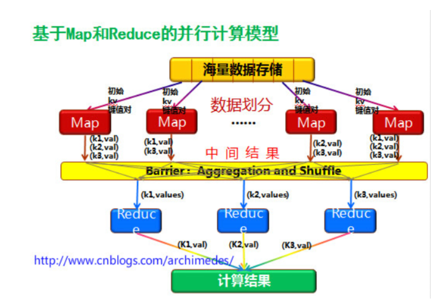
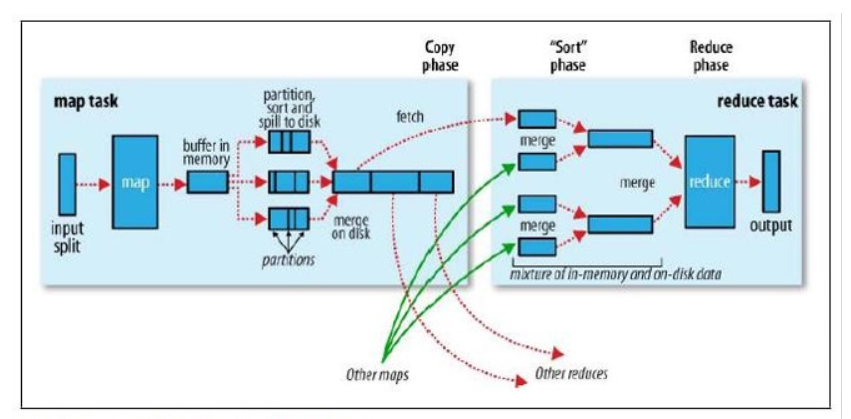

### MapReduce

---

#### 简介

##### 概述

1. MapReduce是一种分布式计算模型。
2. 由谷歌提出，基于GFS进行设计，主要用于搜索领域中解决海量数据的计算问题。
3. Doug Cutting根据《MapReduce: Simplified Data     Processing on Large Clusters》设计实现了Hadoop中基于HDFS的MapReduce。
4. MapReduce是由两个阶段组成：Map和Reduce，用户只需要实现map以及reduce两个函数，即可实现分布式计算，这样做的目的是简化分布式程序的开发和调试周期。

##### 组成

1. JobTracker/ResourceManager：任务调度者，管理多个TaskTracker。ResourceManager是Hadoop2.0版本之后引入Yarn之后用于替代JobTracke部分功能的机制。
2. TaskTracker/NodeManager：任务执行者。

##### 结构图



1. 从HDFS中获取数据。
2. MapReduce首先会将输入的数据进行逻辑切片，每一个接片是一个InputSplit对象。
3. 每一个InputSplit对象会交给一个MapTask来执行。
4. 切片中的每一行数据都会触发一次map方法。
5. map方法的输入的键默认为数据偏移量，输入的值为这一行的数据；输出的键以及值的类型根据业务确定。
6. 在Barrier阶段，会将所有相同的键所对应的值放入一个ArrayList中，然后产生一个迭代器交给ReduceTask来执行。
7. 在ReduceTask中，每一个键都会触发一次reduce方法。
8. 将结果写到HDFS中。

#### 入门案例

##### demo01

统计文件中的每一个单词出现的次数（文件：words.txt）

1. mapper类

```java
public class WordCountMapper extends Mapper<LongWritable, Text, Text, LongWritable> {
    // key -- 当前行的开始位置在整个文件中的偏移量
    // value -- 当前行的内容
    // context -- 环境对象
    public void map(LongWritable key, Text value, Context context) throws IOException, InterruptedException {
        // 获取一行数据
        String line = value.toString();
        // 以空格为单位进行切分，获得单词对应的数组
        String[] arr = line.split(" ");
        // 遍历数组，输出这个词对应的频率
        for (String str : arr) {
            context.write(new Text(str), new LongWritable(1));
        }
    }
}
```

2. Reducer类

```java
public class WordCountReducer extends Reducer<Text, LongWritable, Text, LongWritable> {
    // key 键
    // it 集合的迭代器
    // context 环境对象
    public void reduce(Text key, Iterable<LongWritable> values, Context context)
        throws IOException, InterruptedException {
        // 定义变量记录次数
        long sum = 0;
        // 循环 遍历集合，进行累加的操作，得到当前单词出现的总次数
        for (LongWritable val : values) {
            // 记录总次数
            sum += val.get();
        }
        // 输出数据，key是单词，value是在map阶段这个单词出现的总的次数
        context.write(key, new LongWritable(sum));
    }
}
```

3. Driver类

```java
public class WordCountDriver {

    public static void main(String[] args) throws Exception {

        // 获取当前的默认配置
        Configuration conf = new Configuration();
        // 获取代表当前mapreduce作业的JOB对象
         Job job = Job.getInstance(conf);
        // 指定当前程序的入口类
        job.setJarByClass(cn.tedu.wc.WordCountDriver.class);
     
        // 设置要执行的Mapper类
        job.setMapperClass(WordCountMapper.class);
        // 设置要执行的Reducerr类
        job.setReducerClass(WordCountReducer.class);
 
        // 设置Mapper的结果类型
        job.setMapOutputKeyClass(Text.class);
        job.setMapOutputValueClass(LongWritable.class);
 
        // 设置Reducer的结果类型
        job.setOutputKeyClass(Text.class);
        job.setOutputValueClass(LongWritable.class);
 
        // 设置输入路径
        //  如果输入的是文件，那么读取的是指定的文件
        // 如果输入的是目录，则读取当前目录下的所有的文件
        FileInputFormat.setInputPaths(job, new Path("hdfs://192.168.32.138:9000/mr/words.txt"));
        // 设置输出路径
        FileOutputFormat.setOutputPath(job, new Path("hdfs://192.168.32.138:9000/wcresult"));
         
        // 执行job
        if (!job.waitForCompletion(true))
            return;
    }
}

```

##### Mapper组件的知识点 

1. Mapper组件开发方式：自定义一个类，继承Mapper。

2. Mapper组件的作用是定义每一个MapTask具体要怎么处理数据。例如一个文件，257MB，会生成3个MapTask。即三个MapTask处理逻辑是一样的，只是每个MapTask处理的数据不一样。

3. KEYIN：对应的Mapper的输入key。默认是LongWritable，表示每行的行首偏移量。

4. VALUEIN：对应的Mapper的输入Value。默认是Text，表示每行的内容。

5. KEYOUT：对应的Mapper的输出key，根据业务来定义。

6. VALUEOUT：对应的Mapper的输出value，根据业务来定义。

7. 注意：初学时，KEYIN和VALUEIN写死。KEYOUT和VALUEOUT则需要根据需求进行改变。

8. Writable机制是Hadoop自身的序列化机制，常用的类型：

9. 1. LongWritable 
   2. Text(String)
   3. IntWritable
   4. NullWritable

10. 定义MapTask的任务逻辑是通过重写map()方法来实现的。读取一行数据就会调用一次此方法，同时会把输入key和输入value进行传递。

11. 在实际开发中，最重要的是拿到输入value(每行内容)。

12. 输出方法：通过context.write(输出key，输出value)。

13. 开发一个MapReduce程序（job），Mapper可以单独存储，此时，最后的输出的结果文件内容就是Mapper的输出。

14. Reducer组件不能单独存在，因为Reducer要依赖于Mapper的输出。当引入了Reducer之后，最后输出的结果文件的结果就是Reducer的输出。

##### Reducer组件知识点

1. Reducer组件用于接收Mapper组件的输出
2. reduce的输入key,需要和mapper的输出key类型一致
3. reduce的输入value，需要和mapper的输出value类型一致
4. reduce的输出key类型，根据具体业务决定
5. reduce的输出value类型，根据具体业务决定
6. reduce收到map的输出，会按相同的key做聚合，形成:key Iterable 形式然后通过reduce方法进行传递
7. reduce方法中的Iterable是一次性的，即遍历一次之后，再遍历，里面就没有数据了。所以，在某些业务场景，会涉及到多次操作此迭代器，处理的方法是：①先创建一个List ②把Iterable装到List ③多次去使用List即可

#### 序列化/反序列化机制

##### 概述

1. 在Hadoop的集群工作过程中，一般是利用RPC来进行集群节点之间的通信和消息的传输，所以要求MapReduce处理的对象必须可以进行序列化/反序列操作
2. Hadoop并没有使用Java原生的序列化，而是利用的是Avro实现的序列化和反序列，并且在此基础上进行了更好的封装，提供了便捷的API
3. 在Hadoop中要求被序列化的对象对应的类必须实现Writable接口，重写其中的write方法以及readFields方法
4. 序列化过程中要求属性值不能为null

##### demo02

统计流量(文件：flow.txt)

1. pojo类

```java
// 实现Hadoop提供的序列化接口
public class Flow implements Writable {
 
    private String phone;
    private String address;
    private String name;
    private int flow;
 
    public String getPhone() {
        return phone;
    }
 
    public void setPhone(String phone) {
        this.phone = phone;
    }
 
    public String getAddress() {
        return address;
    }
 
    public void setAddress(String address) {
        this.address = address;
    }
 
    public String getName() {
        return name;
    }
 
    public void setName(String name) {
        this.name = name;
    }
 
    public int getFlow() {
        return flow;
    }
 
    public void setFlow(int flow) {
        this.flow = flow;
    }
 
    // 序列化
    @Override
    public void write(DataOutput out) throws IOException {
         
        out.writeUTF(phone);
        out.writeUTF(address);
        out.writeUTF(name);
        out.writeInt(flow);
         
    }
 
    // 反序列化
    @Override
    public void readFields(DataInput in) throws IOException {
         
        phone = in.readUTF();
        address = in.readUTF();
        name = in.readUTF();
        flow = in.readInt();
    }
 
}

```

2. Mapper类

```java
public class FlowCountMapper extends Mapper<LongWritable, Text, Text, Flow> {
 
    public void map(LongWritable key, Text value, Context context) throws IOException, InterruptedException {
 
        // 获取一行数据
        String line = value.toString();
 
        // 按照空格进行切分
        String[] arr = line.split(" ");
 
        // 设置流量
        Flow f = new Flow();
        f.setPhone(arr[0]);
        f.setAddress(arr[1]);
        f.setName(arr[2]);
        f.setFlow(Integer.parseInt(arr[3]));
 
        context.write(new Text(f.getPhone()), f);
    }
 
}

```

3. Reducer类

```java
public class FlowCountReducer extends Reducer<Text, Flow, Text, IntWritable> {
 
    public void reduce(Text _key, Iterable<Flow> values, Context context) throws IOException, InterruptedException {
 
        int sum = 0;
        Flow f = null;
        for (Flow val : values) {
            f = val;
            sum += val.getFlow();
        }
        context.write(new Text(f.getPhone() + "\t" + f.getName()), new IntWritable(sum));
    }
 
}

```

4. Driver类

```java
public class FlowCountDriver {
 
    public static void main(String[] args) throws Exception {
        Configuration conf = new Configuration();
        Job job = Job.getInstance(conf, "JobName");
        job.setJarByClass(cn.tedu.flow.FlowCountDriver.class);
 
        job.setMapperClass(FlowCountMapper.class);
        job.setReducerClass(FlowCountReducer.class);
 
        job.setMapOutputKeyClass(Text.class);
        job.setMapOutputValueClass(Flow.class);
 
        job.setOutputKeyClass(Flow.class);
        job.setOutputValueClass(IntWritable.class);
 
        FileInputFormat.setInputPaths(job, new Path("hdfs://192.168.32.138:9000/mr/flow.txt"));
        FileOutputFormat.setOutputPath(job, new Path("hdfs://192.168.32.138:9000/fcresult"));
 
        if (!job.waitForCompletion(true))
            return;
    }
 
}
```

#### 分区

##### 概述

1. 分区操作是shuffle操作中的一个重要过程，作用就是将map的结果按照规则分发到不同reduce中进行处理，从而按照分区得到多个输出结果。
2. Partitioner是分区的基类，如果需要定制partitioner也需要继承该类
3. HashPartitioner是MapReduce的默认partitioner。计算方法是：which     reducer=(key.hashCode() & Integer.MAX_VALUE) % numReduceTasks
4. 默认情况下，reduceTask数量为1
5. 很多时候MapReduce自带的分区规则并不能满足业务需求，为了实现特定的效果，可以需要自己来定义分区规则
6. 如果定义了几个分区，则需要定义对应数量的ReduceTask

##### demo03

改造如上统计流量案例，根据不同地区分区存放数据

```java
// 开发Partitioner代码，写一个类实现Partitioner接口，在其中描述分区规则
public static class DCPartitioner extends  Partitioner<Text, DataInfo>{
    private static Map<String,Integer> addrMap = new HashMap<String,Integer>();
     
    static{
        addrMap.put("bj", 1);
        addrMap.put("sh", 2);
        addrMap.put("sz", 3);
    }
         
    @Override
    public int getPartition(Text key, DataInfo value, int numPartitions) {
        String addr = value.getAddr().toString();
        Integer num = addrMap.get(addr);
        if(num == null){
            num = 0;
        }
        return num;
    }
}
 
// 在任务调度代码中，增加Partitioner配置
//设置Partitioner类
job.setPartitionerClass(DCPartitioner.class);
//指定Reducer的数量，此处通过main方法参数获取，方便测试
job.setNumReduceTasks(3);

```

注意问题：

* Partitioner将会将数据发往不同reducer，这就要求Reducer的数量应该大于等于Partitioner的数量，如果少于则在执行的过程中会报错。
* Partitioner的默认数量为1，所以可以将Reducer的数量设置为1

#### MR执行流程

##### 数据本地化策略

1. 当JobTracker访问资源的时候需要向NameNode请求数据

1. JobTracker获取到数据的描述信息，根据描述信息对数据进行了切片（InputSplit），然后将切片发给不同MapTask来执行
2. MapTask在TaskTracker上执行，在执行的时候需要获取实际的数据
3. TaskTracker需要去访问DataNode，为了节省带宽资源，所以往往将DataNode和TaskTracker放在同一个节点上 --- 数据本地化策略
4. 为了减少网络资源的消耗，往往还会将切片的大小和实际的Block的大小设置的相同

##### job执行流程

1. run job：客户端提交一个mr的jar包给JobClient。提交方式：hadoop jar …

2. 1. 做job环境信息的收集，比如各个组件类，输入输出的kv类型等，检测是否合法
   2. 检测输入输出的路径是否合法

3. JobClient通过RPC和ResourceManager进行通信，返回一个存放jar包的地址（HDFS）和jobId。jobID是全局唯一的，用于标识该job

4. client将jar包写入到HDFS当中(path     = hdfs上的地址 + jobId)

5. 开始提交任务(任务的描述信息，不是jar,     包括jobid，jar存放的位置，配置信息等等)

6. JobTracker进行初始化任务

7. 读取HDFS上的要处理的文件，开始计算输入切片，每一个切片对应一个MapperTask。注意，切片是一个对象，存储的是这个切片的数据描述信息；切块是文件块（数据块），里面存储的是真正的文件数据

8. TaskTracker通过心跳机制领取任务（任务的描述信息）。切片一般和切块是一样的，即在实际开发中，切块和切片认为是相同的。在领取到任务之后，要满足数据本地化策略

9. 下载所需的jar，配置文件等。体现的思想：移动的是运算，而不是数据

10. TaskTracker启动一个java     child子进程，用来执行具体的任务（MapperTask或ReducerTask）

11. 将结果写入到HDFS当中

#### 排序

##### 概述

1. Map执行过后，在数据进入reduce操作之前，数据将会按照输出的Key进行排序，利用这个特性可以实现大数据场景下排序的需求
2. 要排序的对象对应类实现WritableComparable接口，根据返回值的正负决定排序顺序
3. 如果比较的结果一致，则会将相同的结果舍弃
4. 如果对类中的多个属性进行比较，则此时的排序称之为叫二次排序

##### demo04

计算学生的总分（文件：score.txt），对学生总分进行排序。

1. pojo类

```java
public class Student implements WritableComparable<Student>{
 
    private String name;
    private int score;
 
    public String getName() {
        return name;
    }
 
    public void setName(String name) {
        this.name = name;
    }
 
    public int getScore() {
        return score;
    }
 
    public void setScore(int score) {
        this.score = score;
    }
 
    @Override
    public void readFields(DataInput in) throws IOException {
        this.name = in.readUTF();
        this.score = in.readInt();
    }
 
    @Override
    public void write(DataOutput out) throws IOException {
        out.writeUTF(name);
        out.writeInt(score);
    }
 
    @Override
    // 比较规则就是在这个方法中来指定
    // 拿当前对象this和参数s进行比较
    // 如果返回值是正数，那么this排在后边，形成的是升序排序
    // 如果返回值是负数，那么this排在前边，形成的是降序排序
    public int compareTo(Student s) {
        return s.score - this.score;
    }
 
}


```

2. Mapper类

```java
// 要排序的对象必须放在键的位置
public class SortMapper extends Mapper<LongWritable, Text, Student, NullWritable> {
 
    public void map(LongWritable key, Text value, Context context) throws IOException, InterruptedException {
 
        String[] arr = value.toString().split("\t");
        Student s = new Student();
        s.setName(arr[0]);
        s.setScore(Integer.parseInt(arr[1]));
        context.write(s, NullWritable.get());
         
    }
 
}
```

3. Reducer类

```java
public class SortReducer extends Reducer<Student, NullWritable, Text, IntWritable> {
 
    public void reduce(Student key, Iterable<NullWritable> values, Context context) throws IOException, InterruptedException {
     
        context.write(new Text(key.getName()), new IntWritable(key.getScore()));
    }
 
}
```

4. Driver类

```java
public class SortDriver {
 
    public static void main(String[] args) throws Exception {
        Configuration conf = new Configuration();
        Job job = Job.getInstance(conf, "JobName");
        job.setJarByClass(cn.tedu.sort.SortDriver.class);
        job.setMapperClass(SortMapper.class);
        job.setReducerClass(SortReducer.class);
         
        job.setMapOutputKeyClass(Student.class);
        job.setMapOutputValueClass(NullWritable.class);
 
        job.setOutputKeyClass(Text.class);
        job.setOutputValueClass(IntWritable.class);
         
        // _开头的文件在Hadoop中认为是隐藏文件，自动忽略
        FileInputFormat.setInputPaths(job, new Path("hdfs://192.168.44.133:9000/score"));
        FileOutputFormat.setOutputPath(job, new Path("hdfs://192.168.44.133:9000/sort"));
 
        if (!job.waitForCompletion(true))
            return;
    }
 
}

```

#### 合并

##### 概述

1. 在MapReduce中，所有MapTask的执行结果会汇总到Reducer端，此时Reducer的计算压力相对Mapper端而言要大一些，因此Reducer的计算性能则基本决定了整个MapReduce程序的一个执行效率
2. 为了减少Reducer端的数据的计算量，可以在Mapper端将结果先进行一次合并，然后再将合并之后的结果发送给ReduceTask
3. Combine的核心思想是减少数据量而不改变计算结果
4. Combiner执行的逻辑和Reducer的逻辑一般是相同的，所以一般可以复用Reducer端的逻辑

#### Shuffle

##### Mapper的Shuffle

1. 在MapReduce程序刚开始的时候会先对文件进行切片。如果文件不可切，则将整个文件作为一个切片进行处理。如果文件可切，则进行切分，但是需要注意的是如果剩余数据量/splitsize<=1.1，则剩余的数据整体作为一个分区来进行处理
2. 每一个分区会分配给一个MapTask来处理。MapTask在接收到FileSplit之后进行按行读取，每读取一行调用一次map方法
3. 每执行完一次map方法之后会将计算结果写到缓冲区中。缓冲区是维系在内存中的
4. 缓冲区的大小默认是100M，可以通过io.sort.mb来进行调节
5. 在缓冲区中，会对数据进行分区-partition，排序     - sort。如果指定了合并 - combine操作，则在缓冲区中也会进行combine操作
6. 当缓冲区的容量利用率达到阈值0.8的时候，会启动给一个后台线程将缓冲区中的数据写到指定目录下的溢写文件中，这个过程称之为是溢写     （Spill），而每次的Spill都会产生一个新的溢写文件
7. 等最后所有的数据都写完之后，会将所有的溢写文件进行一次合并     (merge)，合并到一个新的分区并且排序的文件中。需要注意的是merge过程并不减少数据量，而combine过程会减少数据总量
8. 如果在最终合并的时候，溢写文件个数>=3，那么合并完成之后会再执行一次Combiner

注意问题：

1. 当产生溢写的时候，缓冲区最后残留的数据会flush到最后一个溢写文件中
2. 在默认情况下，Spill文件理论上是80M，但是要考虑序列化以及最后的冲刷等因素
3. 不能凭借一个MapTask处理的切片大小来衡量MapTask之后的输出数据的多少
4. 每一个切片对应一个MapTask，每一个MapTask对应一个缓冲区
5. 缓冲区本质上是一个字节数组
6. 缓冲区又叫环形缓冲区，好处在于可以重复利用同一块地址的缓冲区
7. 阈值的作用是避免Spill过程产生阻塞
8. merge过程可能不会发生

##### Reducer的Shuffle

1. ReduceTask通过Http的方式来得到输出文件的分区，这个过程称之为fetch
2. 每一个ReduceTask将获取的分区的数据再次进行merge，然后进行排序
3. 将相同的key做聚合，将值放入迭代器中，这一步称之为grouping
4. 调用reduce方法，将key和迭代器传入

注意问题：

1. fetch的默认线程数是5
2. ReduceTask的阈值为5%，即当5%的MapTask完成之后，ReduceTask就开始启动
3. Merge因子默认为10，即每10个文件合并成一个文件

##### 流程图



##### Shuffle调优

1. Map阶段的调优：

2. 1. 调大缓冲区，一般可以调为250~350M
   2. 可以引入combine过程
   3. merge之后的文件可以进行压缩，减少网络传输的消耗

3. Reduce阶段的调优：

4. 1. 增多fetch的线程数
   2. 降低ReduceTask的阈值
   3. 提高merge因子

#### InputFormat

##### 概述

1. MapReduce开始阶段阶段，InputFormat类用来产生InputSplit，并把基于RecordReader它切分成record（即KEYIN-VALUEIN），形成Mapper的输入
2. Hadoop本身提供了若干内置的InputFormat，其中如果不明确指定默认使用TextInputFormat

##### 常见子类

1. TextInputFormat：作为默认的文件输入格式，用于读取纯文本文件，文件被分为一系列以LF(Line-Feed     换行)或者CR(Carriage-Return     回车)结束的行，key是每一行的数据位置偏移量，是LongWritable类型的，value是每一行的内容，为Text类型

2. KeyValueTextInputFormat：同样用于读取文本文件，如果行被分隔符（默认是\t）分割为两部分，第一部分为key，剩下的部分为value；如果没有分隔符，整行作为     key，value为空。

3. SequenceFileInputFormat：用于读取sequence     file。 sequence file是Hadoop用于存储数据自定义格式的binary文件。它有两个子类：

4. 1. SequenceFileAsBinaryInputFormat，将 key和value以BytesWritable的类型读出
   2. SequenceFileAsTextInputFormat，将key和value以Text类型读出

5. SequenceFileInputFilter：根据filter从sequence文件中取得部分满足条件的数据，通过     setFilterClass指定Filter，内置了三种     Filter，RegexFilter取key值满足指定的正则表达式的记录；PercentFilter通过指定参数f，取记录行数%f==0的记录；MD5Filter通过指定参数f，取MD5(key)%f==0的记录

6. NLineInputFormat：0.18.x新加入，可以将文件以行为单位进行split，将文件的每一行对应一个mapper。得到的key是每一行的位置偏移量（LongWritable类型），value是每一行的内容，Text类型。适合于行数不多但是每一行的字段较多的场景

7. CompositeInputFormat：用于多个数据源的join

8. DBInputFormat：把数据库表数据读入到HDFS

##### 自定义输入格式

###### 概述

1. 所有InputFormat都要直接或间接的继承InputFormat抽象类
2. InputFormat中主要定义了如下两个方法：getSplits以及createRecordReader
3. 如果数据来源是文件，那么可以继承FileInputFormat。FileInputFormat实现了InputFormat接口，实现了getSplits方法，根据配置去逻辑切割文件，返回FileSplit的集合，并提供了isSplitable()方法，子类可以通过在这个方法中返回boolean类型的值表明是否要对文件进行逻辑切割，如果返回false则无论文件是否超过一个Block大小都不会进行切割，而将这个文件作为一个逻辑块返回。而对createRecordReader方法则没有提供实现，设置为了抽象方法，要求子类实现。
4. TextInputFormat继承了FileInputFormat

###### demo05

1. 格式类

```java
// 格式类
public class AutoInputFormat extends FileInputFormat<Text, Text>{
     
    @Override
    protected boolean isSplitable(JobContext context, Path filename) {
        return false;
    }
 
    @Override
    public RecordReader<Text, Text> createRecordReader(InputSplit split, TaskAttemptContext context)
            throws IOException, InterruptedException {
        return new AutoRecordReader();
    }
 
}

```

2. 读取类

```java
// 读取类
public class AutoRecordReader extends RecordReader<Text, Text> {
    private LineReader reader;
    private Text key;
    private Text value;
 
    @Override
    public void initialize(InputSplit split, TaskAttemptContext context) throws IOException, InterruptedException {
 
        // 获取文件分片
        FileSplit fs = (FileSplit) split;
        // 通过分片获取文件路径
        Path path = fs.getPath();
        // 获取环境配置
        Configuration conf = context.getConfiguration();
        // 获取文件系统
        FileSystem system = FileSystem.get(URI.create(path.toString()), conf);
        // 获取输入流
        FSDataInputStream in = system.open(path);
        // 将该字节流包装成一个LineReader对象方便按行读取
        reader = new LineReader(in);
 
    }
 
    @Override
    public boolean nextKeyValue() throws IOException, InterruptedException {
 
        // 初始化键值对
        key = new Text();
        value = new Text();
 
        Text temp = new Text();
        if (reader.readLine(temp) == 0)
            return false;
        key.set(temp.getBytes());
        for (int i = 0; i < 2; i++) {
            if (reader.readLine(temp) == 0)
                return false;
            value.append(temp.getBytes(), 0, temp.getLength());
            value.append(new Text(" ").getBytes(), 0, 1);
        }
 
        return true;
    }
 
    @Override
    public Text getCurrentKey() throws IOException, InterruptedException {
        return key;
    }
 
    @Override
    public Text getCurrentValue() throws IOException, InterruptedException {
        return value;
    }
 
    @Override
    public float getProgress() throws IOException, InterruptedException {
        return 0;
    }
 
    @Override
    public void close() throws IOException {
        if (reader != null)
            reader.close();
    }
 
}

```

3. Mapper类

```java
public class AutoMapper extends Mapper<Text, Text, Text, Text> {
 
    public void map(Text key, Text value, Context context) throws IOException, InterruptedException {
         
        context.write(key, value);
         
    }
 
}
```

4. Driver类

```java
// Driver
public class AutoDriver {
 
    public static void main(String[] args) throws Exception {
        Configuration conf = new Configuration();
        Job job = Job.getInstance(conf, "JobName");
        job.setJarByClass(cn.tedu.autoinput.AutoDriver.class);
        job.setMapperClass(AutoMapper.class);
         
        job.setInputFormatClass(AutoInputFormat.class);
         
        job.setOutputKeyClass(Text.class);
        job.setOutputValueClass(Text.class);
 
        FileInputFormat.setInputPaths(job, new Path("hdfs://192.168.32.147:9000/txt/score3.txt"));
        FileOutputFormat.setOutputPath(job, new Path("hdfs://192.168.32.147:9000/result"));
 
        if (!job.waitForCompletion(true))
            return;
    }
}

```

###### 多源输入

```java
public class AutoDriver {
 
    public static void main(String[] args) throws Exception {
        Configuration conf = new Configuration();
        Job job = Job.getInstance(conf, "JobName");
        job.setJarByClass(cn.tedu.autoinput.AutoDriver.class);
         
         
 
        job.setOutputKeyClass(Text.class);
        job.setOutputValueClass(IntWritable.class);
         
        // 如果多源输入的文件处理格式都一致，可以使用统一的Mapper类
        // 如果多源输入的文件处理格式不一致，则需要分别指定Mapper类
        MultipleInputs.addInputPath(job, new Path("hdfs://192.168.32.147:9000/txt/score.txt"), TextInputFormat.class, AutoMapper1.class);
        MultipleInputs.addInputPath(job, new Path("hdfs://192.168.32.147:9000/txt/score3.txt"), AutoInputFormat.class, AutoMapper2.class);
 
        FileOutputFormat.setOutputPath(job, new Path("hdfs://192.168.32.147:9000/result2"));
 
        if (!job.waitForCompletion(true))
            return;
    }
 
}

```

####  OutputFormat

##### 概述

1. MapReduce结束阶段，OutputFormat类决定了Reducer输出结果的形式
2. Hadoop本身提供了若干内置的OutputFormat，如果不明确指定默认使用TextOutputFormat

##### 常见子类

1. TextOutputFormat：以行分隔、包含制表符定界的键值对的文本文件格式

2. SequenceFileOutputFormat：二进制键值数据的压缩格式

3. 1. SequenceFileAsBinaryOutputFormat - 原生二进制数据的压缩格式

4. MapFileOutputFormat：一种使用部分索引键的格式

5. MultipleOutputFormat：使用键值对参数写入文件的抽象类

6. 1. MultipleTextOutputFormat：输出多个以标准行分割、制表符定界格式的文件
   2. MultipleSequenceFileOutputFormat：输出多个压缩格式的文件      

7. DBOutputFormat：将数据以指定形式写到数据库中

##### 自定义输出格式

###### 概述

1. 所有的OutputFormat都要直接或间接的继承OutputFormat抽象类
2. OutputFormat抽象类中定义了如下的抽象方法：getRecordWriter(TaskAttemptContext     context) ，      checkOutputSpecs(JobContext context     )以及getOutputCommitter(TaskAttemptContext context)
3. 如果输出的目的地是文件，则可以继承FileOutputFormat，这个类中实现了checkOutputSpecs和getOutputCommitter方法，并将getRecordWriter()设置为抽象方法要求子类实现
4. 如果想要更精细的改变逻辑可以自己去编写getOutputCommitter和checkOutputSpecs方法

##### 多源输出

1. Mapper类

```java
public class MoutMapper extends Mapper<LongWritable, Text, Text, Text> {
 
    public void map(LongWritable key, Text value, Context context) throws IOException, InterruptedException {
         
        String line = value.toString();
        String[] arr = line.split(" ");
        context.write(new Text(arr[0]), new Text(arr[1]));
 
    }
 
}
```

2. Reducer类

```java
public class MoutReducer extends Reducer<Text, Text, Text, Text> {
 
    private MultipleOutputs<Text, Text> mo;
 
    @Override
    protected void setup(Reducer<Text, Text, Text, Text>.Context context) throws IOException, InterruptedException {
        mo = new MultipleOutputs<>(context);
    }
 
    public void reduce(Text key, Iterable<Text> values, Context context) throws IOException, InterruptedException {
 
        String name = key.toString();
        Text value = values.iterator().next();
        if (name.charAt(0) <= 'I')
            mo.write("a2i", key, value);
        else
            mo.write("j2z", key, value);
 
    }
 
}

```

3. Driver类

```java
public class MoutDriver {
 
    public static void main(String[] args) throws Exception {
        Configuration conf = new Configuration();
        Job job = Job.getInstance(conf, "JobName");
        job.setJarByClass(cn.tedu.multiout.MoutDriver.class);
        job.setMapperClass(MoutMapper.class);
        job.setReducerClass(MoutReducer.class);
         
        job.setMapOutputKeyClass(Text.class);
        job.setMapOutputValueClass(Text.class);
 
        FileInputFormat.setInputPaths(job, new Path("hdfs://192.168.32.147:9000/txt/score2.txt"));
        FileOutputFormat.setOutputPath(job, new Path("hdfs://192.168.32.147:9000/result4"));
         
        MultipleOutputs.addNamedOutput(job, "a2i", TextOutputFormat.class, Text.class, Text.class);
        MultipleOutputs.addNamedOutput(job, "j2z", TextOutputFormat.class, Text.class, Text.class);
         
        if (!job.waitForCompletion(true))
            return;
    }
 
}

```

#### 分组

##### 概述

1. 在reduce阶段进行，对mapper发送过来的数据会进行分组的操作，这个过程称为Grouping
2. 默认情况下会将键相同的内容作为一组
3. 可以通过job.setGroupingComparatorClass(MyGroupingComparator.class);方法自己指定Grouping规则

示例：

```java
public class WCComparator extends WritableComparator {
    @Override
    public int compare(byte[] b1, int begin1, int len1, byte[] b2, int begin2, int len2) {
        try {
            DataInput in = new DataInputStream(new ByteArrayInputStream(b1,begin1,len1));
            Text ta = new Text();
            ta.readFields(in);
            in  = new DataInputStream(new ByteArrayInputStream(b2,begin2,len2));
            Text tb = new Text();
            tb.readFields(in);
                 
            if(ta.toString().matches("^[a-h].*$") && tb.toString().matches("^[a-h].*$")){
                return 0;
            }else if(ta.toString().matches("^[i-z].*$") && tb.toString().matches("^[i-z].*$")){
                return 0;
            }else{
                return 1;
            }
        } catch (IOException e) {
            e.printStackTrace();
            throw new RuntimeException(e);
        }
    }
}
```

#### 数据倾斜

##### 概述

在开发MR程序时，可能遇到的数据分配不均匀，造成程序性能下降的问题，这个问题称之为数据倾斜问题

##### 解决方案

1. 如果是因为shuffle分配数据不均匀造成数据倾斜，重写 parition 均匀分配数据即可

2. 如果是数据本身带有倾斜的特点，无法通过修改parition来解决倾斜问题，可以采取如下方案进行：

3. 1. 利用combiner减轻倾斜的情况
   2. 将造成倾斜的数据拿出单独处理
   3. 将一个mr拆分成多个mr      降低倾斜造成的危害
   4. 多表联查

#### 小文件处理

##### 概述

1. 每个小文件无论多小都会对应一个block，而每一个小文件在NameNode中都要有元数据的记录，如果存在大量小文件，则NameNode中的大量空间都用来存放这些小文件的元数据信息，其实是相当浪费的，对于NameNode的性能有比较大的影响
2. 当使用mapreduce处理大量小文件时，默认情况下mapreduce在进行切片操作时规则是和block切的规则一样，即一个block一个InputSplit，而一个InputSplit就对应一个Mapper，这样会造成开启大量的MapperTask，但是每个MapperTask处理的数据量都很有限。极端情况下开启大量Mapper耗费内存甚至可能造成程序的崩溃。

##### 解决方案-Hadoop Archive

###### 概述

1. Archive简称为HAR，是一个高效地将小文件放入HDFS块中的文件存档工具，它能够将多个小文件打包成一个HAR文件，这样在减少namenode内存使用的同时，仍然允许对文件进行透明的访问
2. HAR是在Hadoop     file system之上的一个文件系统，因此所有fs     shell命令对HAR文件均可用，只不过是文件路径格式不一样，HAR的访问路径可以是以下两种格式：
   1. har://scheme-hostname:port/archivepath/fileinarchive
   2. har:///archivepath/fileinarchive(本节点)

###### 注意事项

1. 对小文件进行存档后，原文件并不会自动被删除，需要用户自己删除
2. 创建HAR文件的过程实际上是在运行一个mapreduce作业，因而需要有一个hadoop集群运行此命令

###### 缺点

1. 一旦创建，Archives便不可改变。要增加或移除里面的文件，必须重新创建归档文件
2. 要归档的文件名中不能有空格，否则会抛出异常，可以将空格用其他符号替换(使用-Dhar.space.replacement.enable=true     和-Dhar.space.replacement参数)。

###### 指令

1. 将某个文件打成har: hadoop archive -archiveName small.har -p     /small/small1.txt /small
2. 将多个small开头的文件打成har:     hadoop archive -archiveName small.har -p /small/small* /small
3. 将某个文件夹下所有文件打成har:hadoop     archive -archiveName small.har -p /small /small
4. 查看HAR文件存档中的文件：hadoop fs -ls har:///small/small.har     输出har文件内容到本地系统：hadoop fs -get har:///small/small.har/smallx

##### 解决方案-SequenceFile

###### 概述

1. SequenceFile文件是Hadoop用来存储二进制形式的key-value对而设计的一种平面文件(Flat File)。
2. 目前，也有不少人在该文件的基础之上提出了一些HDFS中小文件存储的解决方案，他们的基本思路就是将小文件进行合并成一个大文件，同时对这些小文件的位置信息构建索引
3. 文件不支持复写操作，不能向已存在的SequenceFile(MapFile)追加存储记录
4. 当write流不关闭的时候，没有办法构造read流。也就是在执行文件写操作的时候，该文件是不可读取的     

###### 实现过程

```java
@Test
/**
    * SequenceFile 写操作
    */
public void SequenceWriter() throws Exception{
    final String INPUT_PATH= "hdfs://192.168.242.101:9000/big";
    final String OUTPUT_PATH= "hdfs://192.168.242.101:9000/big2";
             
    //获取文件系统
    Configuration conf = new Configuration();
    conf.set("fs.defaultFS", "hdfs://192.168.242.101:9000");
    FileSystem fileSystem = FileSystem.get(new URI(INPUT_PATH), conf);
             
    //创建seq的输出流
    Text key = new Text();
    Text value = new Text();
    SequenceFile.Writer writer = SequenceFile.createWriter(fileSystem, conf, new Path(OUTPUT_PATH), key.getClass(), value.getClass());
 
    //写新的数据
    System.out.println(writer.getLength());
    key.set("small4.txt".getBytes());
    value.set("ddddddd".getBytes());
    writer.append(key, value);
            
    //关闭流
    IOUtils.closeStream(writer);
}
 
@Test
/**
    * SequenceFile 读操作
    */
public void sequenceRead() throws Exception {
        final String INPUT_PATH= "hdfs://192.168.242.101:9000/big/big.seq";
             
    //获取文件系统
    Configuration conf = new Configuration();
    conf.set("fs.defaultFS", "hdfs://192.168.242.101:9000");
    FileSystem fileSystem = FileSystem.get(new URI(INPUT_PATH), conf);
             
    //准备读取seq的流
    Path path = new Path(INPUT_PATH);
    SequenceFile.Reader reader = new SequenceFile.Reader(fileSystem, path, conf);
    //通过seq流获得key和value准备承载数据
    Writable key = (Writable) ReflectionUtils.newInstance(reader.getKeyClass(), conf);
    Writable value = (Writable) ReflectionUtils.newInstance(reader.getValueClass(), conf);
    //循环从流中读取key和value
    long position = reader.getPosition();
    while(reader.next(key, value)){
                //打印当前key value
        System.out.println(key+":"+value);
        //移动游标指向下一个key value
          position=reader.getPosition();
        }
    //关闭流
    IOUtils.closeStream(reader);
}
 
@Test
/**
* 多个小文件合并成大seq文件
* 
* @throws Exception
*/
public void small2Big() throws Exception {
    final String INPUT_PATH = "hdfs://192.168.242.101:9000/small";
    final String OUTPUT_PATH = "hdfs://192.168.242.101:9000/big/big.seq";
    // 获取文件系统
    Configuration conf = new Configuration();
    conf.set("fs.defaultFS", "hdfs://192.168.242.101:9000");
    FileSystem fs = FileSystem.get(conf);
    // 通过文件系统获取所有要处理的文件
    FileStatus[] files = fs.listStatus(new Path(INPUT_PATH));
    // 创建可以输出seq文件的输出流
    Text key = new Text();
    Text value = new Text();
    SequenceFile.Writer writer = SequenceFile.createWriter(fs, conf, new Path(OUTPUT_PATH), key.getClass(),
            value.getClass());
    // 循环处理每个文件
    for (int i = 0; i < files.length; i++) {
        // key设置为文件名
        key.set(files[i].getPath().getName());
        // 读取文件内容
        InputStream in = fs.open(files[i].getPath());
        byte[] buffer = new byte[(int) files[i].getLen()];
        IOUtils.readFully(in, buffer, 0, buffer.length);
        // 值设置为文件内容
        value.set(buffer);
        // 关闭输入流
        IOUtils.closeStream(in);
        // 将key文件名value文件内容写入seq流中
        writer.append(key, value);
    }
     
}


```

##### 解决方案-CompositeInputFormat

###### 概述

1. 用于多个数据源的join
2. 此类可以解决多个小文件在进行mr操作时map创建过多的问题
3. 此类的原理在于，它本质上是一个InputFormat，在其中的getSplits方法中，将他能读到的所有的文件生成一个InputSplit
4. 使用此类需要配合自定义的RecordReader，需要自己开发一个RecordReader指定如何从InputSplit中读取数据
5. 也可以通过参数控制最大的InputSplit大小     -- CombineTextInputFormat.setMaxInputSplitSize(job, 25610241024);