## 常识
**JVM（Java Virtual Machine）**：负责Java程序在系统中的运行。
**JRE（Java Runtime Environment）**：包括JVM和Java程序所需的核心类库等；如果想要运行一个开发好的Java程序，计算机中只需要安装JRE即可。
**JDK（Java Development Kit）**：提供给Java开发人员使用的，其中包含了java的开发工具（如编译工具 javac.exe，打包工具 jar.exe 等）和JRE。所以安装了JDK，就不用再单独安装JRE了。

Java 8.0 Platform
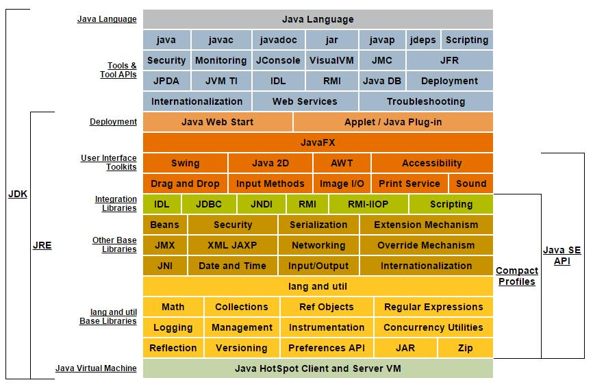


## JDK安装

> JDK安装路径下的目录解释
> * bin目录：该目录用于存放一些可执行程序。
>   * 如javac.exe（java编译器）、java.exe(java运行工具)，jar.exe(打包工具)和 javadoc.exe(文档生成工具)等。
> * db目录：db目录是一个小型的数据库。
>   * 从JDK 6.0开始，Java中引用了一个新的成员JavaDB，这是一个纯Java实现、开源的数据库管理系统。这个数据库不仅轻便，而且支持JDBC 4.0所有的规范，在学习JDBC 时，不再需要额外地安装一个数据库软件，选择直接使用JavaDB即可。
> * jre目录：此目录是Java运行时环境的根目录，它包括Java虚拟机，运行时的类包，Java应用启动器以及一个bin目录，但不包含开发环境中的开发工具。
> * include目录：由于JDK是通过C和C++实现的，因此在启动时需要引入一些C语言的头文件，该目录就是用于存放这些头文件的。
> * lib目录：lib是library的缩写，意为Java类库或库文件，是开发工具使用的归档包文件。
> * src.zip文件：src.zip为src文件夹的压缩文件，src中放置的是JDK核心类的源代码，通过该文件可以查看Java基础类的源代码。

环境变量配置问题
1. path 配置的是可执行的文件,如`javac,java`，配置后可以在不同的盘符下访问path路径下的可执行文件。
2. classpath 配置的是要执行的java字节码文件（.class文件）的目录。如果指定某个目录，那么在命令行使用`java ***`来执行 `***`文件 时，总是会去这个指定的目录找该文件；如果不指定，就是在当前目录。一般用IDE开发，不用配置这个。如果想先在当前目录、再到指定目录找该文件，可以配置classpath为`.;/xxx/xxx`

## 第一个Java程序
### 注释
先用注释写思想，再写代码来实现。代码仅仅是为了实现思想的。
> Java中注释分类
> * 单行注释  `//注释文字`
> * 多行注释  `/* 注释文字 */`
> * 文档注释  `/** 注释文字 */`
    1. 类前：
    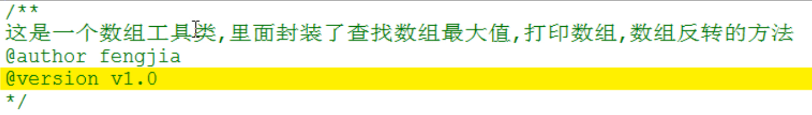
    2. 方法前：
    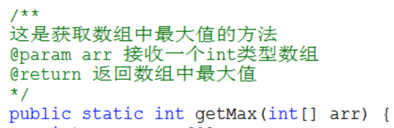
    3. 可以使用 javadoc工具 来生成文档说明书。如：
    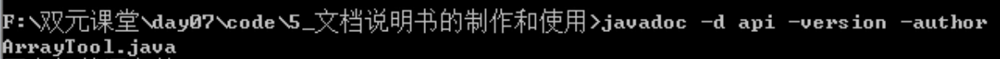


### 关键字
> [官方说明](https://docs.oracle.com/javase/tutorial/java/nutsandbolts/_keywords.html)

- 用于定义数据类型的关键字				
	class interface	enum byte short
	int	long float double char
	boolean	void			
- 用于定义流程控制的关键字				
	if else	switch case	default
while do for break continue
	return				
- 用于定义访问权限修饰符的关键字				
	private	protected public		
- 用于定义类，函数，变量修饰符的关键字			
	abstract final static synchronized	
- 用于定义类与类之间关系的关键字				
	extends	implements		
- 用于定义建立实例及引用实例，判断实例的关键字		
	new	this super instanceof	
- 用于异常处理的关键字				
	try	catch finally throw	throws
- 用于包的关键字				
	package	import			
- 其他修饰符关键字				
	native strictfp	transient volatile assert

> true, false, null像是关键字，但其实是字面量。	
> goto和const是Java保留字，即现有Java版本尚未使用、但以后版本可能会作为关键字使用。

### 标识符
Java标识符的组成规则
- 英文大小写字母
- 数字字符
- $和_ 

Java常用的标识符命名规则
- A:包
  - 最好是域名倒过来,要求所有的字母小写 
- B:类或者接口
  - 如果是一个单词首字母大写
  - 如果是多个单词每个单词首字母大写(驼峰标识) 
- C:方法或者变量
  - 如果是一个单词全部小写
  - 如果是多个单词,从第二个单词首字母大写 
- D:常量
  - 如果是一个单词,所有字母大写
  - 如果是多个单词,所有的单词大写,用下划线区分每个单词

### 约定俗成的书写格式
- 大括号要对齐,并且成对写
- 左大括号前面有空格
- 遇到左大括号要缩进,Tab
- 方法和程序块之间加空行让程序看起来清晰
- 并排语句之间加空格,例如for语句
- 运算符两侧加空格

## 基础语法
### 不同进制数据的写法
二进制：0b/0B + ... （JDK 1.7后可以直接这样写二进制了）
八进制：0 + ...
十六进制：0x/0X + ... abcdef使用大小写均可

### 数据类型
> 原码、反码、补码（数字运算和存储形式）：
> * 进行强制类型转换时，需要明白原反补。
> * 一个数字的原反补符号位均相同。
> 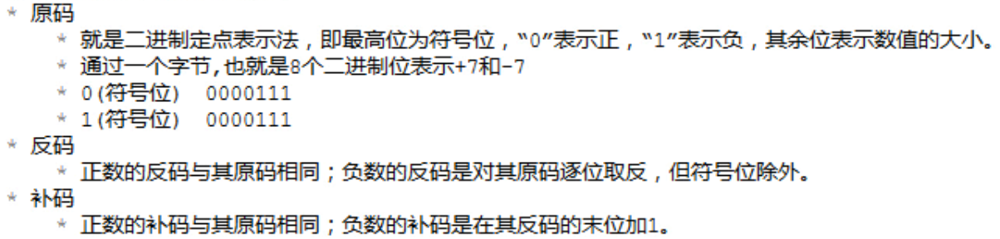
> 一字节中：补码表示范围是-128到+127，所以 -128的补码应该是10000000；原码的取值范围为-127到+127，反码也是，所以-128没有反码和原码（强调是一个字节中）。

> 参考：[深入理解机器码（原码，反码，补码）和算术溢出](https://www.jianshu.com/p/ffc97c4d2306)


Java是强类型语言。

数据类型分类：
* 基本数据类型（4类8种）
    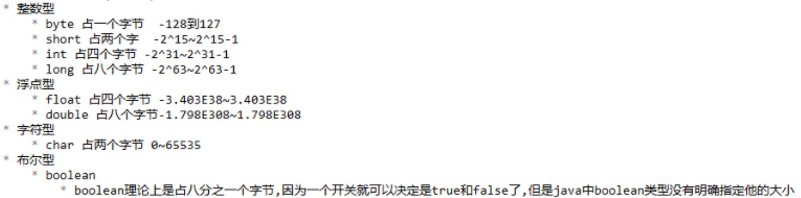
    
    * 各类型有固定的字段长度，不受具体 OS 的影响，以保证 java 程序的可移植性。
    
      > 可是使用如`Integer.SIZE`查看（除了Boolean）
    
    * 对于字面量，整数默认是int类型，浮点数默认是double类型。
    
      如果一个整数字面量过大（超过int类型能表示的最大值2147483647）会报错，比如直接写8888888888是不合法的，此时该数字要显式表示为long类型，即常量数字后要加`L(l)`; 
      而给float类型变量赋值，小数字面量后要加`F(f)`，因为默认是double，不写会报错。
    
      > 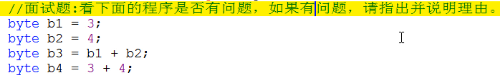
      第3行错误，byte与byte/short/char进行运算会提升为int，此时结果就不能直接赋值给int型变量。进行混合运算时，byte，short，char不会相互转换，都会自动类型提升为int类型。
      第4行正确，Java编译器有常量优化机制，编译时直接算出`3 + 4`的值，判断是否符合范围要求。
      `b1++`没有错，底层是`b1 = (byte)(b1 + 1)`；`b1 += 1`也类似。
    
    * float表示的数据范围比long大。
    
    * Java语言使用Unicode编码，每个字符占两个字节；中文也是，一个char类型变量可以存储一个中文汉字。
    
* 引用数据类型
  数组,类,接口,枚举

### 运算符
**基本运算符**：
`+`：可以做字符串连接运算符，**任何数据类型**用+与字符串相连接都会产生新的字符串。
`%`：`a % b = ?` 结果的符合要看a的符号，值为`|a| % |b|`

**比较运算符**
`instanceof`: 检查是否是类的对象，如 `"Hello" instanceof String;  //true`

**逻辑运算符**：

- &,|,^,!
- &&,|| 
> ^ 逻辑异或:相同为false，不同为true。

>  &&和&的区别:
> - 最终结果一样。
> - &&具有短路效果。

**位运算符**：
&,|,^,~ ,>>,>>>,<<

> 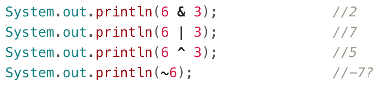
位运算符都是在变量在内存中的表示（补码）的基础上做运算。

> 位异或 运算符：一个数据对另一个数据位异或两次，该数本身不变。`a ^ b ^ b = a`
> 实现两个整数变量的交换：`x = x ^ y; y = x ^ y; x = x ^ y;`

> `<<`:左移	左边最高位丢弃，右边补齐0
> 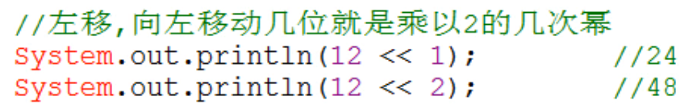
`>>`:右移 最高位是0，左边补齐0;最高为是1，左边补齐1
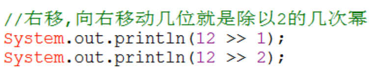
`>>>`:无符号右移 无论最高位是0还是1，左边补齐0
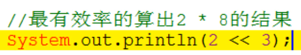
> byte类型在做位运算时，也会先转化为int型再计算，然后再舍去高位。
> 所以：负的byte进行 >> 与 >>> 时（位移不超过24位），结果相同，因为位移前转换为int型时前面要补1.

### 流程控制语句
**键盘录入**
`Scanner input = new Scanner(System.in)`

**选择**


`switch(表达式)`：
- 基本数据类型可以接收byte，short，char，int；
- 引用数据类型可以接收枚举（JDK 1.5）和String（JDK 1.7）。
- case后面只能是常量，不能是变量。

**循环**
`break outer;`可以跳出多层循环，outer写成合法的标识符即可。

一个练习：
```java
for(int x=1; x<=10; x++) {
    if(x%3==0) {
        //在此处填写代码
    }
    System.out.println(“Java基础班”);
}

//我想在控制台输出2次:“Java基础班“
//我想在控制台输出7次:“Java基础班“
//我想在控制台输出13次:“Java基础班“	 
```

### 函数（方法）
方法重载（overload）：在同一个类中，方法名相同，参数列表不同。不关注返回值类型。

### 数组
**数组初始化**
1. 动态初始化
   格式：数据类型[] 数组名 = new 数据类型[数组长度];
   > 系统会给出默认初始化值：
   
   `\u0000`：这里的每个0都是16进制的0
   
   > 直接打印输出数组名时，会输出：
   > 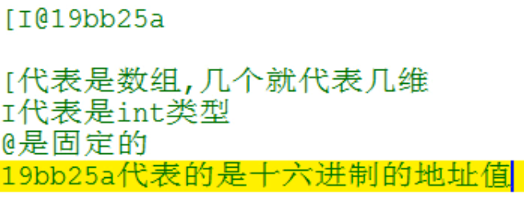
   
2. 静态初始化
   格式：数据类型[] 数组名 = new 数据类型[]{元素1,元素2,…};
   简化格式：数据类型[] 数组名 = {元素1,元素2,…};
3. 内存中的存储形式
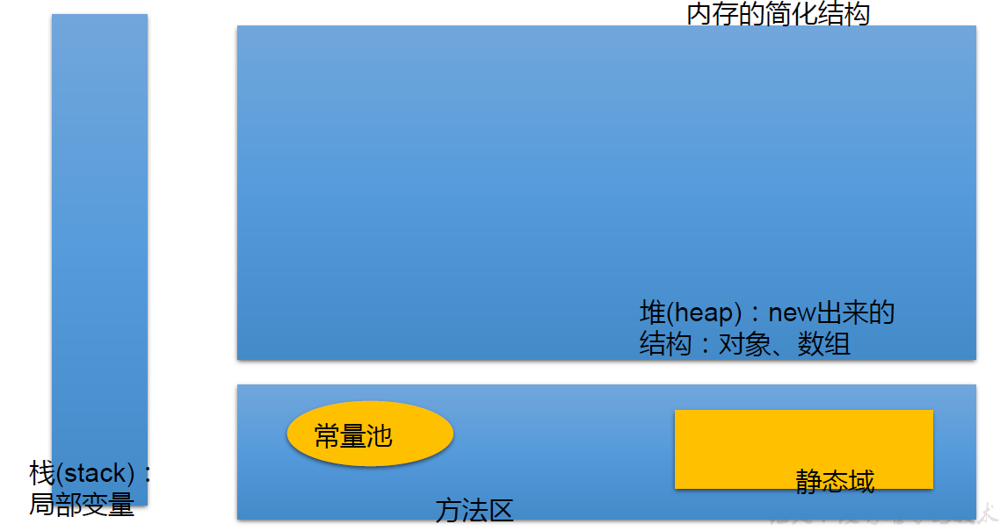

> Java中的内存分配以及栈和堆的区别
> - 栈：存放局部变量（定义在方法声明上（参数）和方法中的变量）
> 栈帧：对应一个加载入栈中未运行完的函数，保存了函数的返回地址和局部变量。
> - 堆：存放new出来的数组或对象（如果没有引用指向该对象，会被Java中的垃圾回收机制（不定时）回收）
> - 方法区（代码区）：存放字节码文件（运行时类对象）。分成两块：静态区（共享区，共性）和非静态区（特性）。（还有个常量池）
> - 本地方法区：操作系统相关。
> - 寄存器：给CPU使用。

三个变量引用两个数组的内存图示：
    

**二维数组**
1. 格式：
动态初始化 `int[][] arr = new int[3][2];`
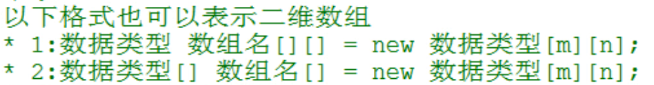
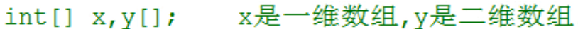

> Java二维数组中各个一维数组的长度可以不同。
> 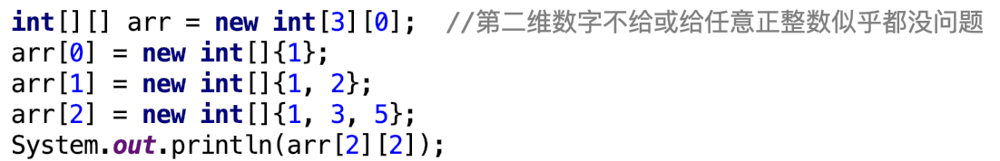
