## 面向对象概述
### 面向对象思想
面向对象思想特点：将我们从执行者变成了指挥者。
面向对象开发：就是不断地创建对象、使用对象、指挥对象做事情。
面向对象设计：其实就是在管理和维护对象之间的关系。 
面向对象特征：封装(encapsulation)，继承(inheritance)，多态(polymorphism)

### 类与对象概述
成员变量就是事物的属性；
成员方法就是事物的行为。

创建对象并使用：`类名 对象名 = new 类名();`
使用成员变量：`对象名.变量名`
使用成员方法：`对象名.方法名(...)`

### 对象的内存图
三个引用两个对象的内存图:
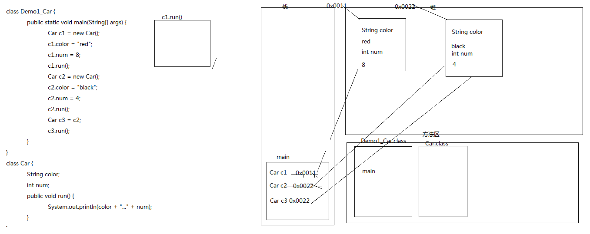

### 匿名对象
即没有名字的对象。

应用场景：
1. 调用方法，仅仅只调用一次的时候。可以节省代码。调用多次的时候不适合。
   匿名对象调用完毕就是垃圾。可以被垃圾回收器回收。
2. 作为实际参数传递。

## 封装
指隐藏对象的属性和实现细节，仅对外提供公共访问方式。

### private关键字
private仅仅是封装的一种体现形式,不能说封装就是私有；只要限制访问，就是一种封装。

### this关键字
>JavaBean是一个遵循特定写法的Java类，它通常具有如下特点：
>- 这个Java类必须具有一个无参的构造函数
>- 属性必须私有化。
>- 私有化的属性必须通过public类型的方法暴露给其它程序，并且方法的命名也必须遵守一定的命名规范（getter/setter）。

### 构造方法
如果我们没有给出构造方法，系统将自动提供一个无参构造方法。
如果我们给出了构造方法，系统将不再提供默认的无参构造方法。
  - 注意：这个时候，如果我们还想使用无参构造方法，就必须自己给出。建议永远自己给出无参构造方法。

>任何方法都有return语句，构造方法也一样，只是没有具体的返回值或返回值为void，你不写时系统会给你加上。

创建一个对象时，会先对属性进行显式初始化，再调用构造方法初始化。

### static关键字
共性用static，特性不用。

内存图示：
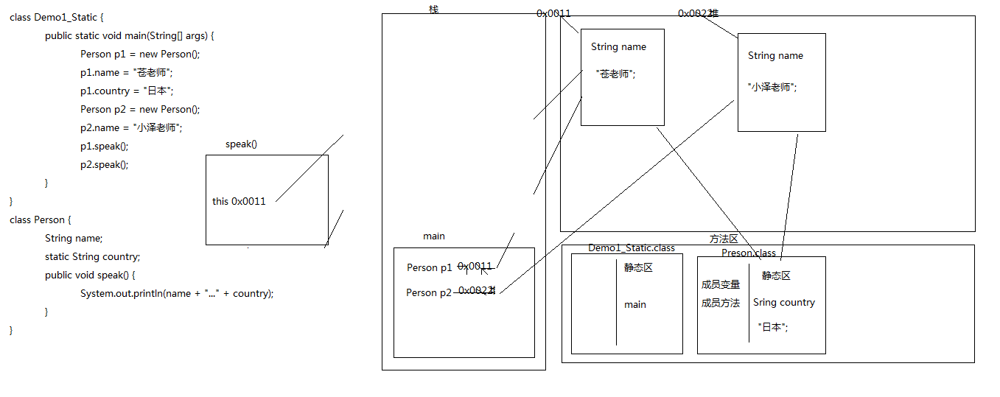

静态变量也叫类变量，它被类的所有对象共享。不用static修饰的叫做成员变量。

类名和对象名都可以调用静态变量和静态方法，一般用类名。

静态方法只能访问静态的成员变量和静态的成员方法。

>如果一个类中所有方法都是静态的，那么也无需创建对象了，直接用类名调用即可。
>一般需要多做一步：**私有构造方法**。目的是不让其它类创建本类对象。
>一般工具类（如Math类）是这种形式。

>java.lang包中的类不用导包。

### 代码块（面试的时候会问）
在Java中，使用{}括起来的代码被称为代码块。

分类：
- 局部代码块 
  - 在方法中出现；能限定变量生命周期；及早释放，提高内存利用率。
- 构造代码块 (初始化块)
  - 在类中方法外出现；多个构造方法中相同的代码存放到一起，每次调用构造方法时（创建对象）都执行，并且在构造方法前执行。
  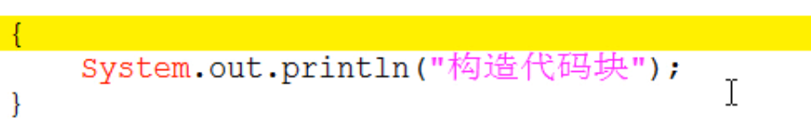
- 静态代码块 
  - 在类中方法外出现，并加上static修饰；用于给类进行初始化，在类加载的时候就执行，并且只执行一次。
  - 一般用于加载驱动
  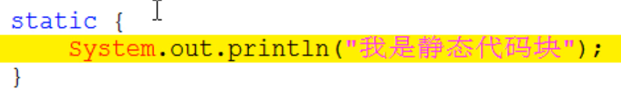
  
- 同步代码块

## 继承
什么时候使用继承？
- 继承其实体现的是一种关系："is a"。
- 如果有两个类A,B。只有他们符合A是B的一种，或者B是A的一种，才考虑使用继承。

继承的弊端
- 类的耦合性增强了。
  
  > 开发的原则：高内聚，低耦合。
    - 耦合：类与类的关系。
    - 内聚：就是自己完成某件事情的能力
  

Java只支持单继承，不支持多继承。但支持多层继承(继承体系)。
- 如果想用这个体系的所有功能用最底层的类创建对象
- 如果想看这个体系的共性功能,看最顶层的类。Object类是所有类最顶层的父类。

super:代表当前对象父类的引用。（this:代表当前对象的引用,谁来调用我,我就代表谁）
- super.成员变量 调用父类的成员变量
- super(...) 调用父类的构造方法
- super.成员方法 调用父类的成员方法

子类中所有的构造方法默认都会访问父类中空参数的构造方法。
- 其实，每一个构造方法的第一条语句默认都是：`super();`。不写时系统会默认加上。 
- 如果父类没有无参构造方法,子类构造方法中要显式写出有参的super()方法。
- super(…)或者this(…)必须出现在构造方法的第一条语句上（因此不能共存）。

>看程序写结果：
```java
class Fu {
    static {
        System.out.println("静态代码块Fu");
    }

    {
        System.out.println("构造代码块Fu");
    }

    public Fu() {
        System.out.println("构造方法Fu");
    }
}

class Zi extends Fu {
    static {
        System.out.println("静态代码块Zi");
    }

    {
        System.out.println("构造代码块Zi");
    }

    public Zi() {
        System.out.println("构造方法Zi");
    }
}

Zi z = new Zi(); 
//请写出执行结果。
```
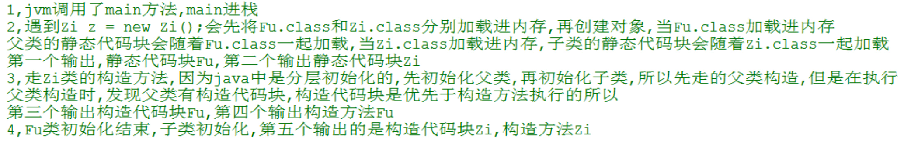

继承中的成员方法关系：
* 同名方法会覆盖（重写，override）；
    * 当子类需要父类的功能，而功能主体子类有自己特有内容时，可以重写父类中的方法。这样，即沿袭了父类的功能，又定义了子类特有的内容。
    * 返回值类型可以是子父类 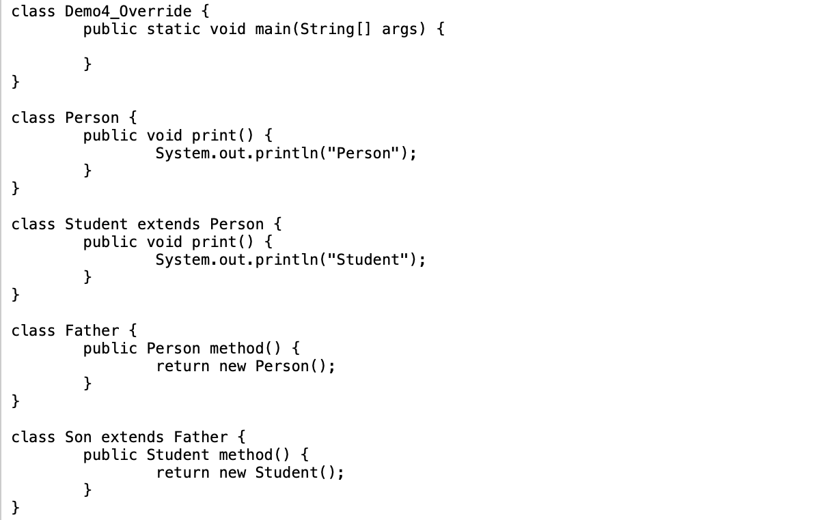
    * 子类重写父类方法时，访问权限不能更低，最好就一致。（儿子不能比父亲差）
    * 父类静态方法，子类也必须通过静态方法进行重写。

### final关键字
final修饰特点
- 修饰类，类不能被继承
- 修饰变量，变量就变成了常量，只能被赋值一次，一般与public static共用。该变量会放在内存方法区中的常量池内。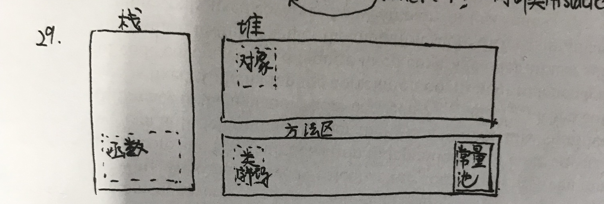
    - 引用类型的变量，是地址值不能被改变，引用的部分里的内容可以改变。
    - 如果成员变量被final修饰，必须在对象构造完毕（构造方法结束）前主动显式初始化（可以在定义时，也可以在构造方法中，或构造代码块中），且只能初始化一次。
    - 类似的，类变量被final修饰，可以在定义时初始化，也可以在静态代码块中初始化。
- 修饰方法，方法不能被重写

## 多态
多态中的成员访问特点：
* 成员变量：编译看左边(父类)，运行看左边(父类)。不过一般父类包含的属性，子类也不用再去定义，所以不用在意这点。
  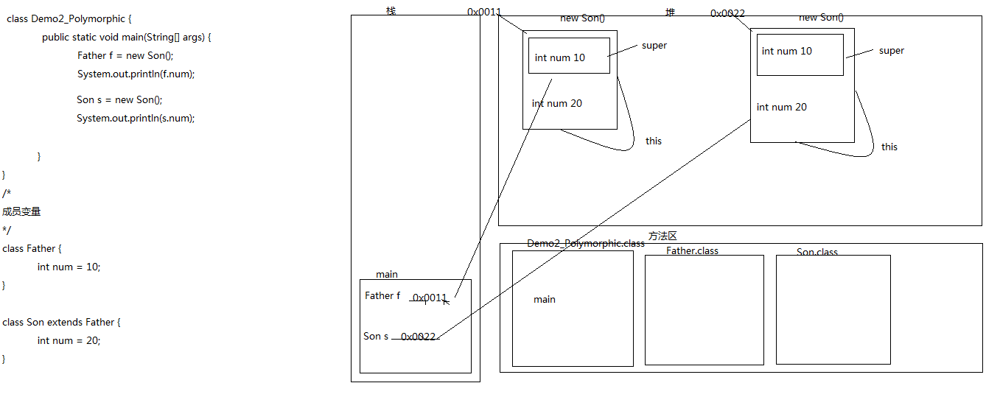

* 成员方法：编译看左边(父类)，运行看右边(子类)。因为针对成员方法有**动态绑定**机制。
  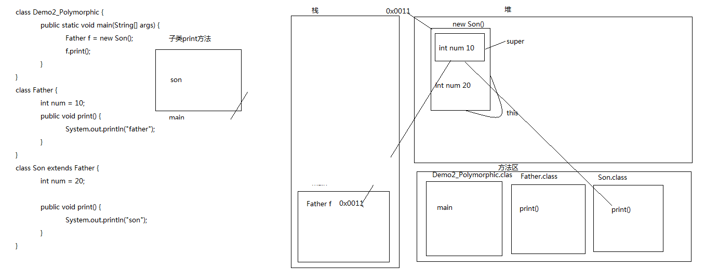

* 静态方法：用对象访问静态方法等价于使用类名访问，不存在动态绑定问题；这里就看声明变量时写的类型。

  ```java
  Father s = new Son();
  s.f();  // f()是静态方法，当Son重写了Father中的f()时，调用哪个看s定义时声明的类型
  ```

  

向上转型和向下转型


>看下面程序是否有问题，如果没有，说出结果
```java
class A {
    public void show() {
        show2();
    }
    public void show2() {
        System.out.println("我");
    }
}
class B extends A {
    public void show2() {
        System.out.println("爱");
    }
}
class C extends B {
    public void show() {
        super.show();
    }
    public void show2() {
        System.out.println("你");
    }
}
public class Test2DuoTai {
    public static void main(String[] args) {
        A a = new B();
        a.show();  //爱；把父类的方法“拿下来”考虑

        B b = new C();
        b.show();  //你
    }
}
```

> 另一个程序

```java
class Father {
    public int a = 3;
    public void f() {
        System.out.println(a);
    }
}

class Son extends Father {
    public static int a = 4;
    /*public static void f() {
        System.out.println(a);
    }*/
}

public class TestDuoTai {
    public static void main(String[] args) {
        Father s = new Son();
        s.f();  // 结果为3，虽然把Father中的f()拉了下来，但是a还是引用的Father中的a
    }
}
```


## 抽象类

>抽象类和普通类差不多，就是可能多了抽象方法。

当你无法描述一个方法时，就把它定义为抽象的。
抽象类和抽象方法必须用abstract关键字修饰
- abstract class 类名 {}
- public abstract void eat();
>- 抽象方法 强制要求子类做的事情。
>- 非抽象方法 子类继承的事情，提高代码复用性。

抽象类不一定有抽象方法，有抽象方法的类一定是抽象类或者是接口。
>一个类如果没有抽象方法，定义为抽象类的目的是不创建本类对象。

抽象类不能实例化，由具体的子类实例化。

抽象类有构造方法，用于子类访问父类数据的初始化。

>面试题：abstract不能和哪些关键字共存?
>修饰类时：final
>修饰方法时:private,final,static
>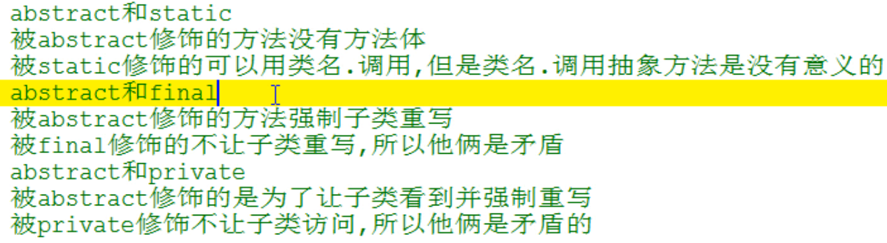

## 接口
interface：只包含抽象方法的类
接口的子类一般是具体类，要重写接口中的所有抽象方法。

- 成员变量；只能是常量，并且是静态的并公开的。
  - 默认修饰符：public static final
    - 建议：自己手动给出。
- 构造方法：接口没有构造方法。
- 成员方法：只能是抽象方法。
  - 默认修饰符：public abstract
    - 建议：自己手动给出。

一个类可以在继承另一个类的同时实现多个接口。
接口可以单继承接口，也可以多继承接口（使用extends）。

设计理念区别
- 抽象类 被继承体现的是：”is a”的关系。抽象类中定义的是该继承体系的共性功能。
- 接口 被实现体现的是：”like a”的关系。接口中定义的是该继承体系的扩展功能。

## 包
package:其实就是文件夹。

编译运行带包的类
- a:javac编译的时候带上-d即可（指定生成目录）
  - javac -d . HelloWorld.java  //在.java文件所在目录下
- b:通过java命令执行。
  - java 包名.HellWord  //在包最顶层文件夹下

> 在开发中，一般用import都是导入具体的类名，比较少用*。

### 四种权限修饰符
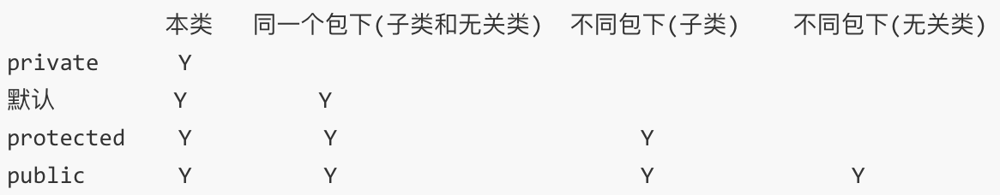

## 内部类
内部类访问特点
- a:内部类可以直接访问外部类的成员，包括私有。
- b:外部类要访问内部类的成员，必须创建对象，此时连内部类中声明为私有的变量和方法也可以访问。
- 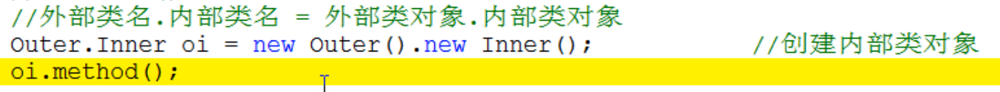


### 私有成员内部类：

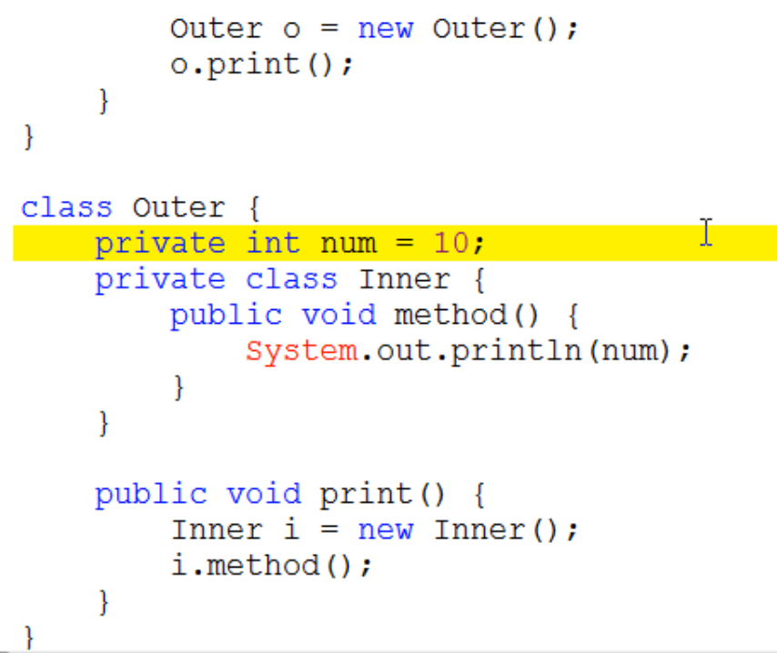


### 静态成员内部类：

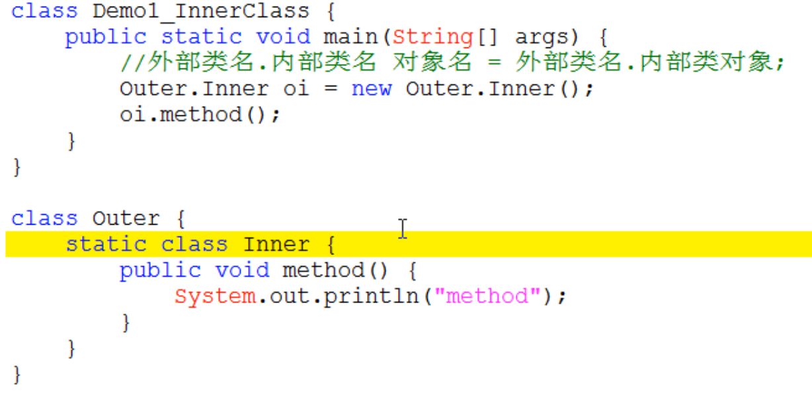
这里`new Outer.Inner();`只是写法习惯，实际上是`Outer.new Inner();`

>面试题
>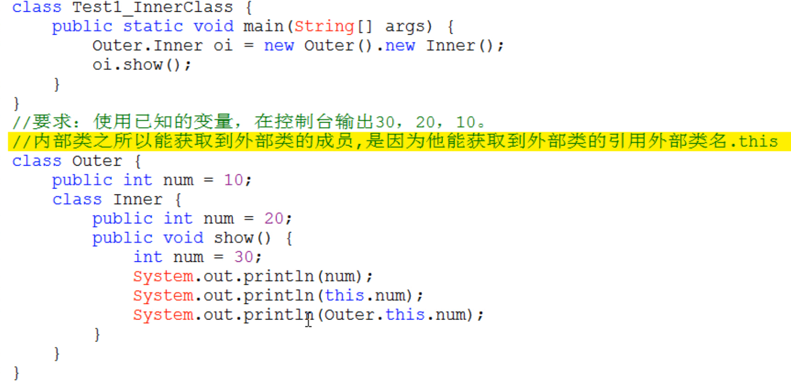


### 局部内部类：

在方法中定义的内部类；只能在其所在的方法中访问。

局部内部类访问局部变量必须用final修饰
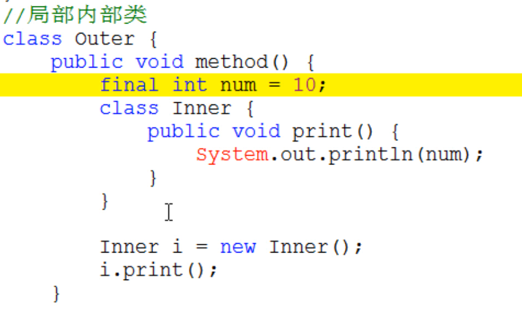
>为什么要这样？
>因为当调用这个方法时,局部变量如果没有用final修饰,他的生命周期和方法的生命周期是一样的,当方法弹栈,这个局部变量也会消失,那么如果局部内部类对象还没有马上消失想用这个局部变量,就没有了,如果用final修饰会在类加载的时候进入常量池,即使方法弹栈,常量池的常量还在,也可以继续使用
>
>但是jdk1.8可以不写final；如果在书写代码时候,没有手动添加,系统底层也会默给你加上final


### 匿名内部类：

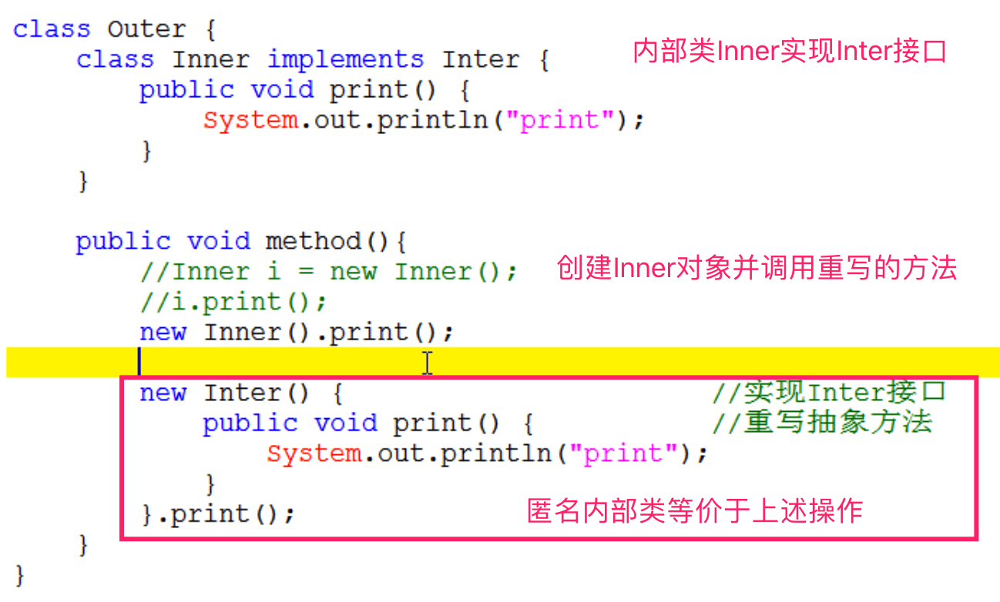
本质是一个继承了该类或者实现了该接口的子类匿名对象。

匿名内部类一般只针对重写一个方法时使用。
实际开发中主要当作参数传递。
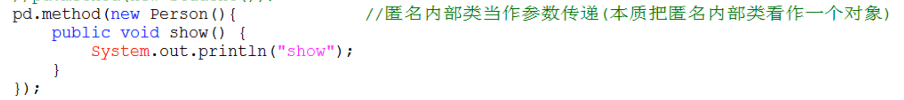

>面试题
>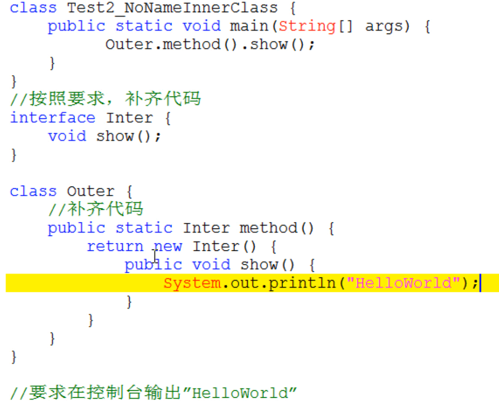

>匿名内部类在编译后，也会生成字节码文件，文件名为`外部类名$编号.class`（如果是一般内部类，生成的文件为`外部类名$内部类名.class`）
>

