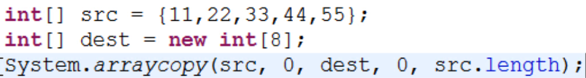

## Object类
类层次结构的根类，所有类都直接或者间接的继承自该类。
`public int hashCode()`方法
- 返回该对象的哈希码值。默认情况下，该方法会根据对象的地址来计算。
- 不同对象，hashCode()一般来说不会相同。但是，同一个对象的hashCode()值肯定相同。

`public final Class getClass()`

- 返回此 Object 的运行时类（字节码文件）对象。
- 可以通过Class类中的方法，获取对象的真实类的全名称或简单名称。	
  - public String getName()
  - public String getSimpleName()

`public String toString()`

- 默认返回`getClass().getName() + "@" + Integer.toHexString(hashCode()) `  //hashcode的十六进制写法
- 如果需要，一般会重写该方法

`public boolean equals(Object obj)`
- 默认情况下比较的是对象的引用是否相同。
- 由于比较对象的引用没有意义，一般建议重写该方法来比较对象中的属性。

>native修饰符 即JNI,Java Native Interface(Java本地接口),表示调用本地C代码。

## System类

包含一些有用的类字段和方法。它不能被实例化。
### 成员方法
* public static void gc() //主动调用时，运行垃圾回收器,相当于呼喊保洁阿姨。那些已成为垃圾的对象会调用自己的finalize()，这是继承自Object类的方法，可以重写，不过一般不需要。
* public static void exit(int status) //0是正常退出JVM，非0状态是异常终止退出jvm
* public static long currentTimeMillis() //获取当前时间的毫秒值，**常用**
* public static long nanoTime()  //获取当前时间的纳秒值（精度要求更高时使用）
* pubiic static void arraycopy(Object src, int srcPos, Object dest, int destPos, int length) //将数组内容拷贝 

