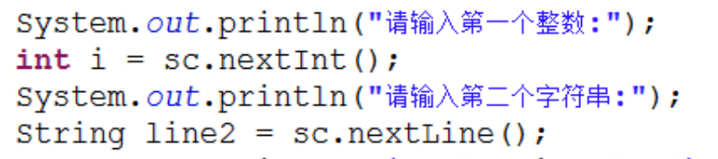
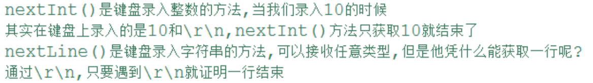

## Scanner的构造方法原理

- `Scanner(InputStream source)`
经常会传入System类下一个静态的字段：
  - `public static final InputStream in;` 标准的输入流，对应着键盘录入。

## 一般方法

- hasNextXxx()  判断是否还有下一个输入项,其中Xxx可以是Int,Double等。

  如果需要判断是否包含下一个单词（以空格作为分隔），则可以省略Xxx

- nextXxx()  获取下一个输入项。Xxx的含义和上个方法中的Xxx相同。

两个常用的方法：
- public int nextInt():获取一个int类型的值
- public String nextLine():获取一个String类型的值

>一个问题
>
>此时line2是空串
>
>解决方法：把所有的数据都先按照字符串获取，然后要什么，你就对应的转换为什么。
```java
Scanner sc = new Scanner(System.in);
        int a = Integer.parseInt(sc.nextLine());
        String b = sc.nextLine();
        System.out.println(a + 1);
        System.out.println(b);
```

>另一个问题
```java
import java.util.*;
public class ScannerKeyBoardTest
{
    public static void main(String[] args)
    {
        System.out.println("请输入若干单词，以空格作为分隔");
        Scanner sc = new Scanner(System.in);
        while(sc.hasNext())
        {
            System.out.println("键盘输入的内容是：" + sc.next());
        }
        System.out.println("执行吗");
    }
}
```
对于如下代码，while循环不能结束。原因是：当执行到hasNext()时，它会先扫描缓冲区中是否有字符，有则返回true,继续扫描。直到扫描为空，这时并不返回false,而是将方法阻塞，等待你输入内容然后继续扫描。
如果想要跳出循环，可以在最后加一个代表结束的符号，代码中判断是否输入了结束符。可以用if语句，也可以用`while(!sc.hasNext("#"))  //匹配#返回true,然后取非运算。即以#为结束符号`

