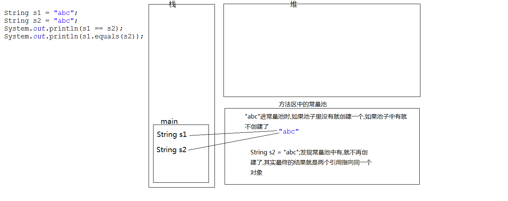
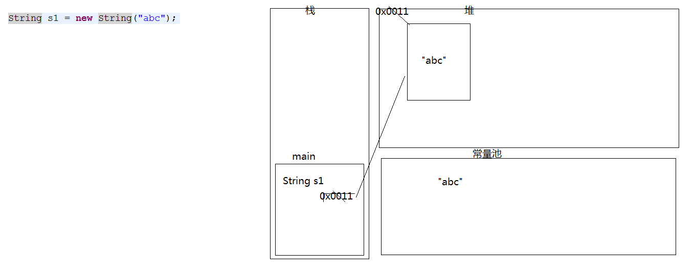
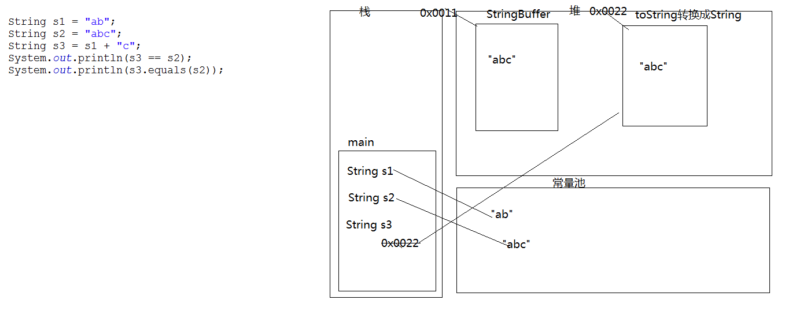

>字符串字面值"abc"也可以看成是一个字符串对象。
>字符串是常量，一旦被赋值，就不能被改变。

### 构造方法
- public String():空构造
- public String(byte[] bytes):把字节数组转成字符串
- public String(byte[] bytes, Charset charset):使用指定的字符集把字节数组转成字符串
- public String(byte[] bytes,int index,int length):把字节数组的一部分转成字符串
- public String(char[] value):把字符数组转成字符串
- public String(char[] value,int index,int count):把字符数组的一部分转成字符串
- public String(String original):把字符串常量值转成字符串

>关于String类的常见面试题
- 1.判断定义为String类型的s1和s2是否相等
  - String s1 = "abc";
  - String s2 = "abc";
  - System.out.println(s1 == s2);  //true				
  - System.out.println(s1.equals(s2)); 	//true
  
- 2.下面这句话在内存中创建了几个对象?
  - String s1 = new String("abc");  //2，这里使用了new，要进堆内存
  
- 3.判断定义为String类型的s1和s2是否相等
  - String s1 = new String("abc");			
  - String s2 = "abc";
  - System.out.println(s1 == s2);  //false		
  - System.out.println(s1.equals(s2));  //true
- 4.判断定义为String类型的s1和s2是否相等
  - String s1 = "a" + "b" + "c";
  - String s2 = "abc";
  - System.out.println(s1 == s2);  //true,常量优化机制		
  - System.out.println(s1.equals(s2));  //true
- 5.判断定义为String类型的s1和s2是否相等
  - String s1 = "ab";
  - String s2 = "abc";
  - String s3 = s1 + "c";  //底层会在堆内存中创建一个StringBuilder或StringBuffer来做字符串连接，再转换成String
  - System.out.println(s3 == s2);  //false
  - System.out.println(s3.equals(s2));  //true
  

### 判断功能
- boolean equals(Object obj):比较字符串的内容是否相同,区分大小写
- boolean equalsIgnoreCase(String str):比较字符串的内容是否相同,忽略大小写
- boolean contains(String str):判断大字符串中是否包含小字符串
- boolean startsWith(String str):判断字符串是否以某个指定的字符串开头
- boolean endsWith(String str):判断字符串是否以某个指定的字符串结尾
- boolean isEmpty():判断字符串是否为空。

### 获取功能
- int length():获取字符串的长度。
- char charAt(int index):获取指定索引位置的字符
- int indexOf(int ch):返回指定字符在此字符串中第一次出现处的索引；参数接收的是int类型，传递char类型会自动提升。
- int indexOf(String str):返回指定字符串在此字符串中第一次出现处的索引。
- int indexOf(int ch,int fromIndex):返回指定字符在此字符串中从指定位置后第一次出现处的索引。
- int indexOf(String str,int fromIndex):返回指定字符串在此字符串中从指定位置后第一次出现处的索引。
    - lastIndexOf(...):从右向左找
- String substring(int start):从指定位置开始截取字符串,默认到末尾。
- String substring(int start,int end):从指定位置开始到指定位置结束截取字符串（左闭右开）。

### 转换功能
- byte[] getBytes():把字符串转换为字节数组。
- byte[] getBytes(Charset charset)
- char[] toCharArray():把字符串转换为字符数组。
- static String valueOf(char[] chs):把字符数组转成字符串。
- static String valueOf(int i):把int类型的数据转成字符串。
  - 注意：String类的valueOf方法可以把任意类型的数据转成字符串
- String toLowerCase():把字符串转成小写。
- String toUpperCase():把字符串转成大写。
- String concat(String str):把字符串拼接。

### 其他功能
替换功能
- String replace(char old,char new)
- String replace(String old,String new)

去除字符串两侧空格
- String trim()

按字典顺序比较两个字符串
- int compareTo(String str)
- int compareToIgnoreCase(String str)

格式化输出
- public static String format(String format, Object... args)  [JAVA字符串格式化-String.format\(\)的使用](https://www.cnblogs.com/Dhouse/p/7776780.html)

### 利用正则表达式
匹配：public boolean matches(String regex)
分割：public String[] split(String regex)
替换：public String replaceAll(String regex, String replacement)