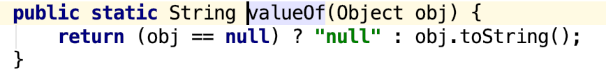

> StringBuilder类线程不安全，效率高，其它方面与StringBuffer都一样。
> String是不可变的字符序列，StringBuilder和StringBuffer是可变的字符序列。

## StringBuffer类
### 构造方法：
* `public StringBuffer()`:无参构造方法,构造一个不带字符的字符串缓冲区，其初始容量为16个字符
* `public StringBuffer(int capacity)`:指定容量的字符串缓冲区对象；如果使用时超出容量，会自动增大
* `public StringBuffer(String str)`:指定字符串内容的字符串缓冲区对象

### String与StringBuffer的转换：
1. String --> StringBuffer
* a:通过构造方法
* b:通过append()方法（推荐）
2. StringBuffer --> String
* a:通过构造方法
* b:通过toString()方法 （推荐）
* c:通过`a.subString(0, a.length())`;

### 常用方法：
* `public int capacity()`：返回当前容量。（理论值） 
* `public int length()`:返回长度（字符数）。（实际值） 
* `public String toString()`:
#### 添加功能
* `public StringBuffer append(String str)`:
	* 可以把任意类型数据添加到字符串缓冲区里面(如果是Object，利用`String.valueOf(obj)`解析为字符串),并返回字符串缓冲区本身 
    
#### 插入功能
* public StringBuffer insert(int offset,String str):
	* 在指定位置把任意类型的数据插入到字符串缓冲区里面,并返回字符串缓冲区本身
#### 删除功能
* public StringBuffer deleteCharAt(int index):
	* 删除指定位置的字符，并返回本身
* public StringBuffer delete(int start,int end):
	* 删除从指定位置开始到指定位置结束的内容（左闭右开），并返回本身
#### 替换功能
* public StringBuffer replace(int start,int end,String str):
	* 从start开始到end用str替换
#### 反转功能
* public StringBuffer reverse():
	* 字符串反转
#### 截取功能
* public String substring(int start):
	* 从指定位置截取到末尾
* public String substring(int start,int end):
	* 截取从指定位置开始到结束位置，包括开始位置，不包括结束位置
