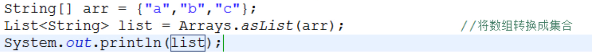
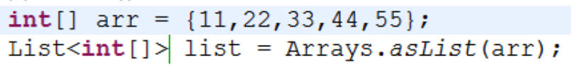

>针对数组进行操作的工具类

#### 数组转字符串
public static String toString(int[] a)  //参数也有其它基本类型和Object[]
#### 数组排序
public static void sort(int[] a)
#### 二分查找
public static int binarySearch(int[] a,int key) //如果key包含在数组中，返回key的索引，否则返回 （- 插入点 - 1）
#### 其它
public static boolean equals(int[] a,int[] b)  //判断两个数组是否相等。
public static void fill(int[] a,int val)  // 将指定值填充到数组之中。
#### 数组转换成集合
static <T> List<T> asList(T... a)
>
>将数组转换成集合的好处，主要是可以使用集合中的方法

>数组元素必须是引用数据类型；8个基本类型构成的数组作为参数传入时，会被当做一个引用类型的对象
>

>转换后得到的集合不可改变

#### 数组拷贝
public static <T> T[] copyOf(T[] original, int newLength)
public static <T> T[] copyOfRange(T[] original, int from, int to)  //包括from，不包括to
```java
Integer[] arr2 = Arrays.copyOf(arr1, arr1.length);
Comparable[] aux = Arrays.copyOfRange(arr, l, r+1);
```