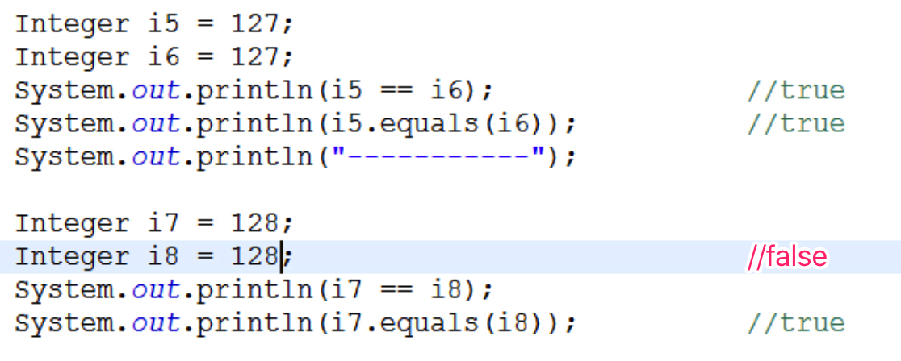

>基本数据类型封装成对象的好处在于可以在对象中定义更多的功能方法操作该数据。

基本类型和包装类的对应
	byte Byte
	short Short
	int Integer
	long Long
	float Float
	double Double
	char Character
	boolean Boolean

### 以Integer类作为示例
#### 构造方法
public Integer(int value)  //将int包装成对象，即装箱
//intValue() 将Integer转换为int，即拆箱。  Jdk1.5开始可以自动装箱和自动拆箱。
public Integer(String s)
#### 常量：
Integer.MAX_VALUE
Integer.MIN_VALUE
#### 十进制转换为其它进制形式的字符串：
Integer.toBinaryString(60)
Integer.toOctalString(60)
Integer.toHexString(60)
#### int与字符串之间的转换：
int --> 字符串
- a:和""进行拼接
- b:String类中的方法：public static String valueOf(int i)

字符串 --> int
- Integer类中的方法：public static int parseInt(String s)
	//基本数据类型包装类有八种,其中七种(除Character外)都有parseXxx的方法,可以将这七种的字符串表现形式转换成基本数据类型
	//字符串到字符的转换通过toCharArray()就可以把字符串转换为字符数组
#### Integer与字符串之间的转换：
Integer --> 字符串
- toString方法

字符串 --> Integer
- Integer类中的方法：public static Integer valueOf(String s)

>面试题
>

