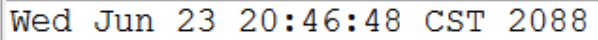

## Date类
表示特定的瞬间，精确到毫秒。大部分方法都由Calendar类代替了，了解以下即可。
### 构造方法
* public Date()  //如果没有传参数代表的是当前时间
* public Date(long date)  //通过毫秒值创建时间对象，如果构造方法中参数传为0代表的是1970年1月1日
### 成员方法
* public long getTime()  //通过时间对象获取毫秒值；如果是当前时间，结果与System.currentTimeMillis()相同
* public void setTime(long time)  //设置毫秒值,改变时间对象
* 重写了toString:会打印如下格式的时间 

## SimpleDateFormat类
### DateFormat类的概述
DateFormat 是日期/时间格式化子类的抽象父类，一般使用其子类SimpleDateFormat来进行**格式化**（日期->文本）、**解析**（文本->日期）和**标准化**。
- DateFormat df = DateFormat.getDateInstance(); //相当于父类引用指向子类对象,右边的方法返回一个子类对象（SimpleDateFormat）
### SimpleDateFormat构造方法
* public SimpleDateFormat() //创建日期格式化类对象，默认格式类似 18-10-31 上午11:33
* public SimpleDateFormat(String pattern)
	如 SimpleDateFormat sdf = new SimpleDateFormat("yyyy/MM/dd HH:mm:ss");
### SimpleDateFormat成员方法
* public final String format(Date date)  //对一个Date类对象格式化为日期/时间字符串
* public Date parse(String source)  //将日期/时间字符串解析成Date类对象
```java
String str = "2000年08月08日 08:08:08";
SimpleDateFormat sdf = new SimpleDateFormat("yyyy年MM月dd日 HH:mm:ss");
Date d = sdf.parse(str);
```

## Calendar类
Calendar 类是一个抽象类，它为特定瞬间与一组诸如 YEAR、MONTH、DAY_OF_MONTH、HOUR 等许多日历字段之间的转换提供了一些方法，并为操作日历字段（例如获得下星期的日期）提供了一些方法。
### 成员方法
* public static Calendar getInstance()
  Calendar c = Calendar.getInstance(); //父类引用指向子类对象（GregorianCalendar）；获得当前时间
* public int get(int field)  //通过字段获取对应的值
  c.get(Calendar.YEAR)  //获取年份 
  c.get(Calendar.MONTH) //月是从0开始编号的
  c.get(Calendar.DAY_OF_MONTH) //几号
  c.get(Calendar.DAY_OF_WEEK) //周日是一周第1天
* public void add(int field,int amount)
  c.add(Calendar.MONTH, -1); //对指定的字段进行向前减或向后加
* public final void set(int year,int month,int date) //这只是一种传入参数的形式
  c.set(2000, 7, 8); //设定年月日，月是从0开始编号的，7是代表8月
  c.set(Calendar.YEAR, 2000); //修改指定字段,这里得到2000年的特定瞬间
  


