>java内部给我们提供了集合类,能存储任意对象,长度是可以改变的.
>集合只能存储引用数据类型(对象)；在存储基本数据类型时会自动装箱。
## 泛型
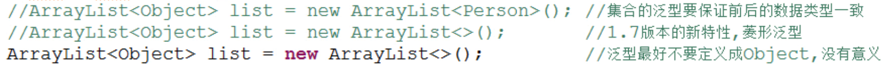
### 泛型类
定义格式 `public class 类名<泛型类型1,…>`
类上的泛型只有在创建对象时才能确定
### 泛型方法
成员方法：
public <T> void show(T t) { //方法泛型最好与类的泛型一致；如果不一致,需要在方法上声明该泛型，并且T在给出参数后才能确定
	System.out.println(t);
}
静态方法：
public static <W> void print(W w) { //静态方法必须声明自己的泛型，因为类上的泛型只有在创建对象时才能确定，静态方法的泛型在调用时确定。用的字母无所谓。

### 泛型接口
* 形式
interface Inter<T> {
	public void show(T t);
}
* 两种实现方式
```java
class Demo implements Inter<String> { //推荐用这种，不过还是要根据实际情况选择
	@Override
	public void show(String t) {
		System.out.println(t);
	}
}
```
```java
class Demo<T> implements Inter<T> { 
	@Override
	public void show(T t) {
		System.out.println(t);
	}
}
```
### 泛型通配符<?>
* 当类型没有明确，可以用？表示任意类型。

	* ? extends E ：固定上边界，向下限定，E及其子类
		Collection<E>类的addAll方法：
		boolean	addAll(Collection<? extends E> c) 
	* ? super E  ：固定下边界，向上限定，E及其父类
		TreeSet(Comparator<? super E> comparator)


## 集合继承体系图
* 单列集合
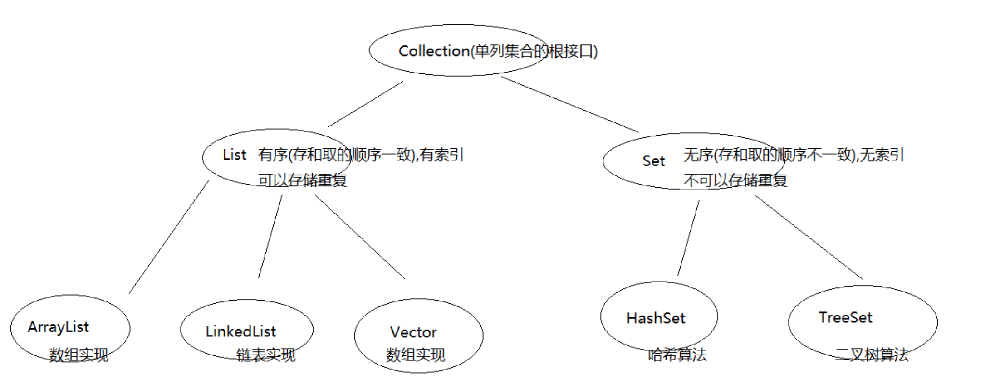

* 双列集合
Map<K,V> （双列集合的根接口）  //与Set的继承体系完全一致，Set底层依赖Map
    - HashMap //底层针对键，使用哈希算法
	    - LinkedHashMap //底层使用了链表
    - TreeMap //底层针对键，使用二叉树算法

## Collection集合
### 基本功能
- boolean add(E e)  //不用范型时可以添加任意对象；添加基本数据类型时会自动装箱;如果是List及其子类调用，始终返回true；如果是Set及其子类调用，当添加已存在元素时，返回false
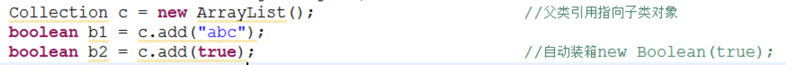
- boolean remove(Object o)  //移除某元素；底层依赖的是equals方法
- void clear()  //清空集合
- boolean contains(Object o)  //判断是否包含某元素；底层依赖的是equals方法
- boolean isEmpty()
- int size()
- toString方法  //重写了toString方法，能列出其中各个元素
### 将集合转换成数组
- toArray() //返回Object[];使用每个数组元素调用其特有的方法时要向下转型
- 另一种使用泛型的： <T> T[] toArray(T[] a)  //T由传入的参数决定
`String[] arr = list.toArray(new String[10]); `  //10为指定的长度
//当集合转换数组时,数组长度如果是小于等于集合的size时,转换后的数组长度等于集合的size
//如果数组的长度大于了size,分配的数组长度就和你指定的长度一样
	

### 带All的功能演示
- boolean addAll(Collection c)  //如果是add(Collection c)，相当于把c这个集合当做元素添加入集合  
- boolean removeAll(Collection c)  //删除交集
- boolean containsAll(Collection c)
- boolean retainAll(Collection c)  //取交集,如果调用的集合改变就返回true,如果调用的集合不变就返回false

### 遍历方法
#### 迭代器遍历
```java
Iterator it = c.iterator(); //获取对c进行迭代的迭代器的引用
while(it.hasNext()) {  //集合中的迭代方法(遍历)
	System.out.println(it.next());
}
```
不同的集合类都可以使用迭代器进行遍历，它们都实现了iterator()。

#### for-each遍历
>for-each也叫增强for，可以简化数组和Collection集合的遍历。
>一般只是用于快速查看各元素，但不进行修改。


## List集合
### 特有功能
* void add(int index,E element)  //传入不正确的索引会出异常
* E remove(int index)  //会返回被删除的元素；remove(111) 表示删除索引为111的元素；这里不是自动装箱，把111看作Interger对象并删除
* E get(int index)
* E set(int index,E element)

>并发修改异常产生的原因及解决方案
>- 使用iterator()迭代（遍历）集合时，如果使用集合方法修改集合（如添加元素），就会产生ConcurrentModificationException
>- 解决方法：
>  1. 迭代器迭代元素，迭代器修改元素
>        - 如果是添加元素，要使用**List特有的ListIterator**的特有功能add添加到最后
>	   ListIterator lit = list.listIterator(); //获取迭代器
>       lit.add("string");  
>      - 如果只是删除元素，使用一般的Iterator就行。当然用ListIterator也行。
>        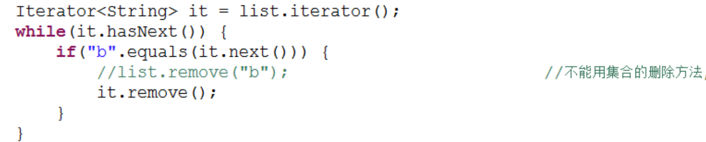
>      - 如果没有特殊的需求，使用通用的Iterator就行。
>  2. 集合遍历元素，集合修改元素
>
>ListIterator的方法
>	boolean hasNext()是否有下一个
>	boolean hasPrevious()是否有前一个
>	Object next()返回下一个元素
>	Object previous();返回上一个元素

### Vector类
基本被ArrayList替代了
#### 特有方法：
public void addElement(E obj)
public E elementAt(int index)
public Enumeration elements()
#### 常用形式：
```java
Enumeration en = v.elements(); //获取枚举
while(en.hasMoreElements()) { //判断集合中是否有元素
    System.out.println(en.nextElement()); //获取集合中的元素
}
```

### ArrayList类
>去除ArrayList中重复的自定义元素时，需要重写equals()
>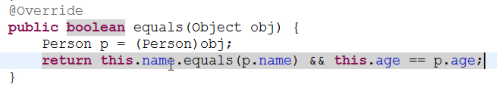

### LinkedList类
特有方法
* public void addFirst(E e)及addLast(E e)
* public E getFirst()及getLast()
* public E removeFirst()及public E removeLast()
* public E get(int index);

### List的三个子类的特点
ArrayList: 底层数据结构是数组，查询快，增删慢。 线程不安全，效率高。（最常用） 
Vector: 底层数据结构是数组，查询快，增删慢。 线程安全，效率低。 
LinkedList: 底层数据结构是链表，查询慢，增删快。 线程不安全，效率高。(只有增删多时用)
>Vector相对ArrayList查询慢(线程安全的) 
>Vector相对LinkedList增删慢(数组结构)


## Set集合

### HashSet
元素不重复，无序。底层使用哈希算法。
#### 如何保证元素不重复？
HashSet调用add()添加元素时，先调用元素的hashCode()与已有元素比较它们的hashcode值：
- 如果不同，就认为是不同的元素；
- 如果相同，就调用equals()：如果为true，就不添加；如果为false，就添加（同一个hashcode可以对应多个元素，HashSet有一种桶结构，将多个元素挂在一起）

所以将自定义类的对象存入HashSet时，类中必须重写hashCode()和equals()方法。
- 应在重写一个类的hashCode()时，属性相同的对象返回值必须相同，属性不同的对象返回值尽量不同，这样就可以减少调用equals()的次数，提高效率。
- eclipse可以自动生成hashCode()和hashCode()

#### LinkedHashSet
元素不重复，有序（底层由链表实现）。

### TreeSet
保证元素唯一的同时，对对象元素进行排序。需要排序时可以使用。
底层是二叉树，小的存左边，大的存右边。
#### 如何比较元素大小？
- 自然顺序：
  默认构造函数什么都不传，按照类实现的Comparable接口中的compareTo方法;String类实现了compareTo方法，按字典顺序比较大小，其实是比较了Unicode编码。
  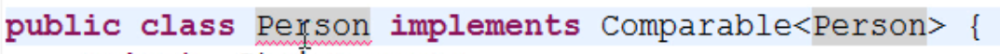
  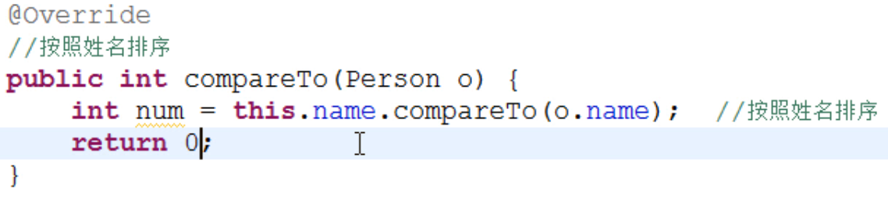
  存入对象调用compareTo方法和集合中的对象做比较，根据返回的数值正数、0、负数来决定存储的位置：右边、不存、左边。
	
- 比较器顺序：
  TreeSet构造函数可以传入**比较器Comparator接口**的子类对象
  `public TreeSet(Comparator<? super E> comparator)`

  如果传入了比较器，会优先按比较器顺序作排序。即使用比较器中的compare()进行比较。
  调用compare方法的对象是compare()的第一个参数，集合中的待比较的对象是第二个参数。
  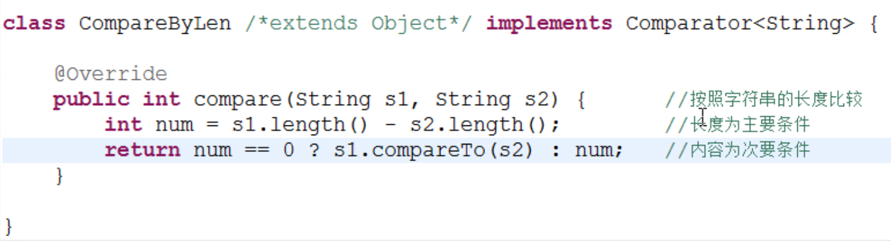
  //Comparator接口有两个方法要实现，一个是compare()，另一个是equals().由于CompareByLen类默认有Object这个父类，因而它包含equals()方法，可以不用实现。
  
## Map集合
### 基本功能
* a:添加功能
    * `V put(K key,V value)`:添加元素。
        * 如果键是第一次存储，就直接存储元素，返回null
        * 如果键不是第一次存在，就用值把以前的值替换掉，返回以前的值
* b:删除功能 
    * `void clear()`:移除所有的键值对元素
    * `V remove(Object key)`：根据键删除键值对元素，并把值返回
* c:判断功能 
    * `boolean containsKey(Object key)`：判断集合是否包含指定的键
    * `boolean containsValue(Object value)`:判断集合是否包含指定的值
    * `boolean isEmpty()`：判断集合是否为空
* d:获取功能
    * `Set<Map.Entry<K,V>> entrySet()`:Entry接口是Map接口的内部接口（Map 内部定义的接口）
    * `V get(Object key)`:根据键获取值
    * `Set<K> keySet()`:获取集合中所有键的集合
    * `Collection<V> values()`:获取集合中所有值的集合
* e:长度功能
    * int size()：返回集合中的键值对的个数 
### 遍历
- 先通过keySet()获取所有key的Set，再通过迭代或for-each，使用get(Object key)获取值。
  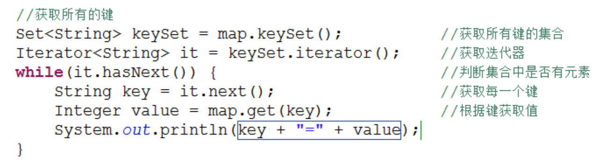
- 使用增强for循环遍历
  
- 先获取所有**键值对**对象的Set，再根据每一个 键值对 对象，获取键（getKey方法）和值（getValue方法）
  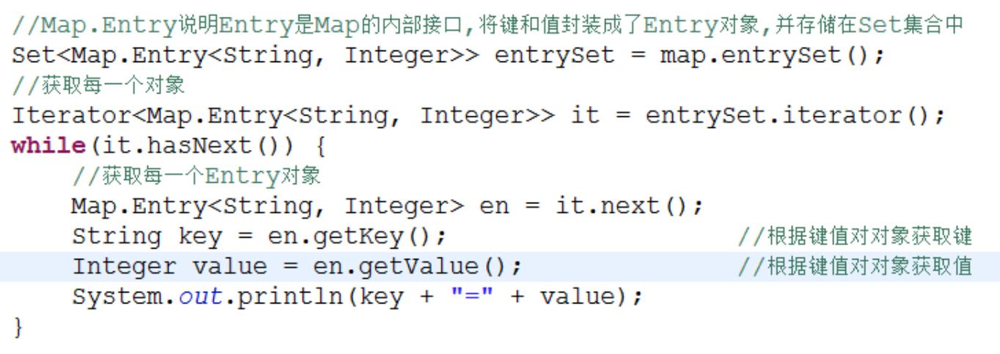
  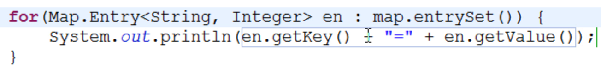
>注意这两条语句的区别：
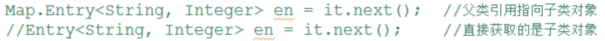
HashMap的内部类Entry实现了Map接口内部定义的Entry接口。如果直接使用Entry&lt;K,V&gt;，要先 import java.util.Map.Entry;

### LinkedHashMap
元素会按存入顺序存储

### TreeMap
存入的元素会排序（先比较键确定位置后存储）

### 关于Hashtable的说明：

已被HashMap替代

>面试题
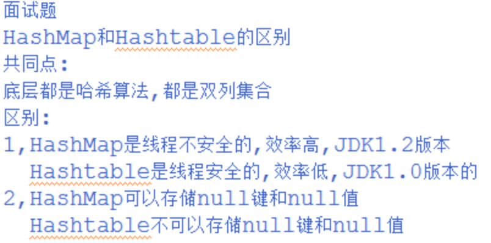
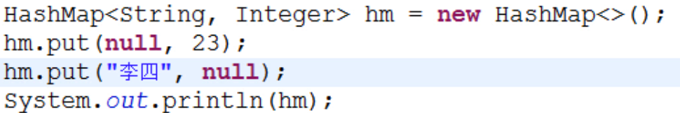

## Collections工具类
>针对 集合操作 的工具类

### Collections成员方法
- public static <T> void sort(List<T> list)  //针对List，排序对象必须实现Comparable
- public static <T> int binarySearch(List<?> list,T key)  //如果key包含在列表中，返回key的索引，否则返回 （- 插入点 - 1）
- public static <T> T max(Collection<?> coll)  //根据默认排序结果获取最大值
- public static void reverse(List<?> list)  //反转 
- public static void shuffle(List<?> list)  //随机置换（打乱顺序）
