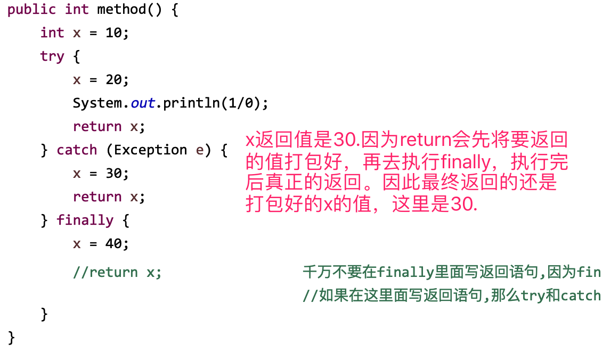
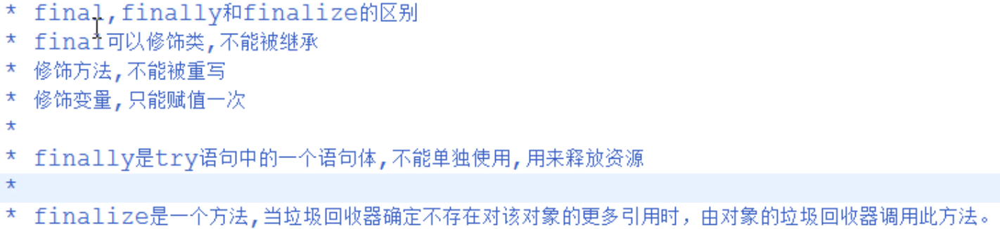
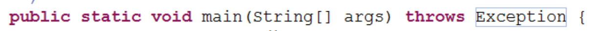
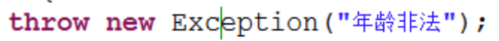
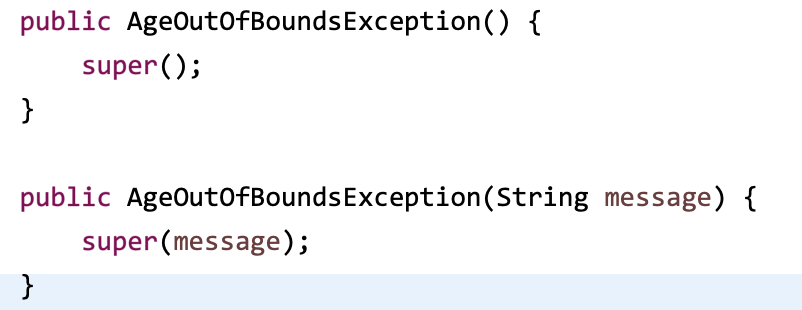

## 异常概述
异常就是Java程序在运行过程中出现的错误。
### 继承体系：
Throwable
- Error
- Exception
    - RuntimeException （运行期异常，就是程序员所犯得错误,需要回来修改代码，可以不显式处理，也可以和编译时异常一样处理）
        - NullPointerException
        - ArrayIndexOutOfBoundsException
        - ……
    - 其它编译期异常类（类似未雨绸缪:在做某些事情的时候要做某些准备，比如打开文件时，文件有可能找不到。不处理就无法通过编译，为正常运行提前做准备。） 

### JVM默认是如何处理异常的
- main函数收到这个问题时,有两种处理方式:
    - a:自己将该问题处理,然后继续运行
    - b:自己没有针对的处理方式,只有交给调用main的jvm来处理
- jvm有一个默认的异常处理机制,就将该异常进行处理，并将该异常的名称,异常的信息.异常出现的位置打印在了控制台上,同时将程序停止运行

### 如何使用异常处理
如果该功能内部可以将问题处理,用try,如果处理不了,交由调用者处理,用throws。
如果JDK没有提供对应的异常，需要自定义异常。

## 处理异常的方式
### try…catch…finally
try:用来检测异常的
catch:用来捕获异常的
finally:释放资源 

#### finally的知识点
- finally的作用：用于释放资源，在IO流操作和数据库操作中会见到
- 被finally控制的语句体一定会执行
    - 特殊情况：在执行到finally之前jvm退出了(比如System.exit(0))
    - Try / catch 块中的return语句在执行过程中会看一看有没有finally,如果有就将finally执行。
    在finally中写返回语句，try和catch中执行的结果会改变的，不要这么写。

>面试题
>

### throw和throws 抛出
#### throws
- 用在方法声明后面，跟的是异常类名 
- 可以跟多个异常类名，用逗号隔开
- 表示抛出异常，由该方法的调用者来处理
#### throw
- 用在方法体内，跟的是异常对象名 
- 只能抛出一个异常对象名
- 表示抛出异常，由方法体内的语句处理。如果方法体内不能处理，就在方法上使用throws抛出
方法体内，如果 `throw new RuntimeException("***"); `则表示抛出运行时异常，可以显式处理，也可以不显示处理。如果抛出编译期异常，则必须在方法内部处理，或在方法上抛出。

### 在实际的Java开发中：
- 安卓，客户端开发,如何处理异常?try{}catch(Exception e){}  //不需要对不同的异常用特定的异常类来接收；
- ee,服务端开发,一般都是底层开发,从底层向上抛，然后记录到日志里。 
### 自定义异常
可以对具体情况设置特定名字的异常，方便查错。
继承Exception或RunTimeException等异常类即可，一般要声明构造方法。  

## Throwable的几个常见方法
* a:getMessage()  获取异常信息，返回字符串。
* b:toString()  获取异常类名和异常信息，返回字符串。
* c:printStackTrace()  获取异常类名和异常信息，以及异常出现在程序中的位置。返回值void。

## 异常注意事项
- 子类重写父类方法时，子类的方法必须抛出相同的异常、父类异常的子类、比父类少或相同数目的异常
- 如果被重写的方法没有异常抛出,那么子类的方法绝对不可以抛出异常。如果子类方法内有异常发生,那么子类只能try,不能throws。 

## Java陷阱之assert关键字
在Java中，assert关键字是从JAVA SE 1.4 引入的，为了避免和老版本的Java代码中使用了assert关键字导致错误，Java在执行的时候默认是不启动断言检查的（这个时候，所有的assert语句都将忽略！），如果要开启断言检查，则需要在jvm参数、用开关-enableassertions或-ea来开启。

### 语法
assert关键字语法很简单，有两种用法：

1. assert <boolean表达式>
如果<boolean表达式>为true，则程序继续执行。
如果为false，则程序抛出AssertionError，并终止执行。
`assert a > b;`
2. assert <boolean表达式> : <错误信息表达式>
如果<boolean表达式>为true，则程序继续执行。
如果为false，则程序抛出java.lang.AssertionError，并输入<错误信息表达式>。
`assert false : "断言失败，此表达式的信息将会在抛出异常的时候输出！";`

### 陷阱
assert关键字用法简单，但是使用assert往往会让你陷入越来越深的陷阱中。应避免使用。
1. assert关键字需要在运行时候显式开启才能生效，否则你的断言就没有任何意义。而现在主流的Java IDE工具默认都没有开启-ea断言检查功能。
2. 用assert代替if是陷阱之二。assert的判断和if语句差不多，但两者的作用有着本质的区别：assert关键字本意上是为测试、调试程序时使用的，但如果不小心用assert来控制了程序的业务流程，那在测试调试结束后去掉assert关键字就意味着修改了程序的正常的逻辑。
3. assert断言失败将面临程序的退出。这在一个生产环境下的应用是绝不能容忍的。一般都是通过异常处理来解决程序中潜在的错误。但是使用断言就很危险，一旦失败系统就挂了。

所以，应当避免在Java中使用assert关键字。如果为了调试测试程序，应该考虑用更好的JUnit。