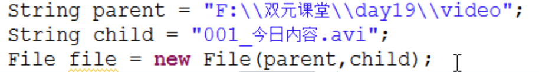
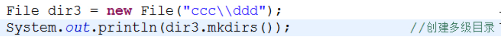
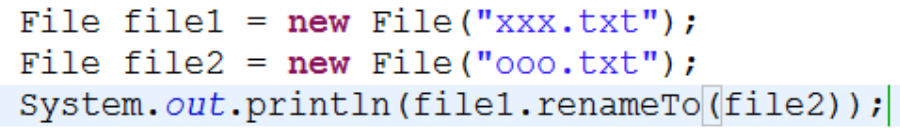
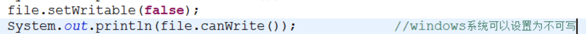
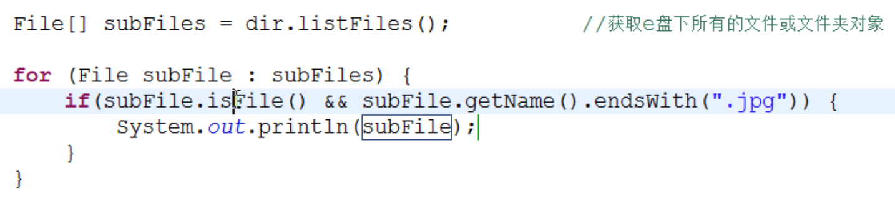

>File对象表示**一个路径**，可以是文件路径或者文件夹路径

### 构造方法

* 	File(String pathname)：根据一个路径得到File对象
* 	File(String parent, String child):根据一个目录和一个子文件/目录得到File对象
	 	
* 	File(File parent, String child):根据一个父File对象和一个子文件/目录得到File对象

	
### 创建功能

* 	public boolean createNewFile():创建文件 如果存在这样的文件，就不创建了
* 	public boolean mkdir():创建文件夹 如果存在这样的文件夹，就不创建了
* 	public boolean mkdirs():创建文件夹,如果父文件夹不存在，会帮你创建出来
	 	
    
    
### 重命名和删除功能

* 	public boolean renameTo(File dest):把文件重命名为指定的文件路径，可以重命名或剪切文件
	 	
    - 如果路径名相同，就是改名。
    - 如果路径名不同，就是改名并剪切;如果有同名文件，会被替换。
* 	public boolean delete():彻底删除文件或者文件夹（该文件夹要为空才可以）

	
### 判断功能

* 	public boolean isDirectory():判断是否是目录
* 	public boolean isFile():判断是否是文件；这里目录不算是文件
* 	public boolean exists():判断是否存在
* 	public boolean canRead():判断是否可读  
    * setReadable(false);可以设置文件是否可读；
    * windows系统认为所有的文件都是可读的，所以setReadable(false)不起作用
    * 在MAC本地硬盘是起作用，但移动硬盘不起作用……
* 	public boolean canWrite():判断是否可写
    * 
* 	public boolean isHidden():判断是否隐藏

### 获取功能

* public String getAbsolutePath()：获取绝对路径
* public String getPath():获取（构造方法中传入的）路径
* public String getName():获取文件或文件夹名称，如a.txt,downloads
* public long length():获取长度。字节数
* public long lastModified():获取最后一次的修改时间，毫秒值
* public String[] list():获取指定目录下的所有文件或者文件夹的名称数组
* public File[] listFiles():获取指定目录下的所有文件或者文件夹的File数组 
 

>File类重写了toString()方法，会输出File对象的绝对路径

### 文件名称过滤器

* public String[] list(FilenameFilter filter)
* public File[] listFiles(FileFilter filter)
* public File[] listFiles(FilenameFilter filter)

```java
File[] files = dir.listFiles(new FileFilter() {
    @Override
    public boolean accept(File file) { //过滤出.jpg图像文件
        return file.isFile() && file.getName().matches(".+\\.jpg");
    }
});
for (File file : files) {
    System.out.println(file.getName());
}
```
