 ## 概述
IO流用来处理设备之间的数据传输。
- Java对数据传输的操作是通过流的方式
- Java用于操作流的类都在IO包中
- 流按流向分为两种：输入流，输出流。

流按操作类型分为两种：
- 字节流 : 字节流可以操作任何数据,因为在计算机中任何数据都是以字节的形式存储的
- 字符流 : 字符流只能操作纯字符数据，比较方便。

字节流的抽象父类：
- InputStream 
- OutputStream

字符流的抽象父类：
- Reader 
- Writer	
	

编写IO程序
* 使用前，导入IO包中的类
* 使用时，进行IO异常处理
* 使用后，释放资源

## 字节流
### 读写文件基本方法
read()方法

- 读取的是一个字节,返回是int，会在byte前面加上24个0；
- -1表示读到了文件最后
  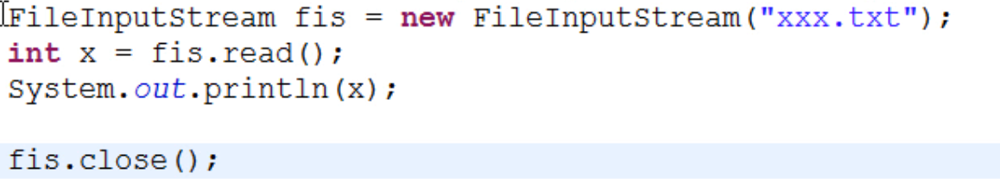 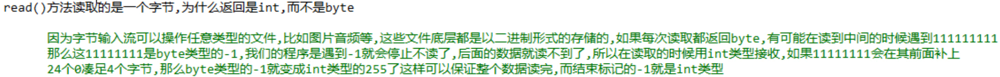

write() 方法

- 一次写出一个字节，虽然写出的是一个int数,但是在写出的时候会将前面的24位去掉,所以写出的是一个byte

```java
FileOutputStream fos = new FileOutputStream("bbb.txt",true);  
//FileOutputStream在创建对象的时候，如果没有这个文件会创建出来。
//不写true参数时，如果有这个文件就会先将文件清空；有true参数时，会在文件末尾追加内容。
```


### 拷贝文件
- 利用available()；了解。
```java
FileInputStream fis = new FileInputStream("致青春.mp3");
//int len = fis.available(); //available方法，返回还可读取的字节数

byte[] arr = new byte[fis.available()]; //创建与文件一样大小的字节数组;不过这可能导致内存溢出
int len = fis.read(arr); //根据字节数组大小，将文件上的字节读取到内存（字节数组）中，返回读取到的有效字节数（<= arr.length），返回-1仍表示读到文件结尾
fos.write(arr); //将字节数组中的字节数据写到文件上
// fos.write(arr,0,len); 从索引0开始，写len个字节
```

- 拷贝文件的核心代码（自定义小数组）

  ```java
  FileInputStream fis = new FileInputStream("致青春.mp3");
  FileOutputStream fos = new FileOutputStream("copy.mp3");
  byte[] arr = new byte[1024 * 8];  //小数组（缓冲数组）的大小一般设为1024的整数倍
  int len;
  while((len = fis.read(arr)) != -1) { //read(arr)方法，如果读的有效的字节就返回个数，没有字节时才返回-1；如果忘记加arr,返回的就不是读取的字节个数,而是字节的码表值
  		fos.write(arr,0,len);
  }
  fis.close();
  fos.close();
  ```

  

- 拷贝文件的核心代码（利用字节缓冲区流）
>效率稍稍低于上面的方法,因为涉及两个数组
```java
BufferedInputStream bis = new BufferedInputStream(new FileInputStream("致青春.mp3")); //创建输入缓冲区流对象,对输入流进行包装（装饰）让其变得更加强大
BufferedOutputStream bos = new BufferedOutputStream(new FileOutputStream("copy.mp3"));//创建输出缓冲区流对象,对输出流进行包装让其变得更加强大
int b;
while((b = bis.read()) != -1) {   //表面上看是在读一个字节，实际上先通过文件输入流，从文件中读取8192个字节到输入缓冲区流中的缓冲数组中，然后从缓冲数组依次读字节
		bos.write(b); //实际上在缓冲区装满后才会写入文件
}
bis.close();
bos.close();
```
### close与flush方法
close方法
* 具备刷新的功能,在关闭流之前,就会先刷新一次缓冲区,将缓冲区的字节全都刷新到文件上,再关闭。

flush方法

* 具备刷新的功能,刷完之后还可以继续写

### 写字符串的方法
写出回车换行 write("\r\n".getBytes());

### 异常处理
- 流的标准异常处理代码 jdk1.6版本及以前
```java
public static void main(String[] args) thorws IOException {
    FileInputStream fis = null;
    FileOutputStream fos = null;
    try {
        fis = new FileInputStream("xxx.txt");  
        fos = new FileOutputStream("yyy.txt");
        int b;
        while((b = fis.read()) != -1) {
            fos.write(b);
        }
    }finally {  //虽然方法上已经声明了抛出异常，但在退出前仍然想把流关掉，比如fos出异常，但fis的流还在
        try{
            if(fis != null)
                fis.close();
        }finally { //try fianlly的嵌套目的是能关一个尽量关一个
            if(fos != null)
                fos.close();
        }
    }
}
```
- 流的标准异常处理代码 jdk1.7版本
```java
try(
	FileInputStream fis = new FileInputStream("xxx.txt");  //在try()中创建的流对象必须实现AutoCloseable这个接口。如果实现了，在try后面的{}里的（读写）代码执行后，就会自动调用流对象的close方法将流关掉。
	FileOutputStream fos = new FileOutputStream("yyy.txt");
){
	int b;
	while((b = fis.read()) != -1) {
		fos.write(b);
	}
}
```

## 字符流
程序需要读取一段文本, 或者需要写出一段文本的时候可以使用字符流
### 读写文件
- 读文本文件
```java
FileReader fr = new FileReader("aaa.txt");	//创建输入流对象,关联aaa.txt
int ch;
while((ch = fr.read()) != -1) {				//将读到的字符(默认转换为整数)赋值给ch
	System.out.println((char)ch);			//将读到的字符强转后打印
}
fr.close();	
```
- 写文件
```java
FileWriter fw = new FileWriter("aaa.txt");
fw.write("aaa");  //可以直接写字符串
fw.close();
```

### 带缓冲区的字符流
```java
BufferedReader br = new BufferedReader(new FileReader("aaa.txt")); //创建字符输入流对象,关联aaa.txt 
BufferedWriter bw = new BufferedWriter(new FileWriter("bbb.txt")); //创建字符输出流对象,关联bbb.txt
```
流对象尽量晚开早关

#### 带缓冲区的字符流中的特殊方法
- BufferedReader的readLine()方法可以读取一行字符(不包含换行符号)
- BufferedWriter的newLine()可以输出一个跨平台的换行符号"\r\n"
```java
BufferedReader br = new BufferedReader(new FileReader("aaa.txt")); 
BufferedWriter bw = new BufferedWriter(new FileWriter("bbb.txt")); 
String line; 
while((line = br.readLine()) != null) { 
	bw.write(line); 
	
  //bw.write("\r\n"); //这种换行写法只支持windows系统 
	bw.newLine(); //跨平台的 
}
```

#### LineNumberReader
BufferedReader的子类, 具有相同的功能, 并且可以显示出行号
- 调用getLineNumber()方法可以获取当前行号
- 调用setLineNumber()方法可以设置当前行号，不是更改流中的当前位置，只更改由getLineNumber()返回的值。
```java
LineNumberReader lnr = new LineNumberReader(new FileReader("zzz.txt"));
String line;
lnr.setLineNumber(100);  //设置初始写入的行号为100
while((line = lnr.readLine()) != null) {  //调用readline()时行号会加1
    System.out.println(lnr.getLineNumber() + ":" + line);
}
lnr.close();
```
### 使用指定的码表读写字符
- FileReader是使用默认码表读取文件, 如果需要使用指定码表读取, 那么可以使用InputStreamReader(字节流,编码表)
- FileWriter是使用默认码表写出文件, 如果需要使用指定码表写出, 那么可以使用OutputStreamWriter(字节流,编码表)
```java
BufferedReader br =  new BufferedReader(new InputStreamReader(new FileInputStream("UTF-8.txt"), "UTF-8")); 
BufferedWriter bw = new BufferedWriter(new OutputStreamWriter(new FileOutputStream("GBK.txt"), "GBK")); 
int ch; 
while((ch = br.read()) != -1) 
{ 
    bw.write(ch); 
}
```

### 装饰设计模式
好处：耦合性不强,被装饰的类的变化与装饰类的变化无关;如果是继承，耦合性就太强了
Eg. BufferedReader br = new BufferedReader(new FileReader("aaa.txt"));  //对FileReader对象做装饰（包装）
```java
interface Coder {
	public void code();
}
class Student implements Coder {
	@Override
	public void code() {
	System.out.println("javase");
	System.out.println("javaweb");
	}
}
class HeiMaStudent implements Coder {
	//1,获取被装饰类的引用
	private Student s; //获取学生引用
	//2,在构造方法中传入被装饰类的对象
	public HeiMaStudent(Student s) {
		this.s = s;
	}
	//3,对原有的功能进行升级
	@Override
	public void code() {
		s.code();
		System.out.println("ssh");
		System.out.println("数据库");
		System.out.println("大数据");
		System.out.println("...");
	}
}

```

## 其他流
### 序列流 SequenceInputStream
序列流可以把多个字节输入流整合成一个
- 整合两个: SequenceInputStream(InputStream, InputStream) 
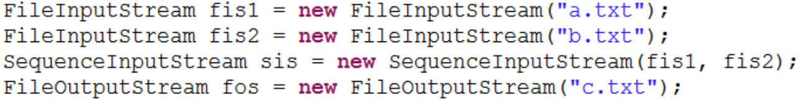
//底层也是将两个流添加到Vector集合中，再用elements()方法返回枚举类型对象
//关闭序列流时会将两个输入流关闭
- 整合多个: SequenceInputStream(Enumeration<? extends InputStream> e)  //推荐用这种

### 内存输出流 ByteArrayOutputStream
> 该输出流可以向内存中写数据, 把内存当作一个缓冲区, 写出之后可以一次性获取出所有数据

创建对象: new ByteArrayOutputStream()
写出数据: write(int), write(byte[])
获取数据: toByteArray(), toString()
```java
FileInputStream fis = new FileInputStream("a.txt");
ByteArrayOutputStream baos = new ByteArrayOutputStream();  //不用关闭，因为在内存中，不连接设备
int b;
while((b = fis.read()) != -1) {
	baos.write(b);
}
	
byte[] newArr = baos.toByteArray();	//将内存缓冲区中所有的字节存储在newArr中；涉及转换码表时用这种方式
System.out.println(new String(newArr));
System.out.println(baos);  //用默认码表转换并输出
fis.close();
```
### RandomAccessFile类
叫做随机访问流，其实不属于流，是Object类的子类。但它融合了InputStream和OutputStream的功能，支持对随机访问文件(在指定位置)的读取和写入。这样就可以支持多线程下载。
#### 构造方法


#### 常用方法：
各种read(),write(),
seek(long pos)  //设置位置指针；在指定位置写会覆盖原来的内容
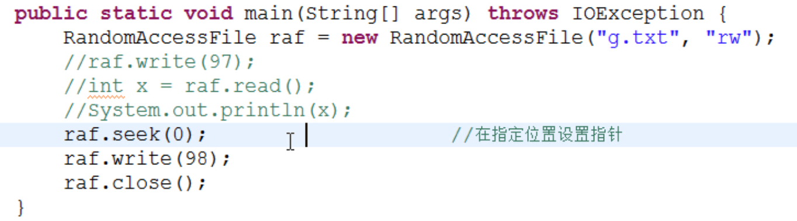

### 对象操作流 ObjecOutputStream 与 ObjectInputStream
该流可以将一个对象写到文件, 或者读取一个对象到程序中. 也就是执行了序列化和反序列化的操作，类似游戏的存档和读档。
- 要写出的对象必须实现Serializable接口才能被序列化。
- ID号作为类版本的标识。可序列化（实现了Serializable接口）的类需要。如果一个类被修改了，没有重新存档，再读取原来的存档会报错，

- 不用必须加id号。不加ID号，系统会自动生成一个随机ID，如果类被改动，ID号也会变。人为添加ID号的话，如果类被改动，可以手动改写ID号。

写出: new ObjectOutputStream(OutputStream), writeObject()
- 可以逐个写出对象；也可以把对象添加到集合中，然后把集合对象写出。
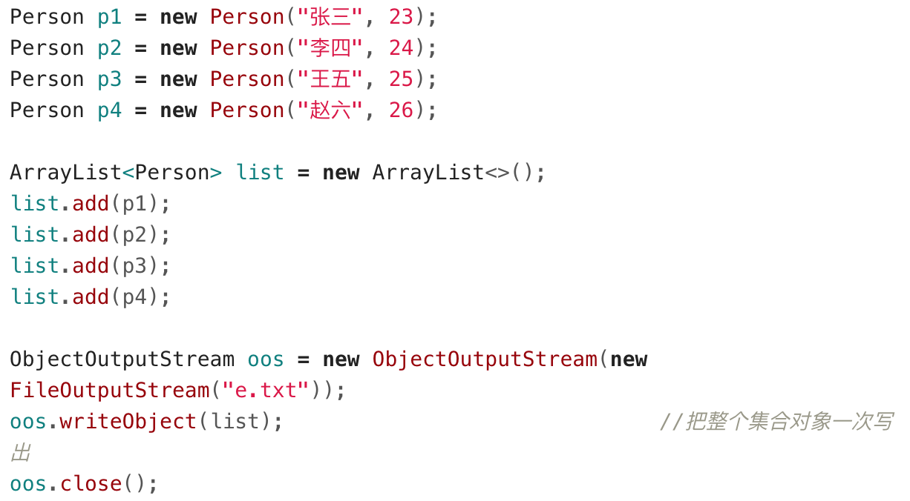

读取: new ObjectInputStream(InputStream), readObject()
- 由于写出的方式不同，可能读到多个一般对象，也可能读到存放对象的集合对象。
- 当文件读取到了末尾时出现EOFException
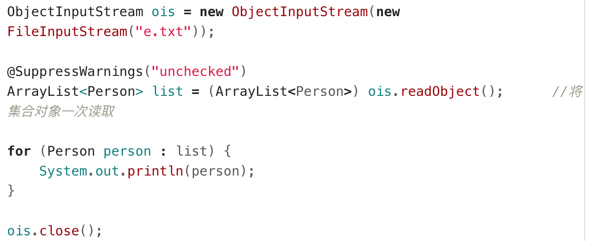


### 数据输入输出流 DataInputStream, DataOutputStream
可以按照基本数据类型大小读写数据。例如按Long大小写出一个数字, 写出时该数据占8字节. 读取的时候也可以按照Long类型读取, 一次读取8个字节.

使用方式：
	DataOutputStream(OutputStream), writeInt(), writeLong() ……
	DataInputStream(InputStream), readInt(), readLong() ……
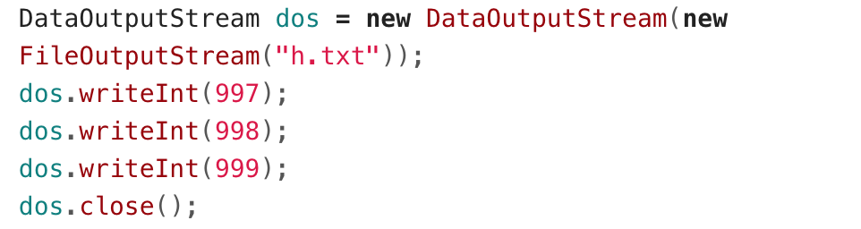
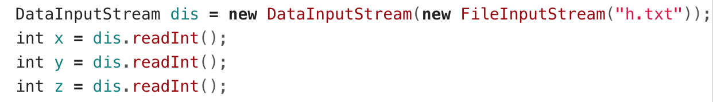

### 打印流 PrintStream PrintWriter
可以很方便的将对象的toString()结果输出，并且自动加上换行，还可以使用自动刷出的模式。
- System.out（标准输出流）就是一个PrintStream, 其默认向控制台输出信息。
  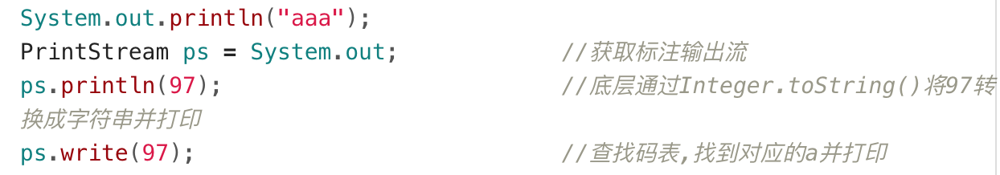
- 自动刷出: PrintWriter(OutputStream out, boolean autoFlush)  或   PrintStream(OutputStream out, boolean autoFlush) 
方法：
	print()
	println()  //只有它支持自动刷出，即使用一次就向关联文件直接写入内容。了解即可，没什么大用，不管什么方法，流关闭后总会刷出的。
	（继承得到的）write()
	  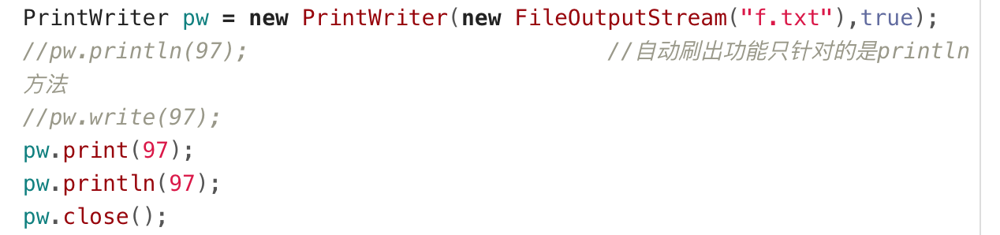
  

System.in是InputStream, 标准输入流, 默认可以从键盘输入读取字节数据。
- 只能关闭一次。其实不用关，因为它不关联文件。关联文件的流必需关闭。 
  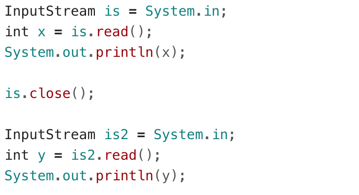

修改标准输入流: System.setIn(InputStream)
修改标准输出流: System.setOut(PrintStream)
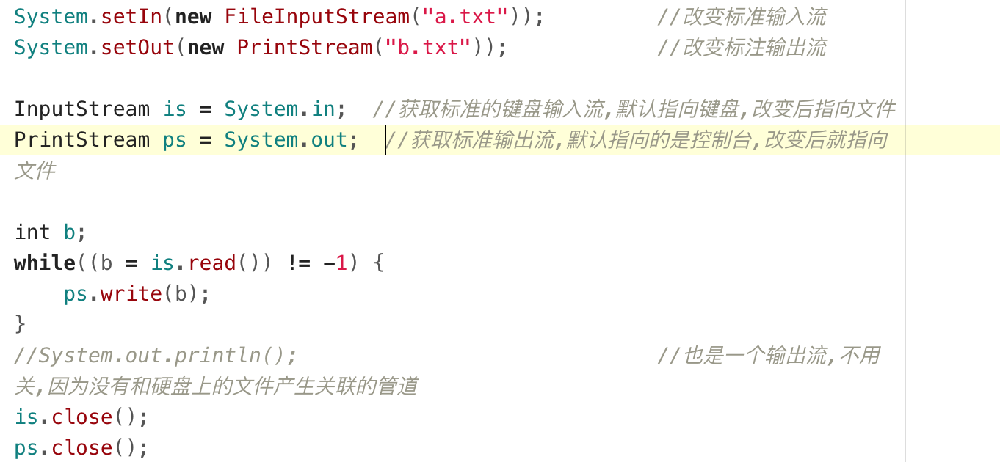

//从键盘读入数据的两种方式
```java
/*BufferedReader br = new BufferedReader(new InputStreamReader(System.in));	//InputStreamReader转换流
String line = br.readLine();
System.out.println(line);
br.close();*/

Scanner sc = new Scanner(System.in);
String line = sc.nextLine();
System.out.println(line);
sc.close();
```

### Properties 类
Hashtable的子类,Hashtable基本被HashMap取代，只有Properties类经常使用,一般用来操纵配置文件`config.properties` 。
属性列表中每个键及其对应值都是一个字符串。

#### 基本使用
- public Object setProperty(String key,String value)
- public String getProperty(String key)
- public Enumeration<String>  propertyNames()
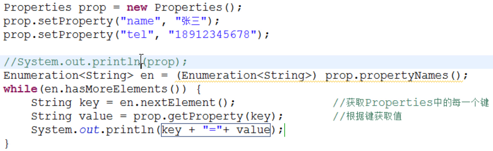

#### load()和store()功能
```java
Properties prop = new Properties();
prop.load(new FileInputStream("config.properties")); //将文件上的键值对读取到集合中
prop.setProperty("tel", "18912345678"); //修改某个键值对
prop.store(new FileOutputStream("config.properties"), null);//第二个参数是对键值对列表的描述,可以给值,也可以给null；给值后会在config.properties文件中以注释的形式出现
System.out.println(prop);
```