 ## 概述
什么是线程？
- 线程是程序执行的一条路径, 一个进程中可以包含多条线程
- 多线程并发执行可以提高程序的效率, 可以同时完成多项工作

线程状态图：
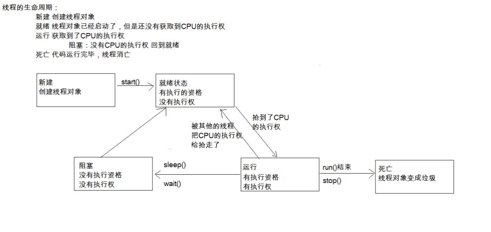

多线程并行和并发的区别：
- 并行就是两个任务同时运行，就是甲任务进行的同时，乙任务也在进行。(需要多核CPU)
- 并发是指两个任务都请求运行，而处理器只能按受一个任务，就把这两个任务安排轮流进行，由于时间间隔较短，使人感觉两个任务都在运行。

Java程序运行原理：Java命令会启动JVM，等于启动了一个应用程序，也就是启动了一个进程。该进程会自动启动一个 “主线程” ，然后主线程去调用某个类的 main 方法。

- JVM的启动是多线程的吗？JVM启动至少启动了垃圾回收线程和主线程，所以是多线程的。

- Java虚拟机允许应用程序并发地运行多个执行线程，即支持多线程。

## 多线程程序实现的方式
### 方式一：定义类继承Thread类
```java
class MyThread extends Thread { //1,继承Thread
    public void run() { //2,重写run方法
        for(int i = 0; i < 1000; i++) { //3,将要执行的代码写在run方法中
            System.out.println("aaaaaaaaaaaa");
        }
    }
}

public static void main(String[] args) {
    MyThread mt = new MyThread();	//4,创建自定义类的对象
    mt.start();	//5,开启线程，JVM会调用run()；多次启动一个线程（多次调用start()是非法的）

    for(int i = 0; i < 3000; i++) {  //这里是JVM进程的主线程执行的代码，所以会交替打印
        System.out.println("bb");
    }
}
```
### 方式二：实现Runnable接口
```java
class MyRunnable implements Runnable { //1,定义一个类实现Runnable
    @Override
    public void run() { //2,重写run方法
        for(int i = 0; i < 1000; i++) { //3,将要执行的代码写在run方法中
            System.out.println("aaaaaaaaaaaa");
        }
    }
}

public static void main(String[] args) {
    MyRunnable mr = new MyRunnable(); //4,创建Runnable的子类对象
    Thread t = new Thread(mr); //5,将其当作参数传递给Thread的构造函数
    t.start(); //6,开启线程
}
```
>一般能用第一种就可直接用第一种，代码简单。第二种扩展性强，代码复杂。

>两种方式的区别:
>查看源码:
>- a.继承Thread : 由于子类重写了Thread类的run(), 当调用start()时, 直接找子类的run()方法
>- b.实现Runnable : 构造函数中传入了Runnable的引用, 成员变量记住了它, start()调用run()方法时内部判断成员变量Runnable的引用是否为空, 不为空编译时看的是Runnable的run(),运行时执行的是子类的run()方法

### 匿名内部类实现多线程的两种方式
• 继承Thread类 
```java
new Thread() { //1,继承Thread类
    public void run() { //2,重写run方法
        for(int i = 0; i < 1000; i++) { //3,将要执行的代码写在run方法中
            System.out.println("aaaaaaaaaaaaaa");
        }
    }
}.start(); 
```
• 实现Runnable接口  
```java
new Thread(new Runnable() { //1,将Runnable的子类对象传递给Thread的构造方法
    public void run() { //2,重写run方法
        for(int i = 0; i < 1000; i++) { //3,将要执行的代码写在run方法中
            System.out.println("bb");
        }
    }
}).start(); 

//所以可以直接写成：
Thread t = new Thread( ... );
t.start();
```
## 多线程方法

### 获取线程对象的名字：
getName()方法 
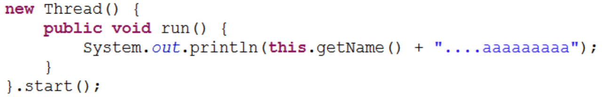
//这里的this指的就是这个匿名内部类对象。
//默认的名字是Thread-?
### 设置线程对象的名字
- 通过构造函数可以传入String类型的名字
  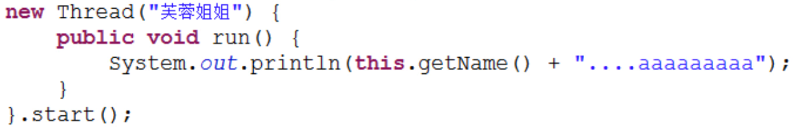
- 通过setName(String)方法可以设置线程对象的名字
  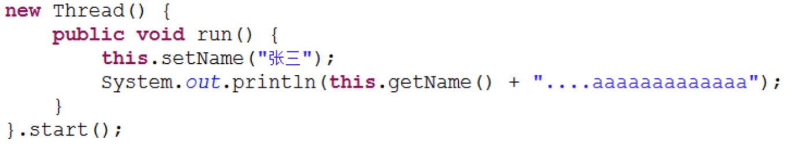
  //setName()在外部通过父类引用调用也可以
### 获取当前线程的对象：
Thread.currentThread()
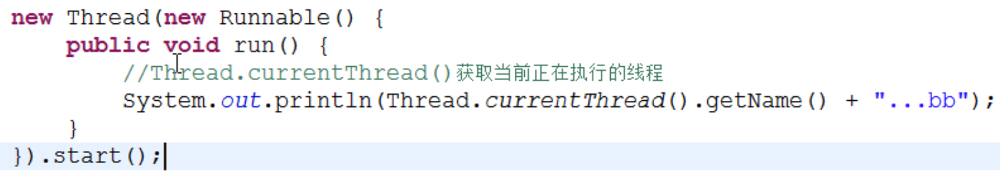
//获取并设置主线程的名字
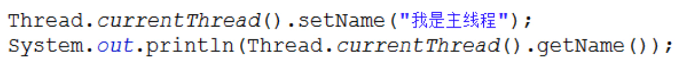

### 休眠线程：
Thread.sleep(毫秒[,纳秒]) //纳秒可不写；使用该方法要处理异常
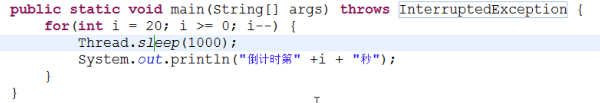
在匿名内部类实现；异常不能抛，要自己处理
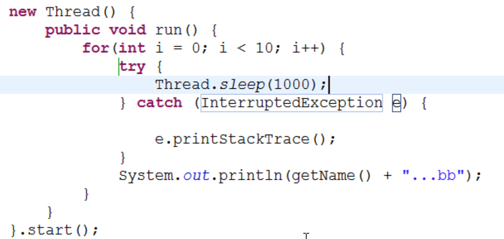

### 守护线程：
setDaemon()  //设置一个线程为守护线程，当其他非守护线程都执行结束后, 自动退出；守护线程就像象棋中的一般棋子，守护老帅，老帅没了，其它也就没了
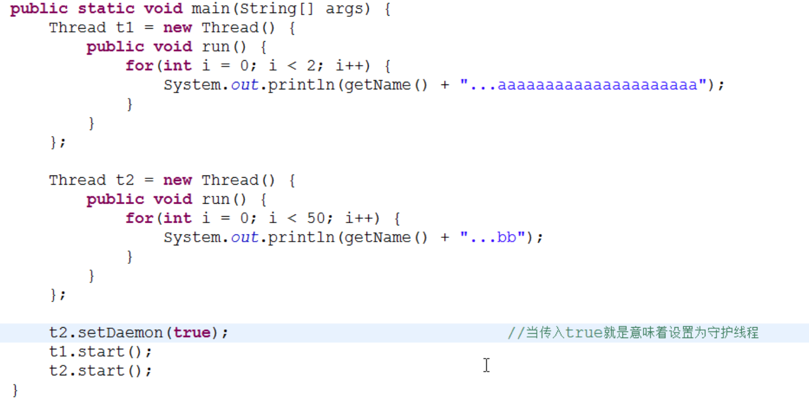
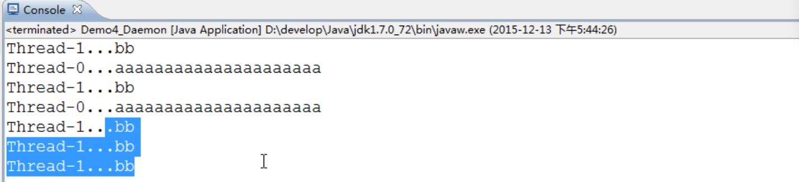  //输出两次aaa...后非守护线程结束，发消息告诉守护线程，守护线程接到消息后结束；由于这个时间差，守护线程又输出了几行

### 加入线程：
插队执行某个线程
- join()  当前线程暂停，等待指定的线程执行结束后, 当前线程再继续
- join(int)  可以等待指定的毫秒之后继续
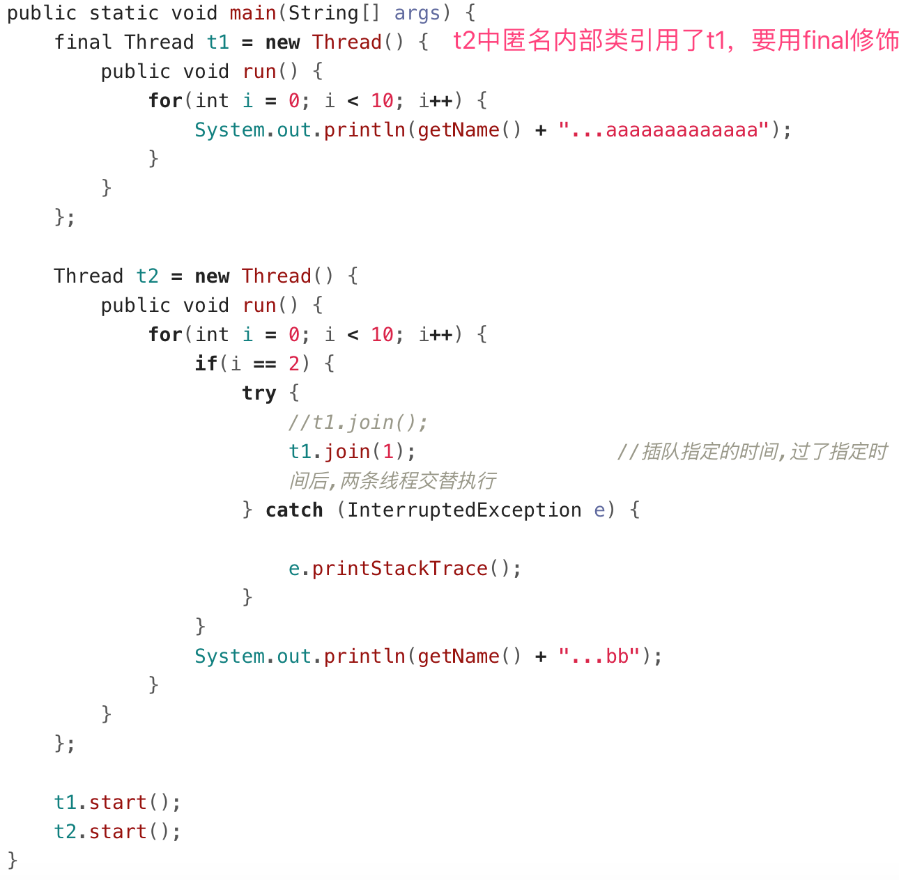

### 礼让线程：
Thread.yield(); //让出CPU，效果很不明显，了解即可
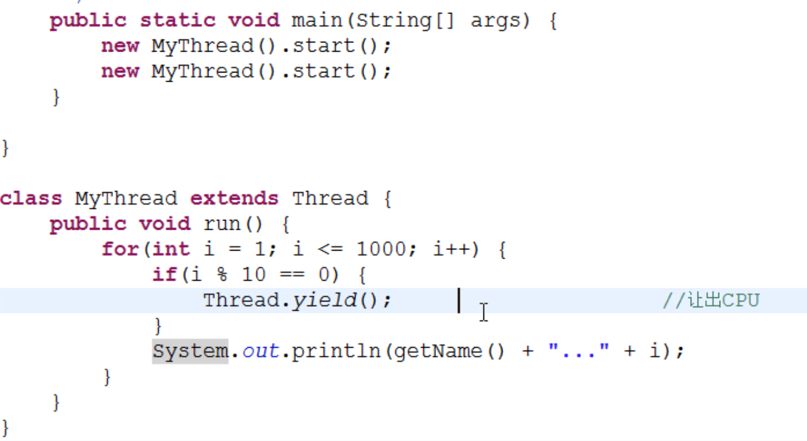

### 线程的优先级
setPriority()设置线程的优先级
- 可用数字1-10表示优先级从低到高
- 默认为NORM_PRIORITY = 5，还可直接用 MIN_PRIORITY (= 1)，MAX_PRIORITY (= 10)。
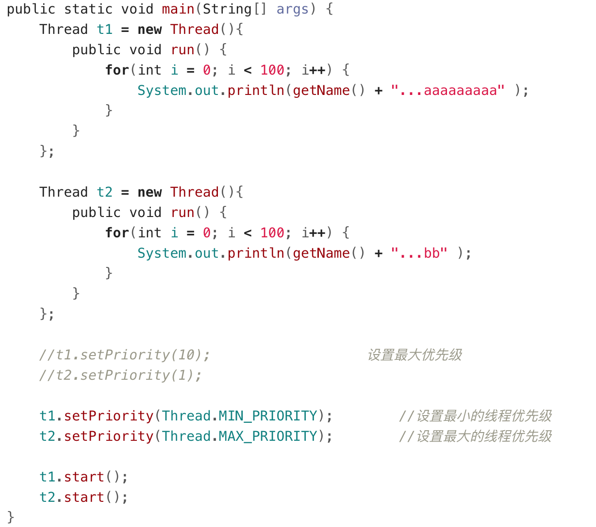


## 同步
- 当多线程并发, 有多段代码同时执行时, 我们希望某一段代码执行的过程中CPU不要切换到其他线程工作. 这时就需要同步.
- 如果两段代码是同步的, 那么同一时间只能执行一段, 在一段代码没执行结束之前, 不会执行另外一段代码.

### 同步代码块
- 使用synchronized关键字加上一个锁对象来定义一段代码, 这就叫同步代码块
- 多个同步代码块如果使用相同的锁对象, 那么他们就是同步的
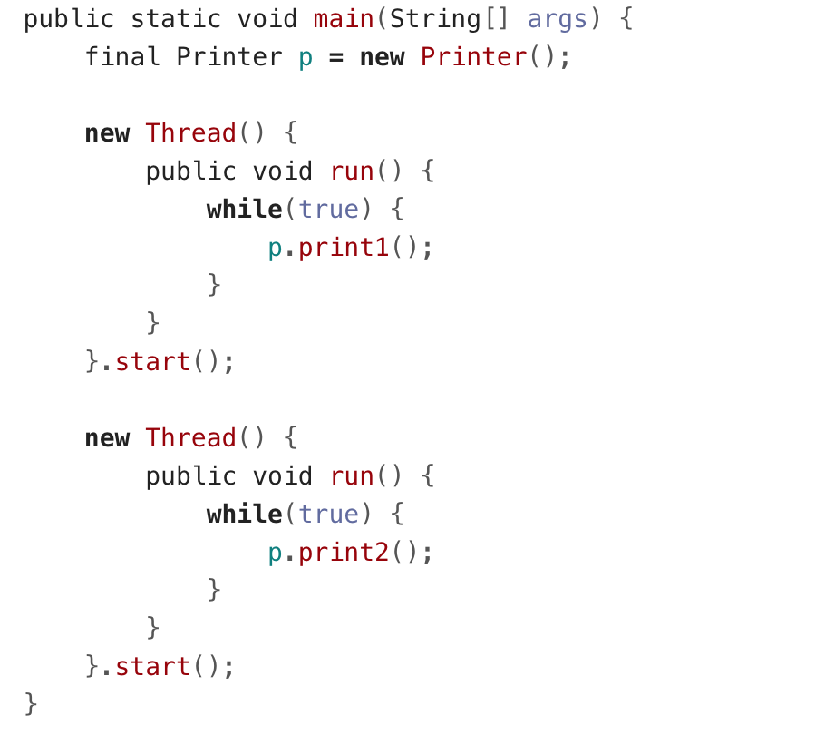
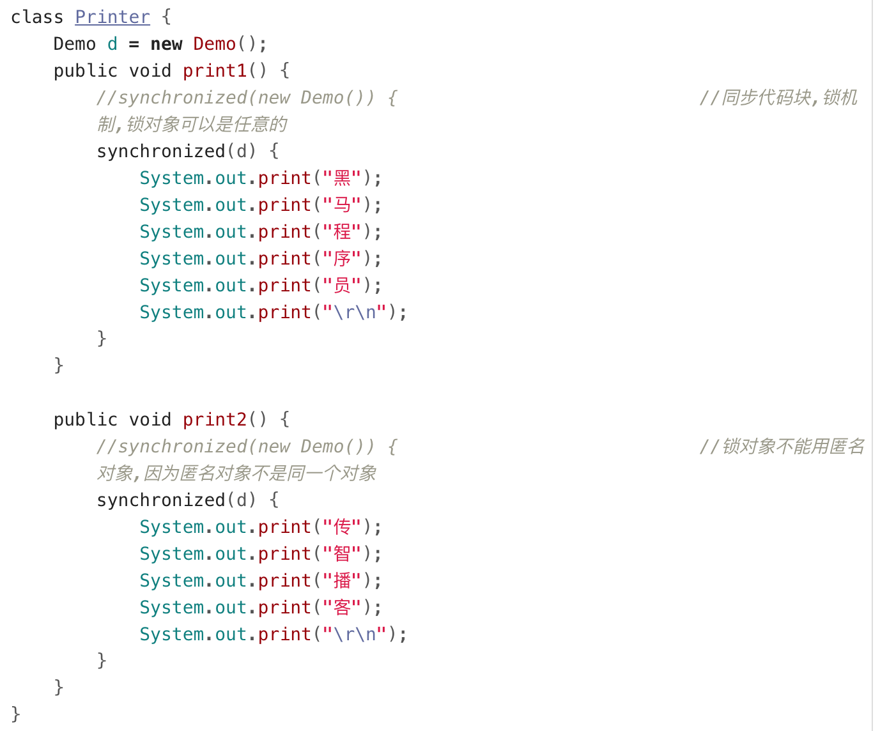

### 同步方法
使用synchronized关键字修饰一个方法，表明该方法中所有的代码都是同步的。

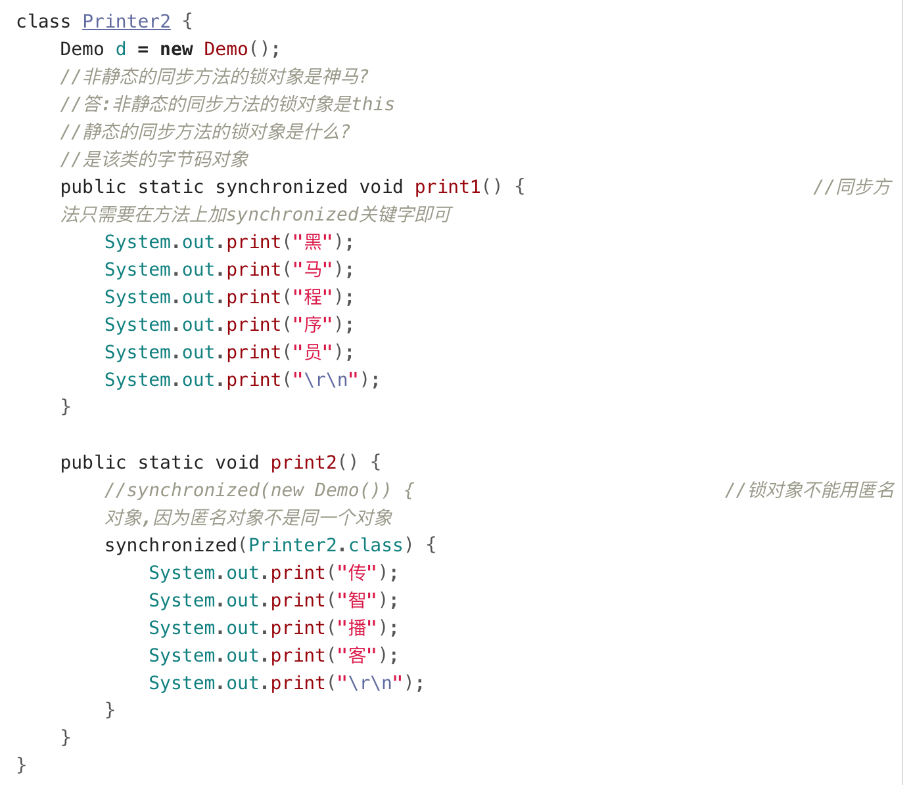

### 线程安全问题
多线程并发操作同一数据时, 就有可能出现线程安全问题。
使用同步技术可以解决这种问题： 把操作数据的代码进行同步, 不要多个线程一起操作
```java
public class Demo3_Ticket {

    /**
     * 需求:铁路售票,一共100张,通过四个窗口卖完.
     */
    public static void main(String[] args) {
        new Ticket().start();
        new Ticket().start();
        new Ticket().start();
        new Ticket().start();
    }

}

class Ticket extends Thread {
    private static int ticket = 100;
    //private static Object obj = new Object();	//如果用引用数据类型成员变量当作锁对象,必须是静态的;还不如用类的字节码文件
    public void run() {
        while(true) {
            synchronized(Ticket.class) {
                if(ticket <= 0) {
                    break;
                }
                try {
                    Thread.sleep(10);		//线程1睡,线程2睡,线程3睡,线程4睡
                } catch (InterruptedException e) {

                    e.printStackTrace();
                }
                System.out.println(getName() + "...这是第" + ticket-- + "号票");
            }
        }
    }
}

```
>以前的线程安全的类：
>Vector是线程安全的,ArrayList是线程不安全的
>StringBuffer是线程安全的,StringBuilder是线程不安全的
>Hashtable是线程安全的,HashMap是线程不安全的
>
>Collections.synchronizedXXX()：使用该系列的方法，可以将原来线程不安全的集合变成线程安全的 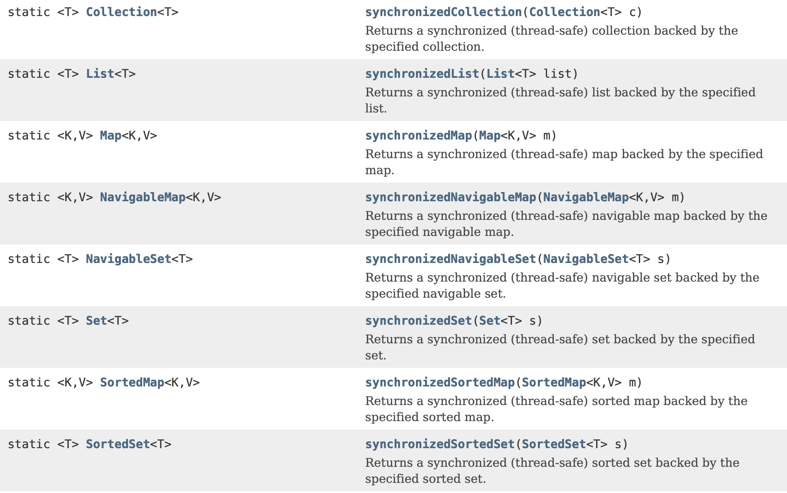


### 死锁
同步代码块嵌套可能会出现死锁。
以哲学家就餐为例来说明：
```java
public class Demo5_DeadLock {

    /**
     * @param args
     */
    private static String s1 = "筷子左";
    private static String s2 = "筷子右";

    public static void main(String[] args) {
        new Thread() {
            public void run() {
                while(true) {
                    synchronized(s1) {
                        System.out.println(getName() + "...获取" + s1 + "等待" + s2);
                        synchronized(s2) {
                            System.out.println(getName() + "...拿到" + s2 + "开吃");
                        }
                    }
                }
            }
        }.start();

        new Thread() {
            public void run() {
                while(true) {
                    synchronized(s2) {
                        System.out.println(getName() + "...获取" + s2 + "等待" + s1);
                        synchronized(s1) {
                            System.out.println(getName() + "...拿到" + s1 + "开吃");
                        }
                    }
                }
            }
        }.start();
    }
}

```

## 单例设计模式
保证类在内存中只有一个对象。
如何做到？关键是通过私有构造方法来控制类的创建，不让其他类来创建本类的对象。
### 几种写法
- 饿汉式（开发用这种）
```java
class Singleton {
    //1,私有构造方法,其他类不能访问该构造方法了
    private Singleton(){}
    //2,创建本类对象
    private static Singleton s = new Singleton();  
    //3,对外提供公共的访问方法
    public static Singleton getInstance() {				//获取实例
        return s;
    }
}
//使用方式
Singleton s1 = Singleton.getInstance();
```

- 懒汉式（也叫单例的延迟加载模式）
```java
class Singleton {
    //1,私有构造方法,其他类不能访问该构造方法了
    private Singleton(){}
    //2,声明一个引用
    private static Singleton s ;
    //3,对外提供公共的访问方法
    public static Singleton getInstance() {	//获取实例
        if(s == null) {  //如果有两个线程同时执行这部分代码，可能会造成各自创建一个new Singleton()
            s = new Singleton();
        }

        return s;
    }
}
//使用方式
Singleton s1 = Singleton.getInstance();
```
>饿汉式和懒汉式的区别
>* 1,饿汉式是空间换时间（先创建出对象）,懒汉式是时间换空间
>* 2,在多线程访问时,饿汉式不会创建多个对象,而懒汉式有可能会创建多个对象

- 第三种，最简单的方式
```java
class Singleton {
    //1,私有构造方法,其他类不能访问该构造方法了
    private Singleton(){}
    //2,声明一个引用
    public static final Singleton s = new Singleton();
}
//使用方式
Singleton s1 = Singleton.s;	
//Singleton.s = null;  不用担心利用这种方式在外部改变s
```

### 应用场景 Runtime类
Runtime类是一个单例类。
```java
Runtime r = Runtime.getRuntime();			//获取运行时对象
//r.exec("shutdown -s -t 300");  //执行在命令行中使用的字符串命令，这里是Windows中设置300秒后关机
r.exec("shutdown -a");  //设置取消关机
```

## Timer类
计时器类，用来在当前线程中安排以后在后台线程中执行的任务。
可安排指定的任务在指定时间一次或重复执行。

```java
class MyTimerTask extends TimerTask {
    @Override
    public void run() {
        System.out.println("起床背英语单词");
    }
}
//安排执行一次任务
Timer t = new Timer();
//第一个参数,是安排的任务,第二个参数是执行的时间
t.schedule(new MyTimerTask(), new Date(188, 6, 1, 14, 22, 50));  //Date()的参数使用见下图 

//安排执行重复任务
//第一个参数,是安排的任务,第二个参数是执行的时间,第三个参数是过多长时间再重复执行
t.schedule(new MyTimerTask(), new Date(188, 6, 1, 14, 22, 50), 3000);
```


## 线程通信
- 多个线程并发执行时, 在默认情况下CPU是随机切换线程的
- 如果我们希望他们有规律的执行, 就可以使用通信, 例如两个线程交替做打印，每次只打印一次

如何实现？
- 如果希望线程等待, 就调用wait()
- 如果希望唤醒等待的线程, 就调用notify();
- 这两个方法必须在同步代码中执行, 并且使用同步锁对象来调用。
### 两个线程通信
```java
//等待唤醒机制
class Printer {
    private int flag = 1;
    public void print1() throws InterruptedException {							
        synchronized(this) {
            if(flag != 1) {
                this.wait(); //当前线程等待
            }
            System.out.print("黑");
            System.out.print("马");
            System.out.print("程");
            System.out.print("序");
            System.out.print("员");
            System.out.print("\r\n");
            flag = 2;
            this.notify();	//随机唤醒单个等待的线程
        }
    }

    public void print2() throws InterruptedException {
        synchronized(this) {
            if(flag != 2) {
                this.wait();
            }
            System.out.print("传");
            System.out.print("智");
            System.out.print("播");
            System.out.print("客");
            System.out.print("\r\n");
            flag = 1;
            this.notify();
        }
    }
}

```

### 三个及以上线程通信
```java
class Printer2 {
    private int flag = 1;
    public void print1() throws InterruptedException {							
        synchronized(this) {
            while(flag != 1) {
                this.wait();					//当前线程等待
            }
            System.out.print("黑");
            System.out.print("马");
            System.out.print("程");
            System.out.print("序");
            System.out.print("员");
            System.out.print("\r\n");
            flag = 2;
            //this.notify();			//随机唤醒单个等待的线程
            this.notifyAll();
        }
    }

    public void print2() throws InterruptedException {
        synchronized(this) {
            while(flag != 2) {
                this.wait();		//线程2在此等待
            }
            System.out.print("传");
            System.out.print("智");
            System.out.print("播");
            System.out.print("客");
            System.out.print("\r\n");
            flag = 3;
            //this.notify();
            this.notifyAll();
        }
    }

    public void print3() throws InterruptedException {
        synchronized(this) {
            while(flag != 3) {
                this.wait();	//线程3在此等待,if语句是在哪里等待,就在哪里起来
                               //while循环是循环判断,每次都会判断标记
            }
            System.out.print("i");
            System.out.print("t");
            System.out.print("h");
            System.out.print("e");
            System.out.print("i");
            System.out.print("m");
            System.out.print("a");
            System.out.print("\r\n");
            flag = 1;
            //this.notify();
            this.notifyAll();
        }
    }
}

```

>说明
> * 1,在同步代码块中,用哪个对象锁,就用哪个对象调用wait方法
> * 2,为什么wait方法和notify方法定义在Object这类中?
>     因为锁对象可以是任意对象,Object是所有的类的基类,所以wait方法和notify方法需要定义在Object这个类中
> * 3,sleep方法和wait方法的区别?
>    - sleep方法必须传入参数,参数就是时间,时间到了自动醒来
>      wait方法可以传入参数也可以不传入参数,传入参数就是在参数的时间结束后等待,不传入参数就是直接等待
>    - sleep方法在同步函数或同步代码块中,不释放锁,睡着了也抱着锁睡
>      wait方法在同步函数或者同步代码块中,释放锁

## JDK1.5的新特性 互斥锁
### 同步
使用ReentrantLock类的lock()和unlock()方法进行同步,替代synchronized

### 通信
- 使用ReentrantLock类的newCondition()方法可以获取Condition对象
- 需要等待的时候使用Condition的await()方法, 唤醒的时候用signal()方法
- 不同的线程使用不同的Condition, 这样就能区分唤醒的时候找哪个线程了（不再随机）
```java
class Printer3 {
    private ReentrantLock r = new ReentrantLock();
    private Condition c1 = r.newCondition();
    private Condition c2 = r.newCondition();
    private Condition c3 = r.newCondition();

    private int flag = 1;
    public void print1() throws InterruptedException {							
        r.lock();								//获取锁
            if(flag != 1) {
                c1.await();
            }
            System.out.print("黑");
            System.out.print("马");
            System.out.print("程");
            System.out.print("序");
            System.out.print("员");
            System.out.print("\r\n");
            flag = 2;
            //this.notify();						//随机唤醒单个等待的线程
            c2.signal();
        r.unlock();								//释放锁
    }

    public void print2() throws InterruptedException {
        r.lock();
            if(flag != 2) {
                c2.await();
            }
            System.out.print("传");
            System.out.print("智");
            System.out.print("播");
            System.out.print("客");
            System.out.print("\r\n");
            flag = 3;
            //this.notify();
            c3.signal();
        r.unlock();
    }

    public void print3() throws InterruptedException {
        r.lock();
            if(flag != 3) {
                c3.await();
            }
            System.out.print("i");
            System.out.print("t");
            System.out.print("h");
            System.out.print("e");
            System.out.print("i");
            System.out.print("m");
            System.out.print("a");
            System.out.print("\r\n");
            flag = 1;
            c1.signal();
        r.unlock();
    }
}

```

## 线程组
Java中使用ThreadGroup来表示线程组，它可以对一批线程进行分类管理。
默认情况下，所有的线程都属于主线程组。
- public final ThreadGroup getThreadGroup() //通过线程对象获取他所属于的组
- public final String getName()//通过线程组对象获取组的名字
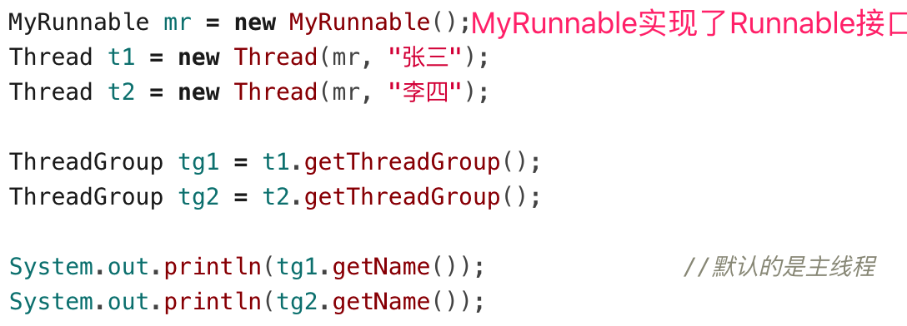

给线程设置分组：
- 1,ThreadGroup(String name) 创建线程组对象并给其赋值名字
- 2,创建线程对象
- 3,new Thread(ThreadGroup group, Runnable target, String name) //创建新线程，加入group组，赋予名字
- 4,设置整组线程的优先级或者守护线程
```java
ThreadGroup tg = new ThreadGroup("我是一个新的线程组");		//创建新的线程组
MyRunnable mr = new MyRunnable();		 //创建Runnable的子类对象

Thread t1 = new Thread(tg, mr, "张三");	 //将线程t1放在组中
Thread t2 = new Thread(tg, mr, "李四");	 //将线程t2放在组中

System.out.println(t1.getThreadGroup().getName());		//获取组名
System.out.println(t2.getThreadGroup().getName());

tg.setDaemon(true);
```

## 线程池
程序启动一个新线程成本是比较高的，因为它涉及到要与操作系统进行交互。而使用线程池可以很好的提高性能，尤其是当程序中要创建大量生存期很短的线程时，更应该考虑使用线程池。线程池里的每一个线程代码结束后，并不会死亡，而是再次回到线程池中成为空闲状态，等待下一个对象来使用。

在JDK5之前，我们必须手动实现自己的线程池，从JDK5开始，Java内置支持线程池。
JDK5新增了一个Executors工厂类来产生线程池，有如下几个方法：
- public static ExecutorService newFixedThreadPool(int nThreads)
- public static ExecutorService newSingleThreadExecutor()
    - 这些方法的返回值是ExecutorService对象，该对象表示一个线程池，可以执行Runnable对象或者Callable对象代表的线程。它提供了如下方法
        - Future<?> submit(Runnable task)
        - <T> Future<T> submit(Callable<T> task)
```java
public static void main(String[] args) {
    ExecutorService pool = Executors.newFixedThreadPool(2);//创建线程池
    pool.submit(new MyRunnable());	 //将线程放进池子里并执行
    pool.submit(new MyRunnable());

    pool.shutdown();	 //关闭线程池
}
```

## 多线程程序实现的第三种方式
实现Callable接口。一般不用，了解即可。
```java
class MyCallable implements Callable<Integer> {
    private int num;
    public MyCallable(int num) {
        this.num = num;
    }
    @Override
    public Integer call() throws Exception {
        int sum = 0;
        for(int i = 1; i <= num; i++) {
            sum += i;
        }
        return sum;
    }

}

public static void main(String[] args) throws InterruptedException, ExecutionException {
    ExecutorService pool = Executors.newFixedThreadPool(2);//创建线程池
    Future<Integer> f1 = pool.submit(new MyCallable(100));	 //将线程放进池子里并执行，能够返回执行结果
    Future<Integer> f2 = pool.submit(new MyCallable(50));

    System.out.println(f1.get());  //获取运算结果
    System.out.println(f2.get());

    pool.shutdown();							//关闭线程池
}
```

## 工厂模式
### 简单工厂模式
又叫静态工厂方法模式，它定义一个具体的工厂类负责创建一些类的实例。
- 优点
  - 客户端不需要在负责对象的创建，从而明确了各个类的职责
- 缺点
  - 这个静态工厂类负责所有对象的创建，如果有新的对象增加，或者某些对象的创建方式不同，就需要不断的修改工厂类，不利于后期的维护
```java
public static Animal createAnimal(String name) {
    if("dog".equals(name)) {
        return new Dog();
    }else if("cat".equals(name)) {
        return new Cat();
    }else {
        return null;
    }
}

Dog d = (Dog) AnimalFactory.createAnimal("dog");
d.eat();

Cat c = (Cat) AnimalFactory.createAnimal("cat");
c.eat();
```

### 工厂方法模式
工厂方法模式中抽象工厂类负责定义创建对象的接口，具体对象的创建工作由继承抽象工厂的具体类实现。
- 优点
  - 客户端不需要在负责对象的创建，从而明确了各个类的职责，如果有新的对象增加，只需要增加一个具体的类和具体的工厂类即可，不影响已有的代码，后期维护容易，增强了系统的扩展性
- 缺点
  - 需要额外的编写代码，增加了工作量
```java
工厂接口：public interface Factory {public abstract Animal createAnimal();}
狗工厂：public class DogFactory implements Factory {
		public Animal createAnimal() { return new Dog(); }
	  }
猫工厂：public class CatFactory implements Factory {
		public Animal createAnimal() { return new Cat(); }
	  }  
```

