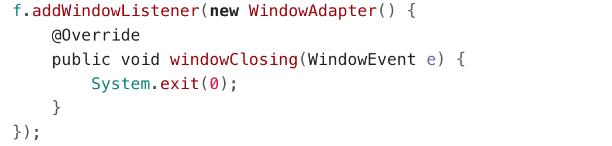
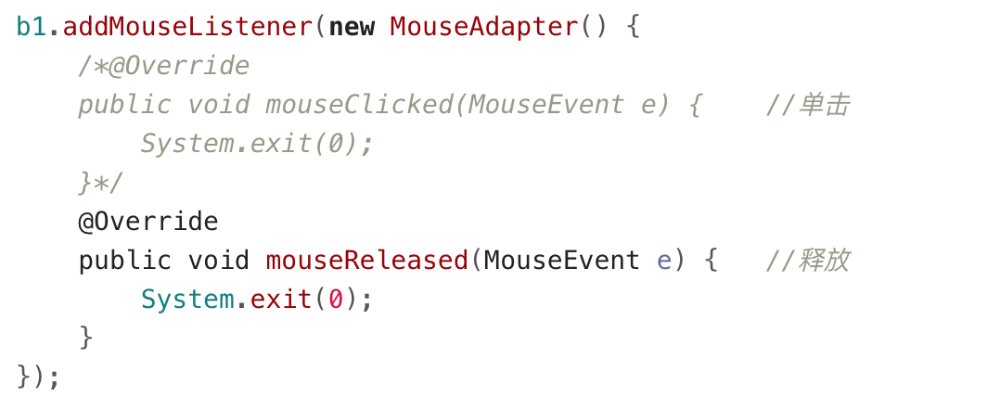
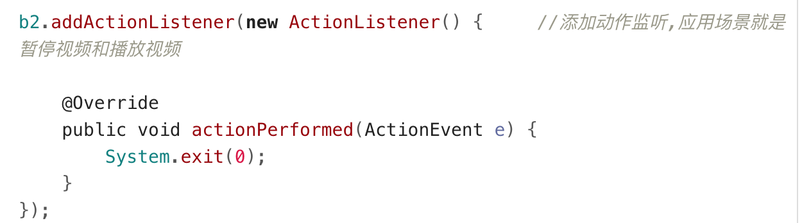

## 如何创建一个窗口并显示
```java
Frame f = new Frame(“my window”);
f.setLayout(new FlowLayout());//设置布局管理器
f.setSize(500,400);//设置窗体大小
f.setLocation(300,200);//设置窗体出现在屏幕的位置
f.setIconImage(Toolkit.getDefaultToolkit().createImage("qq.png"));
f.setVisible(true);
```

## 布局管理器
- FlowLayout（流式布局管理器）
  - 从左到右的顺序排列。
  - Panel默认的布局管理器。
- BorderLayout（边界布局管理器）
  - 东，南，西，北，中
  - Frame默认的布局管理器默认是中。
- GridLayout（网格布局管理器）
  - 规则的矩阵
- CardLayout（卡片布局管理器）
  - 选项卡
- GridBagLayout（网格包布局管理器）
  - 非规则的矩阵

## 监听
### 窗体监听
Frame f = new Frame(“my window”);
f.addWindowListener( ... ); //这里需要一个WindowListener对象，但它是接口，所以要传入一个实现该接口的子类对象；该接口里面有很多方法，这里只需要实现一个方法即可，如果直接实现该接口，其它方法就要写成空方法；对此，JDK提供了WindowAdapter类，该类为抽象类，实现了WindowListener接口，不过方法都是空方法；我们只需要继承WindowAdapter类，并重写继承得到的方法中需要的那一个就好。

### 鼠标监听



### 键盘监听和键盘事件


### 动作监听
//（默认）监听到鼠标左键或键盘空格键有操作，就执行功能，常见的场景就是暂停/播放视频
//ActionListener只有一个方法，就不用适配器了


## 适配器设计模式
- 什么是适配器
  - 在使用监听器的时候, 需要定义一个类事件监听器接口.
  - 通常接口中有多个方法, 而程序中不一定所有的都用到, 但又必须重写, 这很繁琐.
  - 适配器简化了这些操作, 我们定义监听器时只要继承适配器, 然后重写需要的方法即可.
- b.适配器原理
  - 适配器就是一个类, 实现了监听器接口, 所有抽象方法都重写了, 但是方法全是空的.
  - 适配器类需要定义成抽象的,因为创建该类对象,调用空方法是没有意义的
  - 目的就是为了简化程序员的操作, 定义监听器时继承适配器, 只重写需要的方法就可以了.

```java
//一个有趣的例子
interface 和尚 {
    public void 打坐();
    public void 念经();
    public void 撞钟();
    public void 习武();
    }

abstract class 天罡星 implements 和尚 {		//声明成抽象的原因是,不想让其他类创建本类对象,因为创建也没有意义,方法都是空的

    @Override
    public void 打坐() {
    }

    @Override
    public void 念经() {
    }

    @Override
    public void 撞钟() {
    }

    @Override
    public void 习武() {
    }

    }

class 鲁智深 extends 天罡星 {
    public void 习武() {
        System.out.println("倒拔垂杨柳");
        System.out.println("拳打镇关西");
        System.out.println("大闹野猪林");
        System.out.println("......");
    }
}
```

