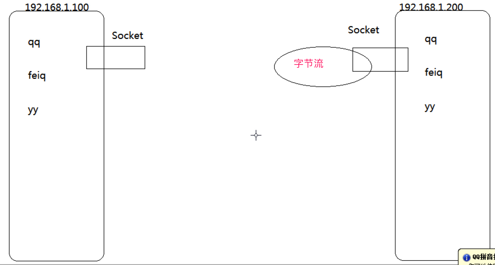

## 网络编程三要素
### IP
本地回路地址：127.0.0.1
广播地址：255.255.255.255
### 端口号
- 每个网络程序都需要绑定一个端口号，传输数据的时候除了确定发到哪台机器上，还要明确发到哪个程序。
- 端口号范围从0-65535
- 编写网络应用就需要绑定一个端口号，尽量使用1024以上的，1024以下的基本上都被系统程序占用了。
- 常用端口
  - mysql: 3306
  - oracle: 1521
  - web: 80
  - tomcat: 8080
  - QQ: 4000

### 协议
为计算机网络中进行数据交换而建立的规则、标准或约定的集合。
- UDP
  - 面向无连接，数据不安全，速度快。不区分客户端与服务端。
- TCP
    - 面向连接（三次握手），数据安全，速度略低。分为客户端和服务端。
        - 三次握手: 客户端先向服务端发起请求, 服务端响应请求, 传输数据
        
## Socket
Socket套接字概述：
- 网络上具有唯一标识的IP地址和端口号组合在一起才能构成唯一能识别的标识符套接字。
- 通信的两端都有Socket。
- 网络通信其实就是Socket间的通信。
- 数据在两个Socket间通过IO流传输。
- Socket在应用程序中创建，通过一种绑定机制与驱动程序建立关系，告诉自己所对应的IP和port。

### UDP传输
```java
/**
 * * 1.发送Send
 * 创建DatagramSocket, 随机端口号
 * 创建DatagramPacket, 指定数据, 长度, 地址, 端口
 * 使用DatagramSocket发送DatagramPacket
 * 关闭DatagramSocket
 * @throws SocketException 
 * @throws UnknownHostException 
 */
public static void main(String[] args) throws Exception {
    Scanner sc = new Scanner(System.in); //创建键盘录入对象
    DatagramSocket socket = new DatagramSocket(); //创建Socket相当于创建码头；发送端口不指定就是随机的

    while(true) {
        String line = sc.nextLine(); //获取键盘录入的字符串
        if("quit".equals(line)) {
            break;
        }
        DatagramPacket packet =  //创建Packet相当于集装箱,参数分别是数据的字节码，数据发送长度，接收方IP，接收方端口号
                new DatagramPacket(line.getBytes(), line.getBytes().length, InetAddress.getByName("127.0.0.1"), 6666);
        socket.send(packet); //发货,将数据发出去
    }
    socket.close();	 //关闭码头
}
```
```java
/**
 ** 2.接收Receive
 * 创建DatagramSocket, 指定端口号
 * 创建DatagramPacket, 指定数组, 长度
 * 使用DatagramSocket接收DatagramPacket
 * 关闭DatagramSocket
 * 从DatagramPacket中获取数据
 * @throws Exception 
 */
public static void main(String[] args) throws Exception {
    DatagramSocket socket = new DatagramSocket(6666); //创建Socket相当于创建码头
    DatagramPacket packet = new DatagramPacket(new byte[1024], 1024);//创建Packet相当于创建集装箱

    while(true) {
        socket.receive(packet);	 //接货,接收数据
        byte[] arr = packet.getData(); //获取数据
        int len = packet.getLength(); //获取有效的字节个数
        String ip = packet.getAddress().getHostAddress(); //获取ip地址
        int port = packet.getPort(); //获取端口号
        System.out.println(ip + ":" + port + ":" + new String(arr,0,len));
    }
    //socket.close();	 //关闭码头;这里在不断接收，就不关了
}
```
* UDP传输多线程：发送和接收在一个窗口完成
```java
class Receive extends Thread {
    public void run() {
        ...
    }
}

class Send extends Thread {
    public void run() {
        ...
    }
}

public static void main(String[] args) {
    new Receive().start();
    new Send().start();
}
```

### TCP传输
```java
/**
 * * 1.客户端
    * 创建Socket连接服务端(指定ip地址,端口号)通过ip地址找对应的服务器
    * 调用Socket的getInputStream()和getOutputStream()方法获取和服务端相连的IO流
    * 输入流可以读取服务端输出流写出的数据
    * 输出流可以写出数据到服务端的输入流
 * @throws IOException 
 * @throws UnknownHostException 
 */
public static void main(String[] args) throws UnknownHostException, IOException {
    Socket socket = new Socket("127.0.0.1", 12345);
    BufferedReader br = new BufferedReader(new InputStreamReader(socket.getInputStream()));		//将字节流包装成了字符流
    PrintStream ps = new PrintStream(socket.getOutputStream());					//PrintStream中有写出换行的方法

    System.out.println(br.readLine());
    ps.println("我想报名黑马程序员");
    System.out.println(br.readLine());
    ps.println("大哭!!!能不能给次机会");

    socket.close();
}
```

```java
/**
 * * 2.服务端
* 创建ServerSocket(需要指定端口号)
* 调用ServerSocket的accept()方法接收一个客户端请求，得到一个Socket
* 调用Socket的getInputStream()和getOutputStream()方法获取和客户端相连的IO流
* 输入流可以读取客户端输出流写出的数据
* 输出流可以写出数据到客户端的输入流
* 服务端一般要做成多线程
*/
public static void main(String[] args) throws IOException {
    ServerSocket server = new ServerSocket(12345);	
    while(true) {
        final Socket socket = server.accept();						//接受客户端的请求
        new Thread() {
            public void run() {
                try {
                    BufferedReader br = new BufferedReader(new InputStreamReader(socket.getInputStream()));		//将字节流包装成了字符流
                    PrintStream ps = new PrintStream(socket.getOutputStream());					//PrintStream中有写出换行的方法

                    ps.println("欢迎咨询黑马程序员");
                    System.out.println(br.readLine());
                    ps.println("不好意思,爆满了");
                    System.out.println(br.readLine());
                    socket.close();
                } catch (IOException e) {

                    e.printStackTrace();
                }
            }
        }.start();
    }
}
```