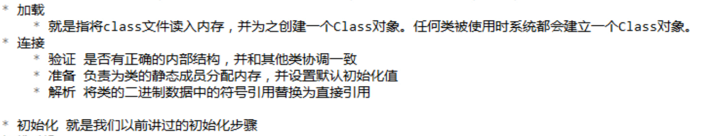
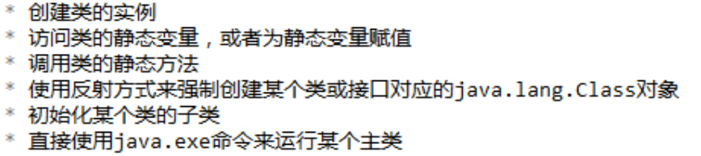
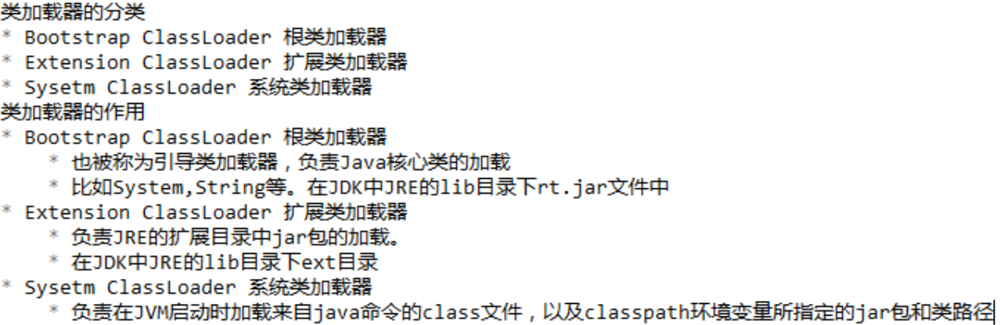
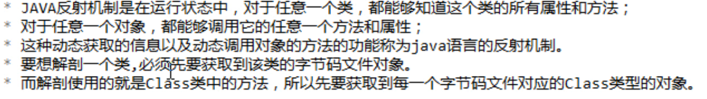
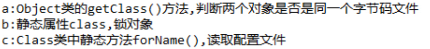
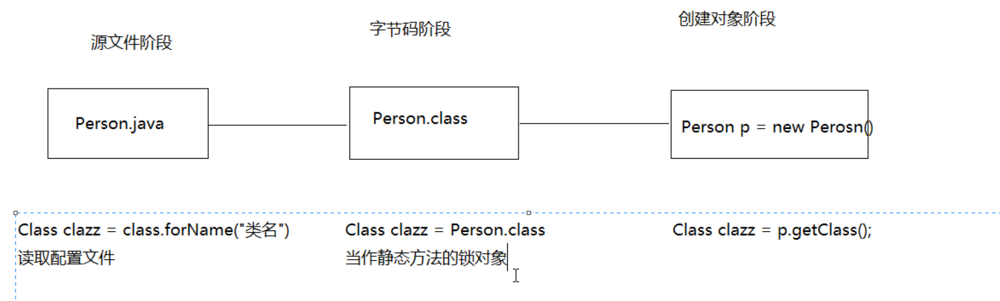
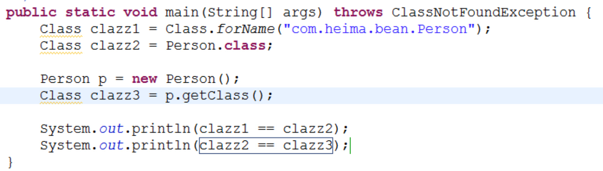
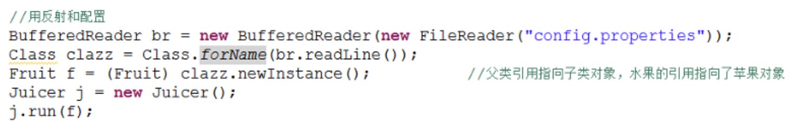
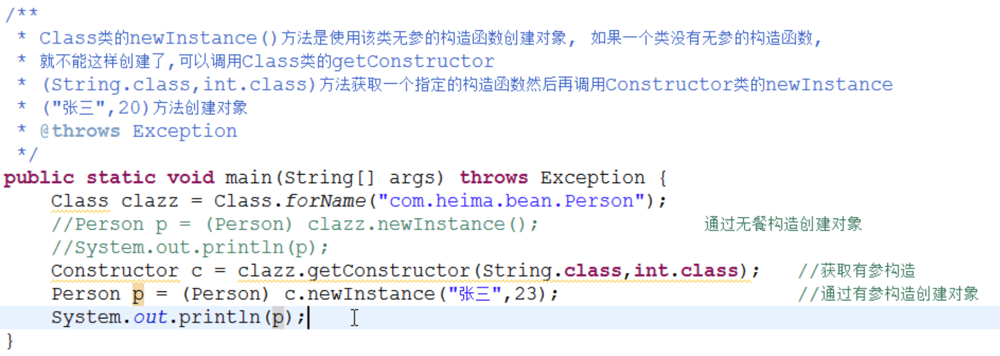

## 类的加载
当程序要使用某个类时，如果该类还未被加载到内存中，则系统会通过加载、连接、初始化三步来实现对这个类进行初始化。
### 类的加载步骤


### 加载时机


### 类加载器
负责将 .class 文件加载到内存中，并为之生成对应的Class对象。


## 反射

### 三种获取Class对象的方式及应用场景



* Class.forName()读取配置文件

//只改变配置文件中的内容而不用修改源代码，就能读到不同的类，后续run()方法运行的效果也不同了

### 通过反射获取带参构造方法并使用

//只要是Java中的类型，都可以使用 .class 来获取字节码对象，如String.class, int.class, void.class

### 通过反射获取成员变量并使用
```java
/**
 * Class.getField(String)方法可以获取类中的指定字段(可见的),
    * 如果是私有的可以用getDeclaedField("name")方法获取,
 * 通过set(obj, "李四")方法可以设置指定对象上该字段的值,
    * 如果是私有的需要先调用setAccessible(true)设置访问权限,
 * 用获取的指定的字段调用get(obj)可以获取指定对象中该字段的值
 * @throws Exception 
 */
public static void main(String[] args) throws Exception {
    Class clazz = Class.forName("com.heima.bean.Person");
    Constructor c = clazz.getConstructor(String.class,int.class);	//获取有参构造
    Person p = (Person) c.newInstance("张三",23);	//通过有参构造创建对象

    //Field f = clazz.getField("name");	//获取姓名字段;如果事先不知道有哪些字段，可以用getFields()方法获取到所有字段
    //f.set(p, "李四");	//修改姓名的值
    Field f = clazz.getDeclaredField("name"); //针对private修饰符使用暴力反射获取字段
    f.setAccessible(true);	//去除私有权限
    f.set(p, "李四");	

    System.out.println(p);
}
```

### 通过反射获取方法并使用
```java
/**
 * Class.getMethod(String, Class...) 和 Class.getDeclaredMethod(String,
 * Class...)方法可以获取类中的指定方法
 * 调用invoke(Object, * Object...)可以调用该方法
 * @throws Exception 
 */
public static void main(String[] args) throws Exception {
    Class clazz = Class.forName("com.heima.bean.Person");
    Constructor c = clazz.getConstructor(String.class,int.class);	//获取有参构造
    Person p = (Person) c.newInstance("张三",23);	 //通过有参构造创建对象

    Method m = clazz.getMethod("eat");	 //获取无参的eat方法
    m.invoke(p); //调用方法

    Method m2 = clazz.getMethod("eat", int.class);	 //获取有参的eat方法；如果参数是对象数组，加入是String[]，写法是 new Class[]{String[].class}
    m2.invoke(p, 10);  //调用方法，10是传入的参数；如果是静态方法，第一个参数是null；如果要传入的参数中有对象数组，要写成 new Object[]{数组名}
}
```

### 通过反射越过泛型检查
```java
/**
 * 对于ArrayList<Integer>的一个对象，在这个集合中添加一个字符串数据，如何实现呢？
 * 泛型只在编译期有效,在运行期会被擦除掉
 * @param args
 * @throws Exception 
 */
public static void main(String[] args) throws Exception {
    ArrayList<Integer> list = new ArrayList<>();
    list.add(111);
    list.add(222);

    Class clazz = Class.forName("java.util.ArrayList");	 //获取字节码对象
    Method m = clazz.getMethod("add", Object.class);  //获取add方法，原型是boolean add(E e);
    m.invoke(list, "abc");

    System.out.println(list);
}
```

## 动态代理
代理：本来应该自己做的事情，请了别人来做。被请的人就是代理对象。
动态代理就是通过反射来生成一个代理。
java.lang.reflect包中提供了一个Proxy类和一个InvocationHandler接口，通过使用它们来生成动态代理对象。

```java
//User.java
public interface User {
    public void add();
    public void delete();
}

//UserImp.java
public class UserImp implements User {

    @Override
    public void add() {
        //System.out.println("权限校验");
        System.out.println("添加功能");
        //System.out.println("日志记录");
    }

    @Override
    public void delete() {
        //System.out.println("权限校验");
        System.out.println("删除功能");
        //System.out.println("日志记录");
    }

}

//MyInvocationHandler
public class MyInvocationHandler implements InvocationHandler {
    private Object target;

    public MyInvocationHandler(Object target) {
        this.target = target;
    }
    @Override
    public Object invoke(Object proxy, Method method, Object[] args)
            throws Throwable {
        System.out.println("权限校验");   //在原方法上扩展的功能
        method.invoke(target, args);	//执行被代理的target对象的方法
        System.out.println("日志记录");   //在原方法上扩展的功能
        return null;
    }

}

//Test.java
public class Test {
    public static void main(String[] args) {
        UserImp ui = new UserImp();
        ui.add();
        ui.delete();

        System.out.println("-------------------------------");*/
        /*
         * public static Object newProxyInstance(ClassLoader loader,Class<?>[] interfaces,
         * InvocationHandler h)
         */
        MyInvocationHandler m = new MyInvocationHandler(ui);
        User u = (User)Proxy.newProxyInstance(ui.getClass().getClassLoader(), ui.getClass().getInterfaces(), m);
        u.add();  //这两个方法是代理在执行
        u.delete();

    }
}
```

## 模板设计模式
就是定义一个算法的骨架，而降具体的算法延迟到子类中来实现。
优点：
- 使用该模式，在定义算法骨架的同时，可以很灵活的实现具体的算法，满足用户灵活多变的需求。
缺点：
- 如果算法骨架有修改的话，则需要修改抽象类。

```java
abstract class GetTime {
    public final long getTime() { //定义骨架
        long start = System.currentTimeMillis();
        code();
        long end = System.currentTimeMillis();
        return end - start;
    }

    public abstract void code(); //声明骨架中的方法
}

class Demo extends GetTime {

    @Override
    public void code() { //实现方法
        int i = 0;
        while(i < 100000) {
            System.out.println("x");
            i++;
        }
    }
}

public static void main(String[] args) {
    Demo d = new Demo();
    System.out.println(d.getTime());
}
```

