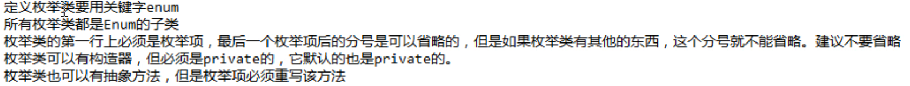
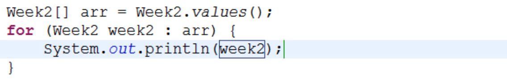

枚举是指将变量的值一一列出，变量的值只限于列举出来的值的范围。如一周只有七天。
单例类是一个类只有一个实例。枚举类是只有有限个数的实例的多例类。
	
### 枚举类的三种写法：
```java
public enum Week {
	MON,TUE,WED;    //MON表示 public static final Week MON = new Week(); 枚举类默认包含一个空参构造
}                                 //默认toString方法返回对象名
```
```java
public enum Week2 {
	MON("星期一"),TUE("星期二"),WED("星期三");     //MON("星期一")表示 public static final Week MON = new Week("星期一");
	private String name;
	private Week2(String name) {
		this.name = name;
	}
	public String getName() {
		return name;
	}
	public String toString() {
		return name;
	}
}
```
```java
public enum Week3 {
	MON("星期一"){    //利用匿名内部类实现Week3的子类对象，相当于将一个子类对象交给父类引用
		public void show() {
			System.out.println("星期一");
		}
	},TUE("星期二"){
		public void show() {
			System.out.println("星期二");
		}
	},WED("星期三"){
		public void show() {
			System.out.println("星期三");
		}
	};
	private String name;
	private Week3(String name) {
		this.name = name;
	}
	public String getName() {
		return name;
	}
	public abstract void show();
}
```
* 注意事项


### 所有枚举类都是Enum的子类，可以使用一些特有的方法。

* int ordinal() 返回枚举项编号 0，1，2...
* int compareTo(E o) 比较编号
* String name() 获取实例名称 MON, TUE, ...
* <T> T valueOf(Class<T> type, String name) //通过字节码对象获取枚举项
    `Week mon = Week.valueOf(Week.class, "MON"); `
* values()  遍历枚举类的所有枚举值 

  