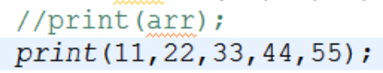
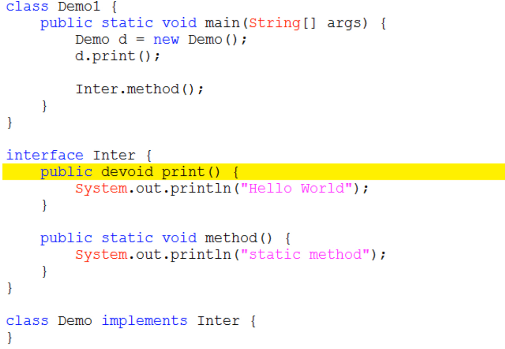

## jdk 1.5 
### 泛型
### 静态导入
直接导入类中的**静态方法**。一般不用，能看懂就行。
import static java.util.Arrays.sort;

### 可变参数
定义方法的时候不知道该定义多少个参数（>0）时可以使用。
格式： `修饰符 返回值类型 方法名(数据类型 …  变量名){}`
注意事项：
* 这里的变量其实是一个数组
* 
可以用数组做参数，也可以直接写多个元素。
* 如果一个方法有可变参数，并且有多个参数，那么，可变参数肯定是最后一个


## jdk 1.7
- 可以直接写二进制字面量，如0b1010；
- 数字字面量可以出现下滑线，表示分割，易于阅读，如100_100_000；
- switch语句可以用字符串；
- 范型简化，可以用菱形范型；
- 异常的多个catch合并，异常之间用 | 分隔；
```java
try {
    System.out.println(a / b);
    System.out.println(arr[10]);
} catch (ArithmeticException | ArrayIndexOutOfBoundsException e) {
    System.out.println("出错了");
    }
```
try-with-resources语句，1.7版的标准异常处理代码。 
## jdk 1.8
- 接口中可以定义有方法体的方法 
    - 如果是静态，就直接用 static 修饰；调用时可以用 接口名.方法名 。
    - 如果是非静态，必需用 default 修饰；实现接口的子类对象可以不重写该方法，直接调用。


- 局部内部类在访问它所在方法中的局部变量，不用显式地用 final 修饰。内部其实还是用 final 修饰。


- [Lambda 表达式](http://www.runoob.com/java/java8-lambda-expressions.html)
    - Lambda 表达式，也可称为**闭包**，它是推动 Java 8 发布的最重要新特性。
    - Lambda 实质上是匿名内部类的简单写法。使用 Lambda 表达式可以使代码变的更加简洁紧凑。


