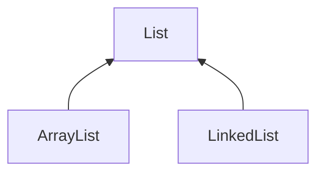

# 集合（容器）


## 集合与数组的区别

+ 相同点

  存储多个结构相同的对象

+ 数组缺点

  长度必须在初始化时指定

  数组采用连续存储空间，删除和添加效率低下 

  数组缺乏封装，操作繁琐

  

## 集合架构


+ List接口存储对象不唯一（两个对象可相同可不同），索引顺序有序
+ Set接口存储对象唯一，无序存储
+ Map接口存储键值对，key到value的映射
  + key唯一，无序
  + value不唯一，无序


## List



+ 特点：有序，不唯一

+ ArrayList 
  + 在内存中分配连续的空间
  + 长度可变（扩容机制） 
  + 优点：遍历元素和随机访问元素的效率较高 
  +  缺点：添加和删除需大量移动元素效率低

+ LinkedList  
  + 采用链表存储方式 
  + 优点：插入、删除元素效率较高
  + 缺点：遍历和随机访问元素效率低下 


## Set

+ 特点：唯一
+ HashSet 
  + 采用Hashtable哈希表存储结构（神奇的结构） 
  + 优点：添加速度快 查询速度快 删除速度快 
  + 无序 

+ LinkedHashSet 
  + 采用哈希表存储结构，同时使用链表维护次序 
  + 有序（添加顺序） 

+ TreeSet 

  + 采用二叉树（红黑树）的存储结构 

  + 有序

    

## Map

+ 特点：key-value键值对映射
+  HashMap 
  + Key无序 唯一 （Set） 
  + Value无序 不唯一 （Collection） 

+ LinkedHashMap 
  + 有序的HashMap ，速度快 

+ TreeMap 
  + 有序


## Iterator

迭代器实现集合遍历（迭代器设计模式）

+ For-each循环 

  + 增强的for循环

    ```java
    for(Obeject o: obejectList){...}
    ```

  + 无需获得集合和数组长度，无需使用索引访问元素，无需循环条件 
  + 遍历集合时底层调用Iterator完成操作 
  + 缺陷： 
    + 数组：不能方便的访问下标值
    + 集合：与使用Iterator相比，不能方便的删除集合中的内容 

  + 适用于简单遍历


## Collections

专门用来操作集合的工具类 

+ 构造方法私有，禁止创建对象 
+ 提供一系列静态方法实现对各种集合的操作 
+ 具体操作：搜索、复制、排序、线程安全化等


## 总结与问题整理

+ 集合和数组的比较 

  + 数组不是面向对象的

    集合面向对象 

  + 数组容量固定且无法动态改变

    集合类容量动态改变

  + 数组一般情况下无法判断其中实际存有多少元素，集合可以判断实际存有多少元素

  + 数组仅采用顺序表方式 

    集合有多种数据结构（顺序表、链表、哈希表、树等）、多种特征（是否有序，是否唯一），适用不同场合

    集合以类的形式存在，具有封装、继承、多态等类的特性，实现各种复杂操作，提高开发效率

+ Set和Map有关系吗？ 

  采用了相同的数据结构，只用于map的key存储数据，就是Set

