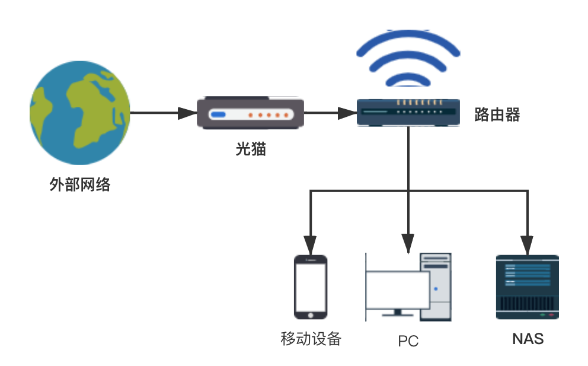
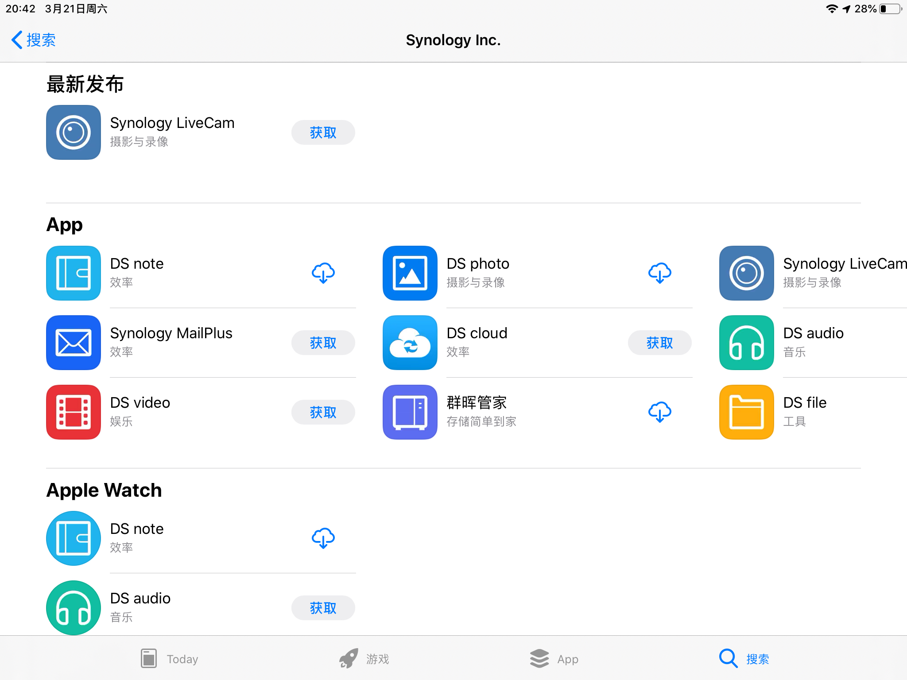

# 网络附属存储（NAS）-UP: 哈哈哈哈输了
## 什么是NAS
NAS（Network Attached Storage：网络附属存储）按字面简单说就是连接在网络上，具备资料存储功能的装置，因此也称为“网络存储器”。它是一种专用数据存储服务器。它以数据为中心，将存储设备与服务器彻底分离，集中管理数据，从而释放带宽、提高性能、降低总拥有成本、保护投资。其成本远远低于使用服务器存储，而效率却远远高于后者。
## NAS在家庭网络中的位置

## 在App Store

## 文件存储
- FileStation
- DS File
- 文件共享

## 文件同步
- Drive
- TimeMachine

## 照片备份 
- Moment

## Web服务器
- WebStation

## 虚拟机
- VMM
- docker
